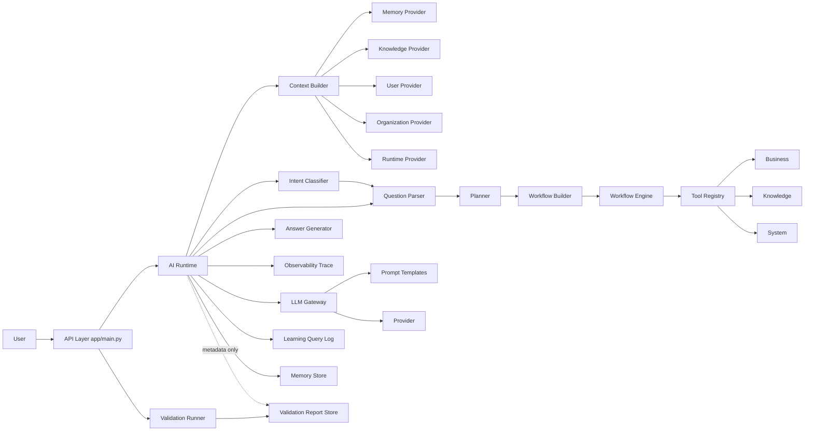
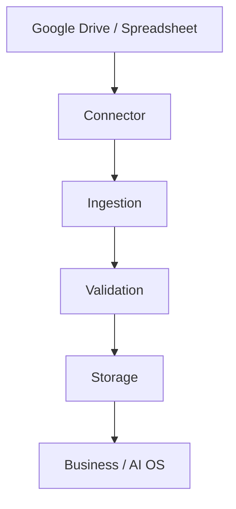
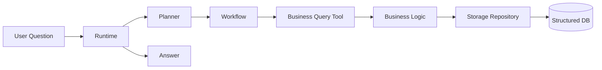
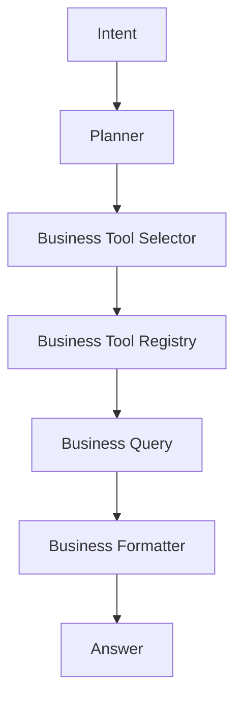
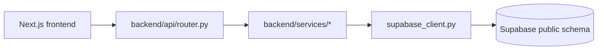

# LOGS AI Platform Architecture (Current)

> **⚠️ 2026-07-06 update — read this first.** `app/` (and the ~30
> top-level packages described in Sections 1–12 below — `database/`,
> `session/`, `config/`, `business/` [root], `system/`, `planner/`,
> `context/`, `intent/`, `question/`, `validation/`, `tools/`,
> `workflow/`, `answer/`, `observability/`, `ai/`, `prompts/`,
> `memory/`, `change_management/`, `self_awareness/`, `admin/`) **were
> deleted this session** (Section 14.14) — none of it exists in the
> repository anymore. `backend/main.py` (port 8000) is now the **only**
> running server; there is no longer a second server on port 8001.
> Sections 1–12 are kept as a historical record of the pre-deletion
> architecture (they explain *why* those layers existed and how they
> related to each other), but nothing in them describes current,
> running code. Of everything they list, only `knowledge/` (data files,
> not a live package import) and parts of `learning/` (see 14.10/14.14)
> survived, and both are now used by `backend/` instead. **For the
> actual current architecture, start at Section 13.**

> **Original scope note (pre-2026-07-06, kept for history):** This
> document describes the layered AI OS implemented in `app/main.py`
> (port 8001). The repository also contains a second, independent
> FastAPI application, `backend/main.py` (port 8000), which serves the
> Next.js frontend and hosts the real-data (Supabase) integration work
> for Home/Workspace/Reasoning. See
> [Section 13](#13-second-api-surface-backend-nextjs-facing) for its
> architecture. The two servers must not run on the same port; see the
> [README](../README.md#two-separate-servers-in-this-repository) for details.

## 1) Current Layer Inventory ⚠️ HISTORICAL — describes deleted `app/`-era code, see banner above

- Entry/API layer (`app/`)
- Data and database layer (`database/`, `data/`)
- Session layer (`session/`)
- Configuration layer (`config/`)
- Business domain layer (`business/`)
- Knowledge layer (`knowledge/`)
- System metadata layer (`system/`)
- Planner layer (`planner/`)
- Context layer (`context/`)
- Intent layer (`intent/`)
- Question Understanding layer (`question/`)
- Validation layer (`validation/`)
- Tool Registry layer (`tools/`)
- Workflow layer (`workflow/`)
- Answer layer (`answer/`)
- Observability layer (`observability/`)
- AI Runtime orchestration layer (`ai/runtime.py`)
- LLM Gateway layer (`ai/gateway.py`, `ai/providers/`, `prompts/`)
- Memory layer (`memory/`)
- Learning layer (`learning/`)
- Change Management layer (`change_management/`)
- Self-awareness layer (`self_awareness/`)
- Admin/monitoring layer (`admin/`)

## 2) Layer Responsibilities ⚠️ HISTORICAL (app/-era, deleted 2026-07-06)

- Entry/API layer
  - Exposes HTTP endpoints and validates request-level inputs.
  - Delegates to runtime or each dedicated layer API.

- Data and database layer
  - Imports Excel to SQLite, inspects schema, executes read-safe SQL.
  - Owns persistence concerns for ERP data.
  - Uses repository abstractions so storage backends can be swapped later.

- Session layer
  - Manages request-scoped session state for `session_id`, `user_id`, `organization_id`, and linked `trace_id` values.
  - Must remain separate from Memory.

- Configuration layer
  - Provides environment-specific runtime settings for dev, staging, and production.
  - Supports deployment metadata and cloud runtime preparation.

- Business domain layer
  - Executes sales/product/customer business logic and business routing.

- Knowledge layer
  - Provides glossary/company/brand knowledge retrieval.

- System metadata layer
  - Publishes logic registry and system map metadata.

- Planner layer
  - Produces plan steps from user message (rule-based).
  - Outputs tool-oriented steps for execution phase.

- Context layer
  - Aggregates question-specific context through provider contracts before planning.
  - Collects memory, knowledge, user, organization, and runtime context in one place.
  - Selects providers by rule-based priority before collecting context.
  - Must not execute business logic or update databases directly.

- Intent layer
  - Classifies what the user is asking for after context is assembled and before planning.
  - Uses rule-based intent types such as explain, search, ranking, compare, summarize, continue, generate, improve, and status.
  - Must not call business logic, update databases, or connect to external systems.

- Question Understanding layer
  - Extracts structured question fields such as metric, operation, entity_type, period, limit, and filters.
  - Runs after Intent and before Planner to improve deterministic tool selection.
  - Must stay rule-based and must not call LLM or execute business logic.

- Validation layer
  - Performs data-quality checks for Excel inputs and SQLite schema/row shape.
  - Produces validation reports for admin and runtime metadata reference.
  - Runs on admin operation, post-import, or periodic schedules, not per user question.

- Tool Registry layer
  - Registers executable tool definitions and dispatches by tool name.
  - Provides a stable execution contract for Workflow/Planner executor.

- Workflow layer
  - Builds workflow graph-like step payload and executes each step.
  - Delegates actual work to Tool Registry.

- Answer layer
  - Converts workflow results into readable response text.

- Observability layer
  - Captures trace records for runtime and layer execution.
  - Stores trace sessions for later retrieval through the API.
  - Must not alter business logic or knowledge content.

- AI Runtime orchestration layer
  - End-to-end orchestration: memory context, planning, workflow, answer, logging, memory write.
  - Handles stage-aware error response contract.

- LLM Gateway layer
  - Provider abstraction, prompt loading, provider-specific retry/timeout/auth handling.
  - Refines draft answer if provider is available.

- Memory layer
  - Stores and retrieves conversational context records.
  - Builds runtime context from related and recent memories.

- Learning layer
  - Stores query logs, feedback, improvement backlog and insights.
  - Focuses on quality/improvement management rather than dialog context.

- Change Management layer
  - Tracks change requests and lifecycle transitions.

- Self-awareness layer
  - Reports capabilities, limitations, recommendations, status metrics.

- Admin/monitoring layer
  - Aggregates usage/quality/improvement metrics for operators.

## 3) Inter-layer Dependencies ⚠️ HISTORICAL (app/-era, deleted 2026-07-06)

### High-level flow

### Direct code-level dependency highlights

- Runtime depends on Context, Intent, Question Understanding, Planner, Workflow, Answer, Gateway, Learning, Memory.
- Runtime depends on Observability for trace capture, but Observability must remain passive.
- Runtime references latest validation report metadata but does not run validation checks per request.
- Context depends on provider registry and provider contracts for Memory/Knowledge/User/Organization/Runtime sources.
- Context selection is rule-based and can be overridden explicitly by provider_names.
- Intent depends on rule-based classifier logic and can be overridden by explicit context if needed.
- Validation depends on importer/schema inspection and produces durable reports.
- Workflow Engine depends on Tool Registry, and Tool Registry depends on Business/Knowledge/System handlers.
- API layer currently exposes both end-to-end endpoint and layer-direct endpoints.
- API layer now exposes `POST /chat`, `GET /trace/{trace_id}`, `GET /health`, and `GET /version` as the cloud-facing entry surface.

## 4) Responsibility Overlaps (Current) ⚠️ HISTORICAL (app/-era, deleted 2026-07-06)

- End-to-end orchestration exists in two routes:
  - `/answer` endpoint executes plan/workflow/answer/log directly.
  - `/ai/chat` endpoint executes the runtime orchestration.
  - This is a functional overlap and can diverge over time.

- Planner execution overlap:
  - Planner has `create_plan` and also `execute_plan` path.
  - Workflow also executes steps through registry.
  - Two execution entry paths increase behavior drift risk.

- Learning vs Memory storage overlap:
  - Both store message/answer/intent-like fields.
  - Responsibilities are conceptually distinct, but data shape overlaps.

## 5) Potential Deviations From Intended Design ⚠️ HISTORICAL (app/-era, deleted 2026-07-06)

- API gateway bypass risk
  - Many layer-direct endpoints remain available, so callers can bypass Runtime orchestration contract.

- Runtime resiliency policy ambiguity
  - Gateway falls back to draft answer internally, while Runtime has stage-based error contracts.
  - This mixes silent fallback and explicit failure styles.

- Intent is accepted but Planner still keeps backward-compatible keyword fallback
  - Runtime passes classified intent into Planner, but Planner remains rule-based and keeps a message fallback path.
  - This is acceptable for current sprint goals, but architecture doc should state this explicitly.

## 6) Refactoring Candidates (Prioritized) ⚠️ HISTORICAL (app/-era, deleted 2026-07-06)

1. Unify orchestration entry
   - Make `/ai/chat` the single production orchestration path.
   - Keep `/answer` as compatibility wrapper calling Runtime, or deprecate.

2. Consolidate execution path
   - Decide one canonical executor path between `planner/executor.py` and `workflow/engine.py` for runtime use.
   - Keep the other as testing/debug utility only.

3. Formalize cross-layer contracts
   - Define shared schemas for Plan, Workflow step result, Runtime response, Memory record.
   - Reduce shape-conversion code in Runtime.

4. Separate operational logs and conversational memory more strictly
   - Keep Learning for quality lifecycle metadata.
   - Keep Memory for retrieval-ready conversation context only.
   - Add explicit mapping policy from log to memory to avoid schema drift.

5. Introduce dependency injection for registries/providers/stores
   - Avoid hidden globals and simplify deterministic testing.

## 7) Current Architecture Summary For Team Use ⚠️ HISTORICAL (app/-era, deleted 2026-07-06)

- The platform has transitioned from data-first API into layered AI orchestration.
- Runtime is now the integration point for context-aware chat execution.
- Context is a working table for each question and is not a replacement for Memory storage.
- Context Priority / Provider Selection determines which working sources are consulted first.
- Intent is the question-meaning layer between context and planning.
- Validation is a separate data-quality assurance lane and does not run for each chat request.
- Tool Registry is the abstraction boundary between orchestrators and executable business/knowledge/system tools.
- Learning and Memory are separated by intent, but should be further clarified by contract and lifecycle.
- Near-term architecture goal is reducing duplicate orchestration/execution paths while preserving existing APIs.

## 8) External Source and Storage Foundation (Sprint 29) ⚠️ HISTORICAL (app/-era, deleted 2026-07-06)

To prepare Google Drive / Spreadsheet and cloud DB integration, the platform now includes `connector/`, `ingestion/`, and `storage/` foundations.

- Connector layer abstracts external source APIs and file metadata contracts.
- Ingestion layer orchestrates source sync jobs and prepares handoff to validation/storage.
- Storage layer abstracts DB backend differences between SQLite and PostgreSQL.

Canonical data path:

Scope constraints in this sprint:

- Real Google API and OAuth are not enabled yet.
- PostgreSQL repository remains scaffold-level until production activation.
- Existing Business, Knowledge, Context, Intent, Planner, and Workflow responsibilities remain unchanged.

## 9) Source Registry Expansion (Sprint 30) ⚠️ HISTORICAL (app/-era, deleted 2026-07-06)

The ingestion layer now includes explicit source definitions for Google Drive preparation.

- `ingestion/source_registry.py` manages source metadata contracts.
- Initial sources include Logsys and sales-authored spreadsheet groups.
- Each source can define connector target, folder_id, file_pattern, data_category, and enabled flag.

Current first-target categories:

- Logsys data sources
- Sales data sources

Future extension candidates (excluded in Sprint 30):

- Mail attachments
- PDF files
- Google Docs
- Proposal document workflows

Data handling policy:

- GitHub stores code and docs only.
- Real datasets stay in Google Drive and cloud storage backends.

## 10) Theme 24 Production UI Target ⚠️ HISTORICAL (app/-era, deleted 2026-07-06)

### Product Direction

- End user UI target is Next.js and React.
- Streamlit is debug-only for developers/operators.
- Runtime and domain layers remain UI-independent.
- Frontend and backend APIs are separated.

### Target Screen Set

- Home: today actions, alerts, project summary, recommended actions.
- Chat: response, references, generated outputs, next actions.
- Tasks: recommendation, due date, priority, status.
- Proposal Builder: customer selection, objective, internal/external references, structure, PPTX draft.
- Documents: draft and approval-oriented transaction UI.
- History: execution, generated output, approvals, feedback.
- Admin/Debug: intent/meaning/knowledge/memory/capability/validation traces and runtime logs.

### MVP Scope

- Home
- Chat
- Tasks
- Proposal Builder
- History
- Debug Trace Panel
- Documents is design-first (draft contract prepared, full UX later)

### API Surface for Frontend

- POST /api/chat
- POST /api/tasks/recommend
- POST /api/proposals/draft
- POST /api/documents/draft
- GET /api/history
- GET /api/executions/{id}
- GET /api/evaluation/summary
- GET /api/debug/trace/{id}

### Evaluation Connection from UI

Persist each UI operation as an evaluation event:

- user_input
- ai_response
- intent
- task
- capability
- validation
- user_feedback
- accepted_or_rejected
- corrected_output

This enables automatic transformation from production behavior logs into future regression suites.

## 11) Storage-to-Business Query Runtime Path (Sprint 31) ⚠️ HISTORICAL (app/-era, deleted 2026-07-06)

For user questions, the runtime path now prioritizes structured data in Storage through Business layer access.

- Storage acts as the query-time structured data store.
- Business layer reads Storage through repository interfaces.
- Runtime/Planner must not embed SQL logic.
- User-time requests must not directly call Google Drive.
- Google Drive remains an ingestion sync origin only.

Runtime query-time chain:

## 12) Business Tool Registry Layer (Sprint 33) ⚠️ HISTORICAL (app/-era, deleted 2026-07-06)

Business capabilities are now managed through a dedicated selector/registry pair inside the business domain.

- Planner asks Business Tool Selector to choose a business tool.
- Business Tool Registry resolves tool metadata and handler.
- Selected business tool executes Business Query functions that read via repository abstractions.
- Formatter converts deterministic business outputs to user answers without requiring LLM for supported cases.

## 13) `backend/` — the Sole Running Application (Next.js-facing)

> Originally titled "Second API Surface" back when `app/` (port 8001)
> was still the primary system. As of 2026-07-06 (Section 14.14),
> `app/` and everything Sections 1–12 describe were deleted — `backend/`
> is now the only server in this repository.

`backend/` is a FastAPI application (`backend/main.py`, port 8000). It
serves the Next.js frontend (`frontend/`) and carries all real-data
integration work (Supabase `public` schema).

### 13.1 Directory Inventory

- `backend/api/` — route definitions. `router.py` mounts business/project
  routes under the `/api` prefix; `capability_router.py` mounts the
  Capability REST API separately under its own `/capabilities` prefix;
  `governance_router.py` mounts the minimal Governance Queue API under its
  own `/governance` prefix. All three are registered in `backend/main.py`.
- `backend/business/` — business-rule helpers specific to the frontend
  surface (`today_actions.py`, `evaluation_rules.py`). Distinct from the
  top-level `business/` package used by `app/`.
- `backend/domain/` — domain model for projects (`project.py`), consumed by
  `services/project_service.py`.
- `backend/services/` — the bulk of backend logic:
  - `supabase_client.py` — connection handling for the shared production
    Supabase `public` schema (PostgreSQL).
  - `data_providers.py` — real Supabase-backed data access (sales,
    customers, products).
  - `reasoning_pipeline.py` — the Fact/Interpretation/Hypothesis/Knowledge-
    Candidate reasoning flow (Phase 8–13 work); reads real data through
    `supabase_client`. Not yet wired through the Capability framework (see
    13.5).
  - `evidence_integration.py`, `evidence_interpreter.py` — supporting
    evidence-handling logic for the reasoning pipeline.
  - `knowledge_loader.py`, `knowledge_registry.py`, `semantic_registry.py` —
    knowledge/semantic lookups specific to this surface (separate from the
    top-level `knowledge/` package).
  - - `capability_instance.py` — the single shared `CapabilityRegistry`
    instance used by both `capability_router.py` and any business logic
    that wants its work tracked as a Capability (e.g.
    `project_service.py`, `reasoning_pipeline.py`). Import `registry` from
    here rather than constructing a new `CapabilityRegistry()` — a previous
    bug had `capability_router.py` construct its own, disconnected
    instance. Also persists execution history to
    `backend/data/capability_executions.jsonl` and replays it on startup,
    so success_rate/execution history survive process restarts (the base
    `CapabilityRegistry` class is in-memory-only by design).
  - - `project_service.py` — builds project state from real `purchase_orders`
    data. `build_project_aggregate` is recorded as a Capability execution
    (`project_aggregate_analysis`) via `capability_instance.registry`.
  - `governance_store.py` — minimal Governance Queue (Phase D-1): durable
    JSONL-backed proposal/approval/audit records
    (`backend/data/governance_approvals.jsonl`,
    `governance_audit.jsonl`). See 13.5 for scope/limitations.
  - `mock_store.py` — **intentional mock implementation** backing several
    endpoints that have not yet been migrated to real data (see 13.3).
- `backend/connectors/`, `backend/runtime/` — currently placeholder
  packages (`__init__.py` only); reserved for future connector/runtime
  abstractions on this surface.
- `backend/scripts/` — one-off / demo scripts (e.g.
  `seed_logisys_demo.py`).

### 13.2 Route Inventory (`backend/api/router.py`)

| Route | Backing | Status |
|---|---|---|
| `GET /api/health` | `services.status_reporting.get_health` | real (reports live Capability/Governance registry state) — updated 2026-07-04, was mock |
| `GET /api/home` | `business.today_actions.get_home_payload` | real (Supabase) |
| `POST /api/chat` | `mock_store.consult` | mock (separate hardcoded demo dataset; overlaps conceptually with `reasoning_pipeline.py` — reconciling the two is future work, see 13.5/13.6) |
| `POST /api/reasoning` | `services.reasoning_pipeline.reason` | real (Supabase); tracked Capability `business_question_reasoning` |
| `GET /api/knowledge/documents` | `services.knowledge_loader.load_documents` | real (local knowledge files) |
| `GET /api/knowledge/registry` | `services.knowledge_registry.get_registry` | real (local knowledge files) |
| `POST /api/tasks/recommend` | `mock_store.recommend_tasks` | mock |
| `POST /api/proposals/draft` | `services.proposal_generation.draft_proposal` | real (Claude API text generation, grounded in real internal purchase-order history) — updated 2026-07-05, was mock |
| ~~`POST /api/documents/draft`~~ | removed 2026-07-05 | Fully removed (was `mock_store.draft_document`) — superseded by the `/document-formats` API (Phase G-2), which does the same job for real. |
| `GET /api/history` | `services.status_reporting.get_history` | real (merges Capability execution history + Governance decisions) — updated 2026-07-04, was mock |
| `GET /api/executions/{id}` | `services.status_reporting.get_execution` | real (Capability execution record) — updated 2026-07-04, was mock |
| `GET /api/evaluation/summary` | `services.status_reporting.get_evaluation_summary` | real (aggregated Capability success rates) — updated 2026-07-04, was mock |
| `GET /api/debug/trace/{id}` | `services.trace_store.get_trace` | real (JSONL: `backend/data/traces.jsonl`) — updated 2026-07-04, was mock |
| `POST /api/events` | `services.status_reporting.store_event` | real (was already real; relocated 2026-07-04 out of `mock_store.py` where it was misclassified alongside genuinely-mock functions) |
| `GET /api/projects`, `GET /api/projects/{id}`, `GET /api/projects/{id}/trace` | `services.project_service.ProjectService` | real (Supabase `purchase_orders`); executed as tracked Capability `project_aggregate_analysis` (updated 2026-07-04) |
| `GET /api/today-actions` | `business.today_actions` | real (Supabase) |

> **Note:** this table should be re-verified whenever `backend/api/router.py`
> changes; it reflects a manual read of the source on 2026-07-04, not an
> automated check.

### 13.3 Real vs Mock Boundary

`backend/services/mock_store.py` **no longer exists** (removed
2026-07-05) — every endpoint it used to back is now real:
`chat` → `reasoning_pipeline.reason` (Phase F), `tasks/recommend` →
`status_reporting.recommend_tasks` (Phase F), `proposals/draft` →
`proposal_generation.draft_proposal` (Phase G-3, LLM-backed), and
`documents/draft` was removed entirely in favor of the `/document-formats`
API (Phase G-2). `health`, `history`, `executions`, `evaluation/summary`,
and `events` were migrated to `services/status_reporting.py` (real, backed
by the Capability/Governance data built in Phases A–D) on 2026-07-04; the
`events` function turned out to already be real (writing to
`backend/data/events.jsonl`) and was simply misplaced. `debug/trace` was
migrated to `services.trace_store` on 2026-07-04 (Phase B).

As of 2026-07-05, there is no mock-backed endpoint left in `backend/`.

The remaining 4 mock functions are a deliberate placeholder boundary, not
an oversight — see 13.6 for why each one needs actual design work before
it can be "just" made real. This table is the fastest way to check what
remains mock at any point in time.

### 13.4 Data Flow (real-data path)

### 13.5 Blueprint Constitution Integration Status (backend/)

`docs/blueprint/AI_OS_BLUEPRINT_v0.2_DRAFT.md`'s 12-principle AI Constitution
was found (2026-07-04 audit) to be largely *not* wired into `backend/`,
despite being partially proven out in `app/`. Work to close this gap is
tracked here rather than only in commit messages, since this table is the
fastest way to check current status without re-auditing from scratch.

| Principle | Status in `backend/` | Notes |
|---|---|---|
| 2, 4, 5, 12 (Capability Driven) | Done | `capability_router.py` is mounted and reachable (Phase A). Every real endpoint in `backend/` is a tracked Capability execution via the shared registry in `services/capability_instance.py`: `project_aggregate_analysis` (Phase C-1), `business_question_reasoning` (Phase C-2), `document_format_structure_inference` and `document_generation` (Phase G-2), and `proposal_draft_generation` (Phase G-3, 2026-07-05). `mock_store.py` no longer exists (see 13.3) — there is no mock-backed endpoint left. |
| 6, 10 (Transparent AI / Trace Everything) | Done for `ProjectService` and `reasoning_pipeline` | Both generate and persist a `trace_id` to `backend/data/traces.jsonl`, retrievable via `GET /api/debug/trace/{id}` (Phase B, extended in Phase C-2). |
| 3, 5 (Human Governed / Governed Learning) | Mostly done | Phase D-1 added a minimal Governance Queue (`services/governance_store.py`, `/governance` API): `reasoning_pipeline.py`'s Phase 13 knowledge candidates and `document_formats.py`'s structure-inference proposals submit for review, and a human must call `POST /governance/{id}/decide` (approve/reject + reason) before anything is considered approved — durably audited (`backend/data/governance_approvals.jsonl`, `governance_audit.jsonl`). Phase G-1 (2026-07-05) implemented the Blueprint Chapter 11 Approval Levels table's auto-approval rule: `submit_proposal(..., governance_level=...)` auto-approves only when `governance_level == "low"` and `confidence_score > 0.85` (`AUTO_APPROVE_THRESHOLD`); `medium`/`high`/`admin_approved_required` always require manual review regardless of confidence, matching the Blueprint table exactly. Still NOT implemented: PolicyRule creation/activation/rollback, and approver authority checks (`decide()` trusts whatever `approver_id` is passed — no auth). Approving a proposal here does not automatically edit any `knowledge/` file — that "apply the rule" step is still manual by design (see `governance_store.py` module docstring). |

Remaining candidate work:
- See 13.6 for the 4 mock endpoints still remaining after Phase E's
  reduced scope (2026-07-04), and why each needs real design work first.
- If/when needed: approval levels + auto-approve thresholds, PolicyRule
  versioning/rollback, and approver authority validation for the
  Governance Queue (Phase D-1 intentionally deferred all of these).

### 13.6 Remaining Mock Endpoints (Phase E/F, updated 2026-07-04)

Phase E was scoped down mid-implementation once it became clear the 9
mock-backed endpoints split into two very different kinds of work: some
were pure data-plumbing (reuse infrastructure already built in Phases
A–D), others need real product/business design. Phase F then tackled two
of the "real design" cases after all, once investigation showed the
design work was smaller than expected.

**Done (all backed by real Supabase/Capability/Governance data):**
- `health`, `history`, `executions/{id}`, `evaluation/summary`, `events` —
  moved to `services/status_reporting.py` (Phase E).
- `POST /api/chat` — now a thin wrapper around
  `reasoning_pipeline.reason()` via a new `to_chat_response()` adapter,
  replacing `mock_store.consult()`'s hardcoded 4-project demo dataset. A
  new `_q5_project_lookup` pattern was added to `reasoning_pipeline.py`
  to cover project/customer-name lookup (what `consult()` used to do)
  using the real `customer_master`/`projects` datasets via
  `LogsysProvider` (Phase F). This also surfaced and fixed a
  `"logisys"` vs `"logsys"` provider-name typo that had been silently
  breaking `sales_lines`/`purchase_lines`/etc. evidence fetches in
  `data_providers.py` and `evidence_interpreter.py`.
- `POST /api/tasks/recommend` — now aggregates real `ProjectAction`
  recommendations across projects via `ProjectService`
  (`services/status_reporting.recommend_tasks`), replacing
  `mock_store.recommend_tasks()`'s 3 hardcoded demo tasks (Phase F).
- `POST /api/proposals/draft` — now generates real LLM-backed (Claude
  API) proposal text grounded in real internal history, via
  `services/proposal_generation.py` (Phase G-3, 2026-07-05). See 14.5
  for what this does and doesn't cover, and the scope decision behind it.
- `POST /api/documents/draft` — removed entirely (not migrated in place);
  superseded by the `/document-formats` API (Phase G-2), which solves the
  same underlying need (customer-specific document generation) for real.

**Nothing is mock anymore.** `backend/services/mock_store.py` was deleted
2026-07-05 once its last two functions (`draft_proposal`,
`draft_document`) were superseded. Every endpoint in `backend/api/` is
now backed by real Supabase data, a real LLM call, or both.

## 14) app/ vs backend/ Duplication — Investigation and Decision (2026-07-04)

### 14.1 Investigation

Prompted by the Blueprint work above, `app/` (the original layered AI OS,
port 8001) was checked against `backend/` (port 8000) for whether the
duplication identified earlier in this document (separate `business/`,
`services/`, `domain/`, `ProjectService` at repo root vs under `backend/`)
still matters in practice. Three checks, in order of decisiveness:

1. **Commit history:** `app/`'s last commit (`60916d6`, 2026-07-01) is
   titled "complete Sprint 2 walking skeleton and prepare product
   review." Every commit since then — 19 in a row as of this writing —
   touches only `backend/` (or docs). `app/` has not participated in any
   of the real-data migration or Blueprint work described in this
   document.
2. **Frontend wiring (decisive):** `frontend/lib/api-client.ts` and
   `frontend/hooks/use-product-event.ts` both default
   `NEXT_PUBLIC_API_BASE` to `http://localhost:8000` — `backend/`'s port.
   A full search of `frontend/` for `8001` (`app/`'s port) returns zero
   matches. The real, user-facing Next.js frontend never talks to `app/`.
3. **Streamlit:** README states Streamlit is debug-only, never production
   UI. The actual Streamlit app lives under `reference/03_application/`
   (last touched 2026-06-30, a single "initialize product foundation"
   commit), not under `app/` — another indicator that `app/` isn't the
   locus of any current usage.

**Conclusion:** `app/` is a frozen reference implementation, not an
active production surface. `backend/` is where real usage and real
development both happen.

### 14.2 What app/ has that backend/ doesn't: a self-improvement loop

Before treating this as "just delete `app/`," its `learning/` (10 files,
1126 lines) and `change_management/` (193 lines) packages were reviewed,
since they implement something `backend/` genuinely lacks: a
propose-review-approve loop for the AI system's *own* behavior, not just
for business-rule knowledge candidates (which is what Phase D-1's
`governance_store.py` handles).

- `learning/query_log.py` + `feedback.py` + `classifier.py` +
  `improvements.py` log questions/answers, collect feedback, classify
  issues, and turn recurring issues into "improvement" proposals.
- `learning/improvements.py` hands each improvement to
  `change_management.repository.create_change_request(...)`, which
  tracks it through a draft → review → approved → implemented → validated
  → released lifecycle (`change_management/lifecycle.py`).
- Both are in-memory only (`_IMPROVEMENTS`, `_CHANGE_REQUESTS` module-level
  lists) — the same "MVP, no persistence" pattern this document already
  flagged and fixed twice this session (`trace_store.py` for traces,
  `capability_instance.py`'s persistence hook for Capability execution
  history). No reason to believe `change_management/`'s persistence gap
  is any less real, or that it has been exercised recently given `app/`'s
  3-day-frozen status.

**This is conceptually distinct from Phase D-1's Governance Queue.**
`governance_store.py` approves *business-rule knowledge candidates*
(e.g. "which date column should 'this month's sales' use"). `learning/` +
`change_management/` approve *changes to the AI system's own code/logic*
in response to observed usage problems. Both are legitimate and both
matter — they are not the same feature under two names.

### 14.3 Decision: rebuild in backend/, do not port app/'s code as-is

Rationale (discussed with Noritsugu 2026-07-04):

1. Porting unverified, 3-day-frozen code would reintroduce exactly the
   class of bug this session spent most of its time fixing (silent typos,
   dead code, unpersisted state) — see the `"logisys"`/`"logsys"` typo
   (13.6) and the pre-Phase-A dead `get_home_payload`/`get_trace` in
   `mock_store.py` as concrete examples from *today alone*.
2. Maintaining two parallel self-improvement systems (one for `app/`, a
   new one for `backend/`) would recreate the same duplication problem
   this document exists to track and resolve.
3. The Blueprint groundwork for tiered approval already exists and is
   unused: `capability/domain.py`'s `GovernanceLevel` enum
   (`LOW`/`MEDIUM`/`HIGH`/`ADMIN_APPROVED_REQUIRED`) is already a field on
   every registered `Capability`, but Phase D-1's `governance_store.py`
   deliberately ignored it, routing every proposal through a single
   manual-approval path regardless of level. Wiring `submit_proposal` to
   branch on `GovernanceLevel` (auto-approve `LOW` + high confidence,
   require human review otherwise) reuses what's already there instead of
   porting `app/`'s parallel machinery.

**`app/` itself is a deletion candidate**, pending nothing further than
archiving this investigation (done, here) — no code from it should be
copied into `backend/` verbatim.

### 14.4 Phase G (done 2026-07-05): tiered Governance + document formats

Implemented across two sessions:

**Phase G-1 — tiered Governance approval.** `governance_store.submit_proposal`
now accepts `governance_level` (a `capability.domain.GovernanceLevel` value)
and implements the Blueprint Chapter 11 Approval Levels table's
auto-approval rule exactly: `governance_level == "low"` and
`confidence_score > AUTO_APPROVE_THRESHOLD` (0.85) auto-approves
immediately (full audit trail entry, actor `system:auto-approved`);
anything else — regardless of confidence — lands in the manual
`QUEUED_FOR_REVIEW` queue, matching the Blueprint table's "Auto-Approve?
NO" for MEDIUM/HIGH/ADMIN_APPROVED_REQUIRED.

**Phase G-2 — real `documents/draft`, replacing the mock.** After
discussion with Noritsugu (2026-07-05) distinguishing the two mock
endpoints by what they actually need:
- `proposals/draft` (customer-facing sales proposals: internal history +
  external trend research + customer research + images + illustrations +
  copy) genuinely needs full generative AI infrastructure that doesn't
  exist in this codebase — deferred, see 14.5.
- `documents/draft` (customer-specific delivery-note-style documents:
  map internal data + user-supplied data like invoices/packing
  lists/shipping details onto a customer-provided Excel format) is a
  structured-mapping problem, not a free-text-generation problem — a
  good fit for this codebase's existing Provider/Capability/Governance
  patterns rather than new LLM infrastructure.

`documents/draft` was implemented as a new `/document-formats` API
(`services/document_formats.py`, `api/document_formats_router.py`),
covering the 8-step flow Noritsugu described:

1. **Upload** (`POST /document-formats`, multipart: name + .xlsx file) —
   stores the template under `backend/data/document_templates/`.
2. **AI infers structure** (`infer_structure()`): a heuristic scans every
   text cell; if the cell to its right (preferred) or below is empty,
   that empty cell is guessed as the input target for that label.
   Labels ending in "："/":" score higher confidence (0.7 vs 0.5) — a
   real, useful signal, not a guarantee (e.g. a title cell like "納品書"
   with an empty cell to its right also gets flagged, at the lower
   confidence, precisely so a human catches it in review rather than the
   system silently trusting it).
3. **Human confirms via Governance, once, for the whole template** — not
   per-field. `create_format()` submits a *single* proposal containing
   the entire field-mapping list as `ai_hypothesis` (JSON), at
   `governance_level="medium"` (`DOCUMENT_FORMAT_CAPABILITY`) — this is
   deliberately never auto-approvable regardless of confidence, since a
   wrong structural guess could misplace real business data in every
   future document generated from it.
4. A format's status is never stored redundantly: `get_format`/
   `list_formats` resolve status live from `governance_store` by
   `governance_approval_id` — there is exactly one place a format's
   approval state lives.
5. **Generation** (`POST /document-formats/{id}/generate`) merges real
   internal data — via `ProjectService.build_project_aggregate`, mapped
   from Japanese field labels to `ProjectData` attributes through an
   explicit, small `_INTERNAL_FIELD_MAP` (unmapped labels are simply not
   auto-filled, never guessed) — with user-supplied `user_data`, which
   takes precedence on overlap. Verified against real Supabase data
   2026-07-05: a real project's actual `顧客名` was correctly
   auto-filled, while `出荷日` correctly stayed empty (in
   `missing_fields`) for a project whose delivery hadn't actually
   happened yet (`actual_delivery_date` was `None`) — the system did not
   fabricate a plausible-looking date.
6. Generation is refused outright (`ValueError` → HTTP 400) for any
   format not in `APPROVED` status — you cannot generate real documents
   from an unconfirmed structural guess.
7. Each generation is tracked as a `document_generation` Capability
   execution (`governance_level="low"`, no per-generation approval
   needed — the risky part, structure inference, was already gated once
   at step 3; mechanically repeating an approved structure is routine).
8. **Reuse** (step ⑦ in Noritsugu's flow): `GET /document-formats`
   lists all formats with live-resolved status by name — an approved
   "フォーマットA" is simply reusable via its `format_id` going forward.
   Adding "フォーマットB, C, D..." (step ⑧) requires no further design —
   each is just another call to step 1.

Not implemented in this pass: natural-language ("via chat") input for
step ③ — only structured JSON `user_data` is supported; parsing
free-form chat instructions or uploaded invoice/packing-list *files*
(as opposed to pre-structured JSON) is future work.

### 14.5 Phase G-3 (done 2026-07-05): `proposals/draft` text-only v1

The full scope described in 14.4 (internal history + external
trend/customer research + image sourcing/illustration + composed prose)
was confirmed to need real generative AI infrastructure this codebase
didn't have. Rather than deferring the whole thing, it was split:

**Built (`services/llm_client.py` + `services/proposal_generation.py`):**
- `llm_client.py` — the first LLM integration anywhere in this codebase.
  A thin wrapper around the `anthropic` Python SDK; requires
  `ANTHROPIC_API_KEY` in `.env` (not committed — verify with
  `Select-String -Path .env,config\*.toml -Pattern "ANTHROPIC|API_KEY"`
  before assuming it's missing, and never paste the key value into chat
  or commit it).
- `proposal_generation.draft_proposal(customer, purpose)` — gathers real
  internal purchase-order history for the customer, then asks Claude
  (`claude-sonnet-4-5`) to draft a 4-section proposal (顧客の課題 /
  提案内容 / 期待される効果 / 実行計画) grounded in that history. The
  prompt explicitly instructs the model not to state external-trend or
  invented facts as certain, and to mark anything not in the supplied
  history as "要確認."
- Tracked as capability `proposal_draft_generation`
  (`governance_level="high"`) — per the Blueprint Chapter 11 table, HIGH
  never auto-approves regardless of confidence, so every draft lands in
  the manual Governance queue before it's considered sendable.
- `/api/documents/draft` (the mock) was removed outright rather than
  migrated in place, since `/document-formats` (Phase G-2) already solves
  the same underlying need for real. `mock_store.py` itself was deleted
  once both of its remaining functions were superseded — there is no
  mock-backed endpoint left anywhere in `backend/`.

**Bug found and fixed the same day, via real end-to-end testing:** the
first version of `_gather_internal_history()` called
`LogsysProvider().fetch(...)` directly instead of routing through
`fetch_required_data` → `integrate_evidence` → `interpret_evidence` (the
pipeline `reasoning_pipeline.py` and `_q5_project_lookup` already use).
That bypassed `evidence_integration.py`'s `_dedupe_records()` step, so a
real test surfaced ten identical "20211203US発注分" lines in the LLM
prompt where 5 *distinct* recent orders were expected. **Lesson
reinforced (same pattern as the `"logisys"`/`"logsys"` typo in Phase F):
new code that needs data another part of the codebase already fetches
correctly should call *that* code, not re-implement a parallel fetch path
— even a well-intentioned "just call the Provider directly, it's
simpler" shortcut silently drops whatever correctness logic lives in the
layer being skipped.** Fixed by routing through the shared pipeline;
verified against real Supabase data that the same customer's history now
shows 5 distinct orders with an explicit "重複排除後" (post-dedup) note.

**Explicitly NOT implemented (deferred, not forgotten):** external
trend/customer research (would need web-search tool access), image
sourcing or illustration generation (would need an image-generation
tool), and any UI/workflow for a human to *edit* a draft before
approving it (today's Governance `decide()` is binary approve/reject with
a text reason, not an edit-and-resubmit loop).

**Update, same day:** external trend research and image sourcing were in
fact added a few hours after this section was first written — see 14.6.
The "explicitly NOT implemented" list above is kept as a historical record
of the original scope decision; it is no longer fully accurate as a
statement of current capability.

Also still pending from 14.3/14.4: designing (not porting) a
`backend/`-native equivalent of `learning/`'s query-log → feedback →
improvement loop, and revisiting deletion of `app/`,
`reference/03_application/`, and the root-level `business/`/`services/`/
`domain/` packages once the above lands.

### 14.6 Same-day extension: web search, image generation, and frontend
verification (2026-07-05)

**Web search (`include_external`).** `services/llm_client.py` gained
`generate_text_with_web_search()`, using Claude's server-side
`web_search_20250305` tool. Wired to `ProposalDraftRequest.include_external`
(a field that existed in the schema since Phase E but was silently
ignored until now). Cited URLs are returned separately
(`external_sources: list[str]`) rather than trusted from the prose, so a
human reviewer can see exactly what was searched.

**Image generation (`include_image`).** A new `generate_image()` in
`llm_client.py` calls OpenAI's `gpt-image-1`. **Finding via real testing:**
unlike the older DALL-E 3 API, `gpt-image-1` returns `b64_json`
(base64-encoded bytes), not a `url` — `response.data[0].url` is `None`.
The function decodes and writes the image to
`backend/data/generated_proposal_images/{trace_id}.png` and returns only
the file path; the base64 string itself is never passed around or logged
(it's enormous — a single response pasted into a terminal produced a
multi-thousand-line block). New endpoint:
`GET /api/proposals/images/{trace_id}/download`. Image generation
failure never blocks the text draft (best-effort, wrapped in try/except).

Both features required new API keys (`ANTHROPIC_API_KEY`,
`OPENAI_API_KEY`) added to `.env` (gitignored). Both are real, metered,
paid API calls — verify a key isn't already present
(`Select-String -Path .env,config\*.toml -Pattern "ANTHROPIC|OPENAI|API_KEY"`)
before assuming one needs to be obtained.

**Frontend verification.** With both `backend/` (port 8000) and
`frontend/` (port 3000, `npm run dev`) running, four pages were confirmed
working end-to-end against real data: `/chat` (correctly returned
"468件見つかりました" with distinct 5-sample project cards for a
customer-name query — matching the Phase F dedup fix), `/tasks` (real
`ProjectAction` cards, though dominated by the known "仕入先へ納期急ぎ連絡"
pattern from `KNOWN_ISSUES.md` #8), and `/reasoning` (full
Intent→...→Phase 13 four-layer display working for an in-pattern
question; correctly showed `判定: 回答不可` with a helpful hint for an
out-of-pattern free-form question — this is the reasoning_pipeline
limitation already documented in 13.6/14.4, now visually confirmed).

**`/proposals` ("資料作成") was found to be a disconnected UI shell** —
its "AIで資料作成" button had no `onClick` handler at all, and "過去に
作成した資料" rendered from `frontend/lib/mock-data.ts`, unrelated to any
real Governance history. This was likely built before `backend/`'s real
`proposals/draft` existed and never wired up afterward. Fixed same
session: added `draftProposal()` / `getProposalImageUrl()` to
`frontend/lib/api-client.ts`, added a customer-name field and
external-search/image-generation checkboxes to the page, and connected
the button to `POST /api/proposals/draft`, following the same
loading/error/result-state pattern already used by `/chat`. Verified with
a real end-to-end run (customer "ビームス", both checkboxes on): correct
`QUEUED_FOR_REVIEW` status text, a substantive multi-section draft
grounded in both real internal history (152 deduped past orders) and 5
real cited URLs, and a real generated image rendered inline via the new
download endpoint.

**Not yet checked:** `/history` (confirmed to have no `fetch` call at
all — likely also disconnected, not yet investigated), `/workspace`,
`/debug`, `/learning`, `/walking-skeleton`. A full frontend audit (which
pages are real vs. decorative) is worth doing before assuming any
unverified page works.

## 14.7 Document-formats becomes fully usable in-app; image generation
disabled (2026-07-05, continued)

Four related changes, made after Noritsugu pointed out `/proposals`'
image-generation checkbox should be removed (business decision: users
should use their own generative-AI tools individually, not this
platform) and that the upload-only `/document-formats` UI wasn't
actually a complete, self-contained flow.

**Image generation disabled, not deleted.** `draft_proposal`'s
`include_image` parameter now does nothing — `image_path` is always
`None` regardless of what's passed. `generate_image()` in
`llm_client.py` and `GENERATED_IMAGES_DIR` are left in place for
possible future re-enablement. The frontend checkbox was removed
entirely (`/proposals` only offers `外部調査（Web検索）も行う` now).

**`/document-formats` given a complete, self-contained UI** inside the
`資料作成` (`/proposals`) page — upload, list, Governance
approve/reject, and generate were previously only reachable via
`curl`/PowerShell:
- Upload form (name + generic file input — deliberately not restricted
  to `.xlsx` client-side, so widening backend format support later needs
  no frontend change) with a real success/failure message and a
  `key`-based reset trick to visibly clear the file picker after a
  successful upload (browsers don't clear a native file input's displayed
  name just because the underlying React state was reset).
- **In-app approve/reject buttons**, calling the same
  `POST /governance/{id}/decide` endpoint that was previously only
  reachable outside the app. Explicitly **not** a real authorization
  system: `approverId` is hardcoded to `"u-demo"` client-side, and the
  backend still accepts any `approver_id` (`docs/architecture.md` 13.5's
  known gap, unchanged today — this only makes that gap reachable via a
  one-click UI button instead of an API call). Accepted as reasonable
  given the current small internal user base; flagged again here so it
  isn't forgotten if the user base grows.
- **Field-by-field generation form**, replacing an initial raw-JSON
  textarea after Noritsugu clarified the actual want: one labeled input
  per detected `field_mapping`, not hand-written JSON. Empty fields are
  simply omitted from `user_data`, letting `services/document_formats.py`'s
  existing project-ID auto-fill logic (Phase G-2) fill them from real
  Supabase data when possible — user-typed values still take precedence
  on overlap, unchanged from before.
- **Full "confirm before approving" review**: the approval list now
  shows every detected field (name, label cell, input cell, confidence),
  sorted lowest-confidence-first with sub-60%-confidence rows
  highlighted, in a scrollable table — replacing a field-count-only
  summary that gave no way to actually review what would be approved.
  This directly caught a real bug (next item) the very first time it was
  used on real data.

**Bug found via the new review table, same day: formula cells were
being misread as labels.** `infer_structure()` didn't check
`cell.data_type` before treating a string cell as a label; without
`data_only=True`, a formula cell's `.value` is the formula text itself
(e.g. `"=SUM(L32:L33)"`), which is a `str` and passed every check. On a
simple test template (no formulas) this never surfaced; on a real,
formula-heavy customer invoice template it produced formula strings as
detected "field names," inflating the detected-field count from 81 to
256 with page-formula noise. Fixed by skipping cells where
`cell.data_type == "f"` (or, defensively, where the value starts with
`"="`). Verified against the real file: 256 → 81 detected fields, zero
formula strings among them. **Lesson reinforced (third time this
session, after the `"logisys"` typo and the evidence-dedup bypass):
build the "can a human actually see what's about to happen" UI *before*
trusting a heuristic on real data — the review table surfaced this bug
on first real use, where a count-only summary had hidden it.**

**Residual limitation, not yet fixed:** even after the formula fix, the
same real invoice template's detected fields include values that look
like reference/master data (e.g. `"FRAY I.D"`, `"日本"`,
`"伊藤忠モードパル（株）"`, `"006186"`) rather than genuine form labels —
likely a lookup table embedded elsewhere in the sheet, misread the same
way a title cell was in the original test template (13.6). This is a
real limit of a purely positional (right/below-empty-cell) heuristic on
visually complex real-world spreadsheets, not something today's fix
addresses. A human reviewer using the new confirmation table can still
catch this before approving (as intended), but the false-positive rate
on complex templates should be expected to stay meaningfully above zero.

**Still not implemented — "flow gap 2" Noritsugu identified:** feeding
input data via an uploaded file (e.g. a real invoice/packing-list) or
via a chat instruction, as opposed to typing values into the generated
per-field form. Today's generation form only accepts direct text input
per field plus an optional `project_id` for internal auto-fill.

**Process lesson from today, stated plainly:** this session repeatedly
lost uncommitted local edits to mid-task `git reset --hard HEAD`
operations, and separately, a browser Downloads-folder filename
collision (repeatedly presenting a file as `proposals-page.tsx`) led to
an old version being applied instead of the latest one — silently
undoing the Governance approve/reject feature for one full round-trip
before being caught. Two changes going forward: (1) never `git reset`
mid-task once local edits exist that haven't been committed yet — reset
only at the start of a fresh task once prior work is confirmed pushed;
(2) give every presented file a version-numbered, task-specific name
(e.g. `proposals-page_v4_review-detail.tsx`) rather than reusing the same
generic name across turns.

## 14.8 Document-formats: collaborative structure confirmation, chat-based
input, and repeating table regions (2026-07-06)

Continuing from 14.7, three more pieces of the "upload → agree on
structure together → use (via form or chat)" flow Noritsugu described:

**Step 2 — human edits the AI's structure guess before confirming.**
`update_field_mappings(format_id, field_mappings)` lets a human rename a
field, fix which cell it points to, or delete a false positive (e.g. a
misdetected formula or master-data cell, per 14.7's residual limitation)
directly in the review table, before approving. Implementation: appends
a new record with the *same* `format_id` — the existing "latest record
per format_id wins" read pattern (`_latest_by_format_id()`) handles
this for free — and keeps the same `governance_approval_id`, since
editing-then-approving is one human review action, not a fresh AI
proposal. `PUT /document-formats/{format_id}/field-mappings`.

**Step 3 (partial) — chat-instruction input for single-value fields.**
`parse_instruction_to_fields(format_id, instruction)` uses Claude to map
a free-text instruction (e.g. "顧客名はUS_LOGS Inc.、担当者は高越") onto
a confirmed format's field names, returning only fields it found a clear
value for (no guessing). Pre-fills the generation form; the human still
reviews/edits before generating. Registered as its own low-governance
Capability (`document_instruction_parsing`) for execution tracking, but
doesn't need per-call Governance approval — the risky part (the
format's structure) was already gated at confirmation time, same
reasoning as `document_generation`. `POST
/document-formats/{format_id}/parse-instruction`. **Not yet extended to
table rows** — chat instructions currently only fill single-value
fields, not detail-table line items (still a manual per-row form).

**Repeating table-region detection and multi-row generation.** The
biggest gap Noritsugu found in 14.7's testing with the real invoice
template: it has both single-value header fields (顧客名, 出荷日) *and*
a variable-length line-item table (品番/カラー/サイズ/数量/単価 repeated
per row) — the original field_mappings model could only ever fill the
*first* row, since it always had exactly one input_cell per field_name.

- `detect_table_regions(mappings)`: a form field is normally alone on
  its row; a table header has *multiple* "below"-direction labels
  sharing one row. Two or more such labels on the same row are grouped
  into one `table_regions` entry (`table_id`, `header_row`, `columns`
  with each column's `field_name`/`label_cell`/`column_letter`), and
  those specific `field_mappings` entries are tagged with a `table_id`
  so a single flat, still-editable `field_mappings` list keeps working
  for both single fields and table columns without a second,
  disconnected structure to keep in sync.
- **Bug found and fixed while building this:** `infer_structure`
  originally decided each cell's direction (`right` vs `below`)
  independently, always preferring `right`. This silently misclassified
  a table's *last* column (e.g. 金額, with empty space beyond it) as
  `direction="right"`, excluding it from its own table's grouping.
  Fixed with a two-pass approach: first identify which *rows* qualify as
  table headers (≥2 candidates with an empty cell below), then prefer
  `below` for cells in those rows regardless of what's to their
  immediate right — verified against a reconstruction of the real
  template: all 8 columns of 品番/カラー/.../金額 grouped correctly.
- **Second bug found via the real file, more serious — crashed the
  entire generate request:** the template's merged title cell (納品書,
  merged across several columns) was getting chosen as an input target
  (and, worse, its row was being misdetected as a *second*, bogus table
  header alongside a nearby "NO." label sharing that row — a known
  remaining false positive, see below). Writing to a `MergedCell`'s
  non-anchor position raises `AttributeError: 'MergedCell' object
  attribute 'value' is read-only` in openpyxl — reproduced directly:
  `ws.merge_cells("D1:G1"); ws["E1"] = "x"` raises immediately. This
  killed the whole `/document-formats/{id}/generate` request with no
  useful error (browser reported bare "Failed to fetch"). Fixed two
  ways: (1) `infer_structure` now excludes `MergedCell` instances from
  being chosen as label *or* target cells at detection time (`from
  openpyxl.cell.cell import MergedCell`); (2) `generate_document` wraps
  every individual cell write in `try/except AttributeError` as
  defense-in-depth (for formats confirmed before this fix, or a human
  manually re-pointing a field at a bad cell during step-2 editing),
  collecting failures into a new `write_errors` list in the response
  instead of failing the whole request — surfaced in the UI with a
  concrete "which field, which cell, likely reason" message rather than
  a silent or total failure.
- **Generation UI**: for each `table_region`, a dynamic table with
  "+行を追加"/"削除" per-row controls, collected into `tableRows:
  Record<table_id, Array<Record<field_name, value>>>` and sent alongside
  the existing single-field `user_data`. Verified end-to-end against the
  real template: two line-item rows (BLACK/NAVY) both landed in the
  correct cells (rows 13/14, directly below the row-12 header) in the
  downloaded output file.

**Known remaining false positive, accepted as-is for now:** the same
real template's title area still produces one bogus table region
(grouping "納品書" and "NO." purely because they happen to share a row
and both have an empty cell below). It's non-fatal (writes fine, just an
extra unwanted table in the generation form) and can be removed via the
step-2 edit UI. A stricter heuristic (e.g. requiring 3+ shared-row
labels, or requiring roughly-even column spacing) would reduce this but
adds its own false-negative risk on genuinely 2-column tables; decided
not worth tuning further today per Noritsugu ("あまり作り込んでも細かく
なっていく") — logged here rather than silently dropped.

**Also still open from 14.7, unchanged:** file-upload-based input (as
opposed to a form or chat instruction) remains unimplemented and is a
substantially larger feature (real document parsing, not just a
detection heuristic tweak).

**Process note:** this feature was rebuilt from scratch twice more
today after `git reset --hard HEAD` wiped uncommitted work at the start
of two different turns, despite the explicit lesson already written in
14.7 about exactly this failure mode. The instruction to self going
forward is stricter than 14.7's: before running `git reset --hard`,
check `git status`/`git log` for uncommitted local work from *this
session* first, every single time, with no exceptions for "probably
already committed."

## 14.9 Frontend page audit begins: `/debug` deleted (2026-07-06)

Started working through 14.6's "not yet checked" frontend page list
(`/history`, `/workspace`, `/debug`, `/learning`, `/walking-skeleton`).

**`/debug` investigated and deleted, per Noritsugu's call ("メニューとして
いらない").** Findings before deletion, for the record:
- Not linked from the sidebar at all — only reachable by typing the URL
  directly, with optional `?trace=` or `?project=` query params.
- With no query params, it silently shows hardcoded `mock-data.ts`
  content forever — looks "populated" without ever calling a real API.
- **With a real, valid `trace_id`, it was still broken**: the frontend
  expected `{success: true, trace: {...}}` but
  `GET /api/debug/trace/{trace_id}` actually returns the trace payload
  directly at the top level (`{trace_id, ...fields}` or
  `{trace_id, status: "not_found"}` if unsaved) — verified via a real
  `trace_id` from `proposal_generation.draft_proposal` (which does call
  `trace_store.save_trace`). `response.trace` was always `undefined`, so
  the page always fell through to its error branch regardless of
  whether the trace actually existed.
- Separately (now moot, but worth remembering if `/api/debug/trace`
  is reused elsewhere): `document_formats.py` never calls
  `trace_store.save_trace()` at all (unlike `proposal_generation.py`),
  so its trace_ids (`docformat-`/`docgen-`/`docinstr-`) would always
  resolve to `{"status": "not_found"}` even if the frontend response
  mismatch were fixed.

Deleted `frontend/app/debug/` entirely (confirmed no other page links to
it first). Left the backend endpoint (`GET /api/debug/trace/{trace_id}`)
and `getDebugTrace()` in `api-client.ts` in place, since
`/walking-skeleton` (still unaudited) also calls `getDebugTrace` —
revisit removing those too once that page is checked.

**Still to audit:** `/history` (confirmed no `fetch` call at all in
14.6 — likely a disconnected shell like `/proposals` originally was),
`/workspace` (code review looks correctly wired to real
`GET /api/projects` — response shape matches — but needs an actual
browser check with real Supabase credentials, which this sandbox
doesn't have), `/learning` (calls `getLearningCenter()` →
`GET /api/learning/center`, which **does not exist anywhere in
`backend/api/router.py`** — confirmed broken, not yet fixed),
`/walking-skeleton` (calls both `getDebugTrace` — real endpoint, per
above — and `getLearningCenter` — does not exist, same as `/learning`).

## 14.10 `/learning` fully wired: persistence, API, and a real data
source (2026-07-06)

Investigating `/learning`'s "not yet checked" status (14.6/14.9) turned
up something better than expected: a complete, already-tested Learning
Domain module already existed at the repo root (`learning/` —
`models.py`, `repository.py`, `service.py`, `classifier.py`,
`lifecycle.py`, covered by `tests/test_learning.py`, implementing
Blueprint v0.2 Ch.8 end-to-end: candidate creation → classify/scope →
apply-or-govern → approval → policy memory → activity feed). It was
simply never connected to `backend/` — `grep` confirmed the only caller
was the old `app/` reference implementation. The frontend's `/learning`
page was built anticipating this connection and was otherwise complete
and correctly shaped; it just called a `GET /api/learning/center` that
didn't exist anywhere in `backend/api/`.

Did all three pieces Noritsugu asked for:

**1. Durable persistence**, previously entirely in-memory (lost on
every restart, unlike every other domain built in `backend/` today).
Added JSONL persistence to all 5 repositories in `learning/repository.py`
(`backend/data/learning/*.jsonl`, gitignored), following the same
"latest record per id wins" convention as `governance_store.py`/
`document_formats.py` for anything mutated over its lifecycle
(`LearningCandidate`, `ApprovalQueueEntry`), plain accumulation for
append-only records (`PolicyMemoryEntry`, `ActivityFeedEntry`,
`OperationalMemoryStore` entries). Found and fixed one bug while adding
this: `service.review_governed_candidate()` mutated an
`ApprovalQueueEntry`'s fields directly without ever calling a save
method afterward — harmless with the old pure-in-memory dict (the
mutated object was already the one held in memory), but would have
silently failed to persist the review decision once persistence was
added. Added `ApprovalQueueRepository.save()` and call it after the
mutation. Verified persistence survives a fresh process (candidate
created and queued in one Python process, correctly read back — same
title, same status — in a second, separate process).

**2. API wiring**: new `backend/api/learning_router.py`
(`GET /api/learning/center`, `POST
/api/learning/approval-queue/{approval_id}/review`), mounted in
`main.py`. Deliberately a thin pass-through to the existing
`learning/service.py` and `learning/repository.py` — no reimplementation
of Learning Domain logic in `backend/`. **Caught the exact `/api` prefix
mismatch bug from 14.8 before it shipped this time**: nearly gave the
router `prefix="/document-formats"`-style bare prefix again out of habit
before checking what the frontend actually calls
(`getLearningCenter()` → `/api/learning/center`) — fixed before
presenting, this time.

**3. A real source of candidates** — the missing piece that would have
otherwise left the wired-up page permanently empty. Chosen integration
point: `document_formats.update_field_mappings()` (14.8's human
structure-editing step) now compares the human-edited `field_mappings`
against the AI's original detection and, if anything was renamed,
re-pointed to a different cell, or deleted, records one
`REPEATED_CORRECTION`-sourced Learning Candidate per edit — this is
exactly the "AI guessed X, a human corrected it to Y" signal Learning
is meant to observe, and reuses work already built rather than
inventing a new trigger. Scoped to the
`document_format_structure_inference` Capability with
`affects_business_rule=True`, which `learning.classifier.classify()`
routes to GOVERNED (queued for human approval, never silently
self-modifying the detection heuristic) — matching this session's
general Governance-first stance. Verified end-to-end: deleting a false
positive field during review correctly produced one candidate in the
Approval Queue, with `evidence` recording exactly which cell/field
changed and how; approving it correctly produced a Policy Memory entry
and Activity Feed events. Recording is wrapped in try/except so any
failure in it can never block the actual field-mapping save a person is
trying to make.

**Deliberately not done:** the recorded Policy Memory entries don't yet
feed back into `infer_structure()`'s actual heuristic — approving a
"policy" here records institutional knowledge and an audit trail, but
doesn't yet change AI behavior. Closing that loop (reading active
Policy Memory entries back into the detection heuristic) is a distinct,
larger piece of work, left for later.

## 14.11 `/walking-skeleton` deleted (2026-07-06)

Last item on the frontend page audit list (14.6/14.9/14.10). "Walking
skeleton" is a software-engineering term for a minimal end-to-end slice
through every architectural layer — this page's own subtitle said
exactly that: "Project → Understanding → Execution → Learning →
Governance → Activity → Trace". It was a one-time proof-of-concept demo
scaffold, not a real feature: it created a **synthetic** project (via a
form defaulting to fictional "Fanatics OEM" / "PO-2026-001" values) to
walk through the whole pipeline concept, rather than working with real
Supabase purchase_order data like everything else built in `backend/`
this session.

Not linked from the sidebar (same as former `/debug`) — only reachable
by direct URL. More importantly, its very first action was broken:
`createProject()` (`POST /api/projects`) and `projectFeedback()`
(`POST /api/projects/{id}/feedback`) — **neither endpoint exists
anywhere in `backend/api/`**. Clicking "Create Project" would 404
immediately, before ever reaching the parts of the page that *would*
have worked (`getLearningCenter()`, wired up just this session in 14.10).

Deleted `frontend/app/walking-skeleton/` entirely (confirmed no other
page links to it). Since nothing else called them, also removed three
now-fully-dead `api-client.ts` functions: `getDebugTrace()` (its only
other caller, `/debug`, was deleted in 14.9; also had the same
frontend/backend response-shape mismatch documented there),
`createProject()`, and `projectFeedback()` — the latter two pointed at
backend endpoints that were never built, so keeping them around risked
someone assuming project creation was a real, working feature.

**This closes the full frontend page audit started in 14.6**: `/debug`
and `/walking-skeleton` deleted (both were disconnected/broken
demo-only scaffolding); `/history` and `/workspace` connected to real
data; `/learning` fully wired end-to-end (persistence + API + a real
data source). Every page reachable from the sidebar now runs on real
data.

## 14.12 Home page's three "recent activity" cards: real data, with two
named honesty caveats (2026-07-06)

`/`'s KPI cards (Data Tables / Sales Records / Sales Data Quality / Last
Sales Update) were already real (`get_real_kpis()`, Supabase-backed).
Only the three cards below them — "最近開いた案件"/"最近作成した資料"/
"最近相談した内容" — still rendered hardcoded `mock-data.ts` entries
(Fanatics OEM / BEAMS Retail / GOLDWIN Campaign) regardless of what had
actually happened, the same pattern found and fixed on `/proposals` and
`/history` earlier this session.

New `business/today_actions._get_recent_activity()`, added to
`GET /api/home`'s response as `recent_activity`:
- **最近相談した内容**: `capability_registry.get_execution_history()`
  filtered to `business_question_reasoning`, reading the real question
  text straight out of that Capability execution's `inputs["question"]`
  (already captured there since `reasoning_pipeline.reason()` records
  it — no new capture needed, just a new reader).
- **最近作成した資料**: same approach, filtered to
  `proposal_draft_generation`, reading `inputs["customer"]`/
  `inputs["purpose"]`.
- **案件**: reuses the exact same `ProjectService` query
  `GET /api/projects` already uses (real Supabase purchase orders).

**Two honesty caveats, deliberately surfaced rather than papered over:**
1. "案件" is NOT "recently opened by this user" — there is no per-user
   view-history tracking anywhere in the system to make that claim true.
   The card was relabeled (dropped "最近開いた") rather than keep a title
   implying tracking that doesn't exist.
2. "最近作成した資料" only covers proposal drafts, not document-format
   generations (帳票フォーマットからの生成). That capability's
   `document_generation` inputs only record `format_id`/`data_keys` (no
   human-readable title), and `document_formats.py` still doesn't call
   `trace_store.save_trace()` either (gap already flagged in 14.9) — so
   there's no accessible readable title to show yet for that source.
   Extending this card to include it is real future work, not done here.
   Card renamed to "最近作成した提案書" to match what it actually shows.

## 14.13 Menu/feature duplication audit (2026-07-06)

Noritsugu asked for a check on whether each sidebar menu maps cleanly to
one real feature, with no redundant backend logic. Findings:

**Removed: `/api/tasks/recommend` duplicated `/api/today-actions`.**
Both aggregated `ProjectAction`s across projects via `ProjectService`,
sorted by priority — the same feature, implemented twice.
`recommend_tasks()` (`status_reporting.py`) was the older one; nothing
in the frontend called it anymore (`今日のタスク` calls
`getTodayActions()` → `GET /api/today-actions`, which is also the more
complete implementation — it includes `customer`/`reason` fields the
frontend actually renders, which `recommend_tasks()` never provided).
Deleted the router endpoint, the `TasksRecommendRequest` schema, the
`recommend_tasks()` function itself (and its now-unused
`_PRIORITY_ORDER` constant / `ProjectService` import in
`status_reporting.py`), and the matching, already-uncalled
`getTaskRecommendations()` in `api-client.ts`.

**Kept intentionally: `相談` (`/api/chat`) and `推論エンジン`
(`/api/reasoning`) both call the same underlying
`reasoning_pipeline.reason()`.** Not accidental duplication — different
presentations of one engine for different purposes. `相談` returns a
conversational summary (`to_chat_response()`); `推論エンジン` shows the
full Intent→Meaning→Hypothesis→...→Evidence Interpretation breakdown,
which Noritsugu specifically wants for verifying the AI's reasoning
during testing. Explicit decision: keep both.

**Noted, not acted on: 4 backend endpoints have no frontend caller at
all** — `/api/knowledge/documents`, `/api/knowledge/registry`,
`/api/executions/{id}`, `/api/evaluation/summary` (`/api/health` is a
5th, but that one is a standard infra/monitoring endpoint never meant to
be called by a UI — not comparable to the other four). Assessed
individually rather than lumped together as "waste":
- `/knowledge/*` exposes the real business-rule knowledge base
  (`BR-SALES-STANDARD-001` etc.) already cited in `chat`/`reasoning`
  answers — a natural base for a future "AIが参照する業務ルール一覧"
  browse page, in the spirit of the transparency principle already
  applied elsewhere.
- `/executions/{id}` would power a drill-down from a `/history` row
  into that single execution's full inputs/outputs.
- `/evaluation/summary` aggregates real per-Capability success rates —
  a natural base for a small "AI品質" dashboard (e.g. surfacing that
  `document_generation` has both successes and real recorded failures,
  per 14.12's screenshot).

Decision: no action now — these are plausible future features already
built on the backend side, not fabricated bloat, but not urgent either.
Left here as a candidate list rather than silently forgotten.

## 14.14 The old `app/`-era top-level package sprawl deleted (2026-07-06)

Item 3 of Noritsugu's four remaining-work list, revisited after the
initial "should be low-risk cleanup" estimate turned out to be wrong —
see the investigation notes below for why this took real care rather
than a quick `rm -rf`.

**What was actually there.** ~30 top-level packages
(`admin/ ai/ answer/ app/ authorization/ business/ change_management/
config/ connector/ context/ conversation/ database/ domain/ ingestion/
intent/ memory/ observability/ planner/ prompts/ question/ scripts/
self_awareness/ semantic/ services/ session/ storage/ system/ tools/
transform/ validation/ workflow/`) made up the old `app/` reference
implementation's full Blueprint-domain-mapped scaffold — `app/main.py`
alone imported from nearly all of them (66 import statements). None of
this was imported by `backend/` (verified by grepping `backend/`'s
actual import statements — only `capability`, `learning`, and
file-path-only `knowledge/` were real dependencies).

**Why this wasn't the "quick, low-risk" task it first looked like:**
each of these ~30 packages had its own dedicated, currently-**passing**
test file, and pytest was silently running all of them alongside the 4
files that actually matter to `backend/` — the reported "342 tests
passing" all day included roughly 280 tests for code nothing in
`backend/` runs. Two specific traps found along the way:
- `tests/test_learning.py` imported `from app.main import app` —
  not because it tested anything `backend/` depends on, but because it
  was testing a *different*, unrelated set of `learning/` submodules
  (`feedback.py`, `improvements.py`, `query_log.py`, `insights.py` — an
  old "query-log → feedback → improvement suggestion" flow, distinct
  from the Blueprint v0.2 Ch.8 Operational/Governed Learning system in
  `models.py`/`service.py`/`repository.py` that 14.10 wired into
  `backend/`). Those four files were the only part of `learning/` not
  needed by `backend/`; deleted along with their test and
  `change_management/` (their only dependency, via `improvements.py`'s
  `from change_management.repository import create_change_request`).
  Also deleted `learning/schemas.py` (unused pydantic-free request
  shaping — `backend/api/learning_router.py` uses plain FastAPI
  `BaseModel`s instead, unrelated to this file).
- `tests/test_project_domain_model.py` and `test_project_events.py`
  imported bare `domain.project` / `services.project_service` — which,
  under `pytest.ini`'s `pythonpath = .` (repo root), resolve to the
  **old root-level** `domain/` and `services/` packages, not
  `backend/domain/` and `backend/services/` (which is what `backend/`
  itself resolves those same import statements to, since it's run from
  inside the `backend/` directory). Same names, same import syntax,
  completely different files — these tests were validating an
  abandoned twin of the real `ProjectService`/`ProjectAction` I edited
  in 14.12, not the real one.
- `tests/conftest.py`'s autouse fixture called
  `from config.settings import get_settings; get_settings.cache_clear()`
  inside a `try/except AttributeError` — which does **not** catch
  `ModuleNotFoundError`. Deleting `config/` without fixing this first
  would have crashed every single test collection, including the ones
  meant to survive. Fixed by removing that block entirely (it only ever
  existed to stop the old module's cached-settings singleton from
  leaking into tests).

**What was deleted, precisely:** all ~30 packages above; `learning/`'s
4 unused submodules + `schemas.py`; 55 test files plus
`tests/run_scenario_tests.py`, `tests/test_scenarios.json`,
`tests/scenario_test_results.txt`, and `tests/evaluation/` (an entire
separate, pytest-uncollected "Blueprint scenario evaluation" framework
with its own scoring/regression subdirectories, referencing fictional
data like "Acme Corp" — same old-app-era origin, never wired to
anything real). `reference/` (docs/specs, not code) was deliberately
left alone — it doesn't create the "same name, different file"
confusion the code packages did, so there was no forcing reason to
touch it today.

**What was kept:** `capability/`, `learning/` (core: `__init__.py`,
`models.py`, `service.py`, `repository.py`, `classifier.py`,
`lifecycle.py`), `knowledge/`, and — from `tests/` — only
`conftest.py`, `test_capability_domain.py`, `test_capability_registry.py`.

**Verified after deletion:** `pytest -q` → 59 passed, 0 failed (down
from 342 passed / 3 known-failing — the known-failing 3 were entirely
inside the now-deleted `test_raw_data_validation.py`, which tested the
now-deleted `validation/`). `backend/main.py`'s FastAPI `app` still
imports and serves correctly; spot-checked `GET /api/home`,
`GET /document-formats`, `GET /api/learning/center`, `GET /api/history`,
and `POST /api/reasoning` all still return 200.

**Named consequence, not hidden:** the test count dropping from 342 to
59 is not new data loss — it reveals a gap that already existed. None
of today's real `backend/` feature work (document-formats, proposals,
Governance wiring, Learning Center wiring) was ever captured as a
committed pytest file; it was all verified by hand via one-off
`TestClient` snippets run and discarded in the course of building each
feature. `capability/`'s 59 tests are the only automated regression
safety net `backend/` currently has. Writing real pytest coverage for
`backend/`'s own services is real, separate future work — this cleanup
just made that gap visible instead of burying it under ~280 tests for
code nothing runs.

## 14.15 `backend/`'s own features get real pytest coverage (2026-07-06)

Item 4 of Noritsugu's remaining-work list, and the thing 14.14 surfaced:
after deleting ~280 tests for the dead `app/`-era code, `capability/`'s
59 tests were the *only* automated regression coverage `backend/` had —
none of this session's real feature work (document-formats, proposals,
Governance wiring, Learning wiring) had ever been captured as a
committed pytest file, only verified by hand via one-off `TestClient`
snippets run and discarded while building each feature.

**New `tests/backend/`**, isolated from `tests/`'s existing
`capability/`-only tests via `tests/backend/conftest.py`:
- Puts `backend/` on `sys.path` (bare imports like `from services.x`
  only resolve correctly with `backend/` itself on the path, matching
  how `backend/main.py` is actually run).
- An autouse fixture monkeypatches every module-level storage path
  constant (`governance_store`, `document_formats`, `capability_instance`,
  `trace_store`, `learning.repository`, `status_reporting`) to a fresh
  `tmp_path` per test, and resets in-memory singleton state
  (`capability_instance.registry`'s dicts, `learning.repository`'s
  lazily-built singletons) — without this, the test suite would read
  and write the developer's real `backend/data/*.jsonl` files.

**9 new test files, 115 new tests** (`capability/`'s 59 + these 115 =
174 total, all passing):
- `test_document_formats.py` (20) — the real bugs found via manual
  testing this session, now regression-tested: formula-cell exclusion
  (14.7), the table-last-column direction bug and merged-cell exclusion
  (14.8), multi-row table generation, and the Learning Domain
  integration (14.10/14.14) including the "no real change = no
  candidate" case.
- `test_governance_store.py` (14) — the LOW+>0.85-confidence
  auto-approve exception and every other governance_level always
  queuing, full `decide()` state-transition guards.
- `test_reasoning_pipeline.py` (8) — Q1-Q4 fixed-pattern routing (with
  `fetch_required_data` stubbed to an empty list — these test routing,
  not real Supabase data), Q5's customer-name fallback, and the final
  "回答不可" fallback for free-form questions matching nothing.
- `test_status_reporting.py` (9) — the `project_aggregate_analysis`
  noise-filtering fix (14.12) under both simple and pool-exhaustion
  conditions, evaluation-summary aggregation, health.
- `test_proposal_generation.py` (8) — Governance HIGH-level submission,
  web-search vs. non-web-search branching, the disabled image feature,
  failure handling. LLM calls always mocked, never real/billed.
- `test_learning_router.py` (7), `test_governance_router.py` (9),
  `test_document_formats_router.py` (11), `test_router.py` (16) — HTTP-
  level integration tests via the real FastAPI app for every router,
  including the full upload→approve→generate and
  create→queue→review→policy-memory lifecycles end-to-end.
- `test_domain_project.py` (5), `test_today_actions.py` (8) — the
  14.12 home-page fix's actual data path: `ProjectAction`→`to_dict()`
  serialization and `_get_recent_activity()`'s question/document/project
  extraction and 3-item capping.

**Two real, previously-unknown bugs found (and fixed) purely by writing
these tests — not by manual browser use:**
1. `status_reporting.get_execution()` (`GET /api/executions/{id}`)
   returned a dict missing `inputs`/`outputs`/`error_message`/
   timestamps entirely. Root cause: `capability/registry.py` defines
   its *own* `CapabilityExecution` class (separate from
   `capability/domain.py`'s class of the same name), and it's the
   registry-local one `execute_capability()` actually constructs — its
   `to_dict()` omits those fields. Fixed by having `get_execution()`
   build its response from the execution object's real attributes
   directly, rather than modifying `capability/registry.py` itself
   (that module has its own committed, passing tests and is documented
   as an intentionally-reduced MVP — patching the gap where it's
   consumed was the safer fix).
2. `GET /api/projects/{id}/trace` crashed with `AttributeError` for any
   action whose `decision_source` is `None` (a legitimate, common case
   — not every action is triggered by a specific decision) — one line
   in `router.py` called `.value` unconditionally instead of the
   `x.value if x else None` guard used everywhere else in the same
   function. Never noticed via manual testing because nobody had
   exercised `/trace` for a project with such an action before this
   test did.

**Deliberately not covered:** `services/project_service.py` (real
Supabase queries — tests here mock `ProjectService` at the class level
rather than testing its DB-querying internals) and `services/llm_client.py`
itself (a thin wrapper directly around the Anthropic/OpenAI SDKs;
every other test file mocks the module-level `generate_text`/
`generate_text_with_web_search`/`generate_image` functions it exports,
never the SDK calls underneath). Both are real gaps, left for
future work rather than attempted here.

## 14.16 New input source: production team's sample/mass-production
spreadsheet synced into Supabase (2026-07-06)

Noritsugu asked for a new business input — the production management
team's own Google Spreadsheet ("生産案件管理", tabs `サンプル`/`量産`,
~8,000 real rows total) — to be synced into Supabase alongside the
existing "Logsys" data (`logsys-chat` repo's `sync.py`/`sync.yml`,
which owns `purchase_orders`, `sales`, `customers`, `products`, etc.).

**Key finding before writing any code:** `logs-ai-platform` had zero
mechanism to *write* to Supabase — every existing `backend/` connection
(`supabase_client.py`, `project_service.py`, `data_providers.py`) is
read-only. All writing happens in the separate `logsys-chat` repo. This
new sync is `logs-ai-platform`'s first-ever write path to the real
database — confirmed with Noritsugu before touching anything.

**Relationship to existing data:** the `量産` tab's `PO#` values use the
exact same format as `purchase_orders."PO_No"` (e.g.
`1032-20220928_2`) — these are very likely the *same* purchase orders,
viewed from the production team's process-tracking angle (PP/TOP/Ex-F/
ETD/ETA milestones) rather than Logsys's financial/logistics angle.
Deliberately **not** merged into `purchase_orders` or joined at
ingestion time — kept as two new, independent tables
(`production_samples`, `production_mass`), to be joined at query time
via `PO#`/`PO_No` when needed, matching the existing
`purchases`⇔`products` pattern in `sync.py`. `サンプル` (quote/sample
requests, pre-PO) has no such overlap — genuinely new data.

**New `scripts/sync_production_data.py`**, matching `sync.py`'s design
(DROP+COPY full-replace per run, same `clean_column_name`-style
replacements) but sourcing from a native Google Sheet via `gspread`
(not an Excel file from Drive) since that's how this team's document is
actually stored. Two real data-quality issues found and fixed by
testing against the actual uploaded file before writing any Supabase
code:
- **Duplicate/blank headers**: `サンプル` has two columns both literally
  named `SlackID` (one following `回答者`, one following `依頼元`) and
  one column with no header at all. `get_all_records()`-style dict
  conversion would silently lose the first `SlackID`'s data (dict key
  collision) and crash on the blank header. Fixed with
  `_dedupe_and_clean_columns()`: reads raw rows via `get_all_values()`
  instead, disambiguates duplicates using the *preceding* column's name
  (`SlackID_回答者`/`SlackID_依頼元`), and assigns placeholder names
  (`col_31`) to blank headers.
- **Row-validity filter, revised mid-build**: initially filtered on
  "row-number column (`＃`→`num`) is a positive integer" to drop the
  sheet's example row (literally containing `例`) and ~1,000 blank
  padding rows. Testing against the real file found this too strict —
  one real サンプル request had `SLG-05182` (a product code) typo'd
  into the row-number column, another had `。。`; both are genuine data
  with real 見積No/仕入先名 that the numeric filter would have silently
  dropped. Changed to the looser but non-lossy rule: exclude only if
  the row-number cell is blank or literally `例`.
- Also caught the full-width `＃` not being in the character-replacement
  table used by `sync.py` itself (only half-width `#` was mapped) —
  would have left a raw `＃` as the actual Postgres column name.
  `"POnum"` (not `"PO_num"`) is what `"PO#"` actually cleans to under
  this same replacement table, since `#`→`num` doesn't insert an
  underscore — worth remembering for anyone querying these tables later.

`report_po_match_rate()` runs on every sync (informational, never
blocks): compares `production_mass`'s `POnum` values against live
`purchase_orders."PO_No"`, printing the match rate and a few unmatched
examples if it drops below 80% — an early warning if the two sheets'
key conventions ever drift apart, per Noritsugu's request to validate
the join key rather than assume it always matches.

**New `.github/workflows/sync_production_data.yml`** in
`logs-ai-platform`: accepts both `workflow_dispatch` (manual) and
`repository_dispatch` (cross-repo trigger). **New
`docs/production_sync_setup.md`**: step-by-step setup for the
"one click does both" requirement — a fine-grained PAT scoped to just
this repo's Actions, stored as `PRODUCTION_SYNC_PAT` in `logsys-chat`,
with a final `curl`-based dispatch step to add to `logsys-chat`'s
`sync.yml` (that file lives in a different repo, so provided as a
snippet to add manually rather than edited directly).

**Deliberately not done:** the `na_rep="\\N"` NULL-handling in
`sync_table_copy` (shared with `sync.py`) only converts real `NaN`
values — `gspread.get_all_values()` returns blank cells as empty
strings, not `NaN`, so blank fields in these two new tables land as
empty strings (`''`) rather than SQL `NULL`. This matches this specific
data source's actual behavior and wasn't changed, but means `IS NULL`
won't catch blank values in `production_samples`/`production_mass` the
way it might in tables synced from an Excel/pandas source — worth
knowing when writing queries against these tables.

## Constraints

- Confidential business data remains local and must not be committed.
- No automatic business definition rewrite from AI outputs.
- Provider-specific LLM tool calling is not enabled yet.