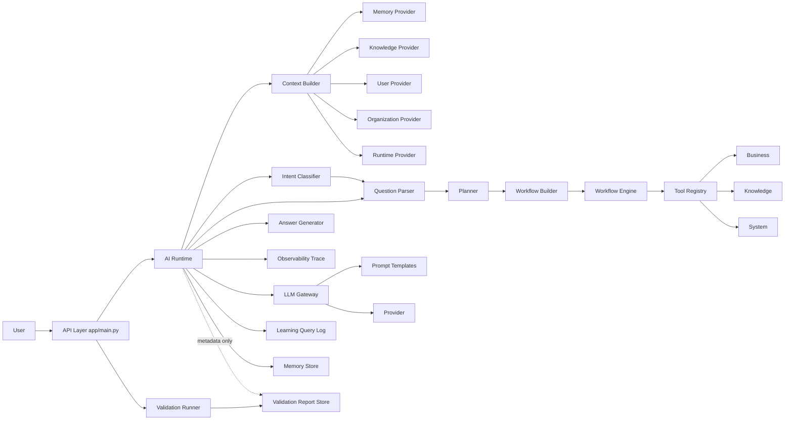
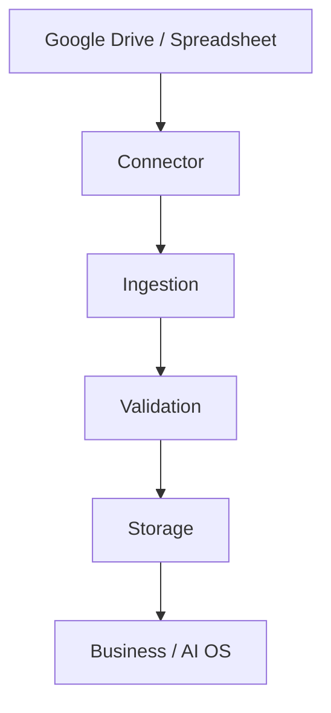
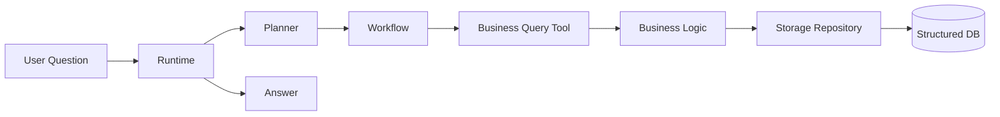
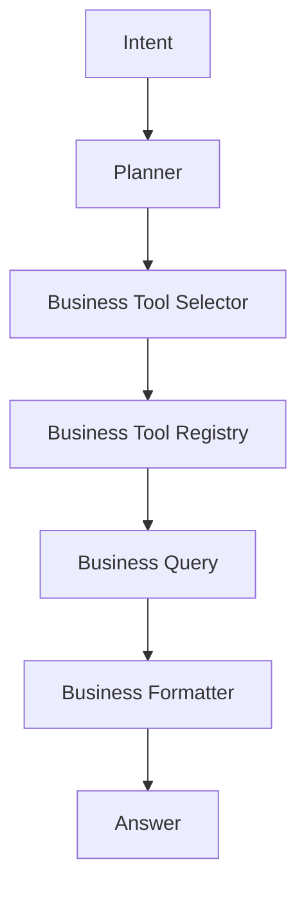
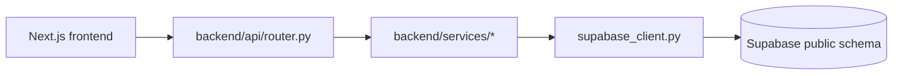

# LOGS AI Platform Architecture (Current)

> **⚠️ 2026-07-06 update — read this first.** `app/` (and the ~30
> top-level packages described in Sections 1–12 below — `database/`,
> `session/`, `config/`, `business/` [root], `system/`, `planner/`,
> `context/`, `intent/`, `question/`, `validation/`, `tools/`,
> `workflow/`, `answer/`, `observability/`, `ai/`, `prompts/`,
> `memory/`, `change_management/`, `self_awareness/`, `admin/`) **were
> deleted this session** (Section 14.14) — none of it exists in the
> repository anymore. `backend/main.py` (port 8000) is now the **only**
> running server; there is no longer a second server on port 8001.
> Sections 1–12 are kept as a historical record of the pre-deletion
> architecture (they explain *why* those layers existed and how they
> related to each other), but nothing in them describes current,
> running code. Of everything they list, only `knowledge/` (data files,
> not a live package import) and parts of `learning/` (see 14.10/14.14)
> survived, and both are now used by `backend/` instead. **For the
> actual current architecture, start at Section 13.**

> **Original scope note (pre-2026-07-06, kept for history):** This
> document describes the layered AI OS implemented in `app/main.py`
> (port 8001). The repository also contains a second, independent
> FastAPI application, `backend/main.py` (port 8000), which serves the
> Next.js frontend and hosts the real-data (Supabase) integration work
> for Home/Workspace/Reasoning. See
> [Section 13](#13-second-api-surface-backend-nextjs-facing) for its
> architecture. The two servers must not run on the same port; see the
> [README](../README.md#two-separate-servers-in-this-repository) for details.

## 1) Current Layer Inventory ⚠️ HISTORICAL — describes deleted `app/`-era code, see banner above

- Entry/API layer (`app/`)
- Data and database layer (`database/`, `data/`)
- Session layer (`session/`)
- Configuration layer (`config/`)
- Business domain layer (`business/`)
- Knowledge layer (`knowledge/`)
- System metadata layer (`system/`)
- Planner layer (`planner/`)
- Context layer (`context/`)
- Intent layer (`intent/`)
- Question Understanding layer (`question/`)
- Validation layer (`validation/`)
- Tool Registry layer (`tools/`)
- Workflow layer (`workflow/`)
- Answer layer (`answer/`)
- Observability layer (`observability/`)
- AI Runtime orchestration layer (`ai/runtime.py`)
- LLM Gateway layer (`ai/gateway.py`, `ai/providers/`, `prompts/`)
- Memory layer (`memory/`)
- Learning layer (`learning/`)
- Change Management layer (`change_management/`)
- Self-awareness layer (`self_awareness/`)
- Admin/monitoring layer (`admin/`)

## 2) Layer Responsibilities ⚠️ HISTORICAL (app/-era, deleted 2026-07-06)

- Entry/API layer
  - Exposes HTTP endpoints and validates request-level inputs.
  - Delegates to runtime or each dedicated layer API.

- Data and database layer
  - Imports Excel to SQLite, inspects schema, executes read-safe SQL.
  - Owns persistence concerns for ERP data.
  - Uses repository abstractions so storage backends can be swapped later.

- Session layer
  - Manages request-scoped session state for `session_id`, `user_id`, `organization_id`, and linked `trace_id` values.
  - Must remain separate from Memory.

- Configuration layer
  - Provides environment-specific runtime settings for dev, staging, and production.
  - Supports deployment metadata and cloud runtime preparation.

- Business domain layer
  - Executes sales/product/customer business logic and business routing.

- Knowledge layer
  - Provides glossary/company/brand knowledge retrieval.

- System metadata layer
  - Publishes logic registry and system map metadata.

- Planner layer
  - Produces plan steps from user message (rule-based).
  - Outputs tool-oriented steps for execution phase.

- Context layer
  - Aggregates question-specific context through provider contracts before planning.
  - Collects memory, knowledge, user, organization, and runtime context in one place.
  - Selects providers by rule-based priority before collecting context.
  - Must not execute business logic or update databases directly.

- Intent layer
  - Classifies what the user is asking for after context is assembled and before planning.
  - Uses rule-based intent types such as explain, search, ranking, compare, summarize, continue, generate, improve, and status.
  - Must not call business logic, update databases, or connect to external systems.

- Question Understanding layer
  - Extracts structured question fields such as metric, operation, entity_type, period, limit, and filters.
  - Runs after Intent and before Planner to improve deterministic tool selection.
  - Must stay rule-based and must not call LLM or execute business logic.

- Validation layer
  - Performs data-quality checks for Excel inputs and SQLite schema/row shape.
  - Produces validation reports for admin and runtime metadata reference.
  - Runs on admin operation, post-import, or periodic schedules, not per user question.

- Tool Registry layer
  - Registers executable tool definitions and dispatches by tool name.
  - Provides a stable execution contract for Workflow/Planner executor.

- Workflow layer
  - Builds workflow graph-like step payload and executes each step.
  - Delegates actual work to Tool Registry.

- Answer layer
  - Converts workflow results into readable response text.

- Observability layer
  - Captures trace records for runtime and layer execution.
  - Stores trace sessions for later retrieval through the API.
  - Must not alter business logic or knowledge content.

- AI Runtime orchestration layer
  - End-to-end orchestration: memory context, planning, workflow, answer, logging, memory write.
  - Handles stage-aware error response contract.

- LLM Gateway layer
  - Provider abstraction, prompt loading, provider-specific retry/timeout/auth handling.
  - Refines draft answer if provider is available.

- Memory layer
  - Stores and retrieves conversational context records.
  - Builds runtime context from related and recent memories.

- Learning layer
  - Stores query logs, feedback, improvement backlog and insights.
  - Focuses on quality/improvement management rather than dialog context.

- Change Management layer
  - Tracks change requests and lifecycle transitions.

- Self-awareness layer
  - Reports capabilities, limitations, recommendations, status metrics.

- Admin/monitoring layer
  - Aggregates usage/quality/improvement metrics for operators.

## 3) Inter-layer Dependencies ⚠️ HISTORICAL (app/-era, deleted 2026-07-06)

### High-level flow



### Direct code-level dependency highlights

- Runtime depends on Context, Intent, Question Understanding, Planner, Workflow, Answer, Gateway, Learning, Memory.
- Runtime depends on Observability for trace capture, but Observability must remain passive.
- Runtime references latest validation report metadata but does not run validation checks per request.
- Context depends on provider registry and provider contracts for Memory/Knowledge/User/Organization/Runtime sources.
- Context selection is rule-based and can be overridden explicitly by provider_names.
- Intent depends on rule-based classifier logic and can be overridden by explicit context if needed.
- Validation depends on importer/schema inspection and produces durable reports.
- Workflow Engine depends on Tool Registry, and Tool Registry depends on Business/Knowledge/System handlers.
- API layer currently exposes both end-to-end endpoint and layer-direct endpoints.
- API layer now exposes `POST /chat`, `GET /trace/{trace_id}`, `GET /health`, and `GET /version` as the cloud-facing entry surface.

## 4) Responsibility Overlaps (Current) ⚠️ HISTORICAL (app/-era, deleted 2026-07-06)

- End-to-end orchestration exists in two routes:
  - `/answer` endpoint executes plan/workflow/answer/log directly.
  - `/ai/chat` endpoint executes the runtime orchestration.
  - This is a functional overlap and can diverge over time.

- Planner execution overlap:
  - Planner has `create_plan` and also `execute_plan` path.
  - Workflow also executes steps through registry.
  - Two execution entry paths increase behavior drift risk.

- Learning vs Memory storage overlap:
  - Both store message/answer/intent-like fields.
  - Responsibilities are conceptually distinct, but data shape overlaps.

## 5) Potential Deviations From Intended Design ⚠️ HISTORICAL (app/-era, deleted 2026-07-06)

- API gateway bypass risk
  - Many layer-direct endpoints remain available, so callers can bypass Runtime orchestration contract.

- Runtime resiliency policy ambiguity
  - Gateway falls back to draft answer internally, while Runtime has stage-based error contracts.
  - This mixes silent fallback and explicit failure styles.

- Intent is accepted but Planner still keeps backward-compatible keyword fallback
  - Runtime passes classified intent into Planner, but Planner remains rule-based and keeps a message fallback path.
  - This is acceptable for current sprint goals, but architecture doc should state this explicitly.

## 6) Refactoring Candidates (Prioritized) ⚠️ HISTORICAL (app/-era, deleted 2026-07-06)

1. Unify orchestration entry
   - Make `/ai/chat` the single production orchestration path.
   - Keep `/answer` as compatibility wrapper calling Runtime, or deprecate.

2. Consolidate execution path
   - Decide one canonical executor path between `planner/executor.py` and `workflow/engine.py` for runtime use.
   - Keep the other as testing/debug utility only.

3. Formalize cross-layer contracts
   - Define shared schemas for Plan, Workflow step result, Runtime response, Memory record.
   - Reduce shape-conversion code in Runtime.

4. Separate operational logs and conversational memory more strictly
   - Keep Learning for quality lifecycle metadata.
   - Keep Memory for retrieval-ready conversation context only.
   - Add explicit mapping policy from log to memory to avoid schema drift.

5. Introduce dependency injection for registries/providers/stores
   - Avoid hidden globals and simplify deterministic testing.

## 7) Current Architecture Summary For Team Use ⚠️ HISTORICAL (app/-era, deleted 2026-07-06)

- The platform has transitioned from data-first API into layered AI orchestration.
- Runtime is now the integration point for context-aware chat execution.
- Context is a working table for each question and is not a replacement for Memory storage.
- Context Priority / Provider Selection determines which working sources are consulted first.
- Intent is the question-meaning layer between context and planning.
- Validation is a separate data-quality assurance lane and does not run for each chat request.
- Tool Registry is the abstraction boundary between orchestrators and executable business/knowledge/system tools.
- Learning and Memory are separated by intent, but should be further clarified by contract and lifecycle.
- Near-term architecture goal is reducing duplicate orchestration/execution paths while preserving existing APIs.

## 8) External Source and Storage Foundation (Sprint 29) ⚠️ HISTORICAL (app/-era, deleted 2026-07-06)

To prepare Google Drive / Spreadsheet and cloud DB integration, the platform now includes `connector/`, `ingestion/`, and `storage/` foundations.

- Connector layer abstracts external source APIs and file metadata contracts.
- Ingestion layer orchestrates source sync jobs and prepares handoff to validation/storage.
- Storage layer abstracts DB backend differences between SQLite and PostgreSQL.

Canonical data path:



Scope constraints in this sprint:

- Real Google API and OAuth are not enabled yet.
- PostgreSQL repository remains scaffold-level until production activation.
- Existing Business, Knowledge, Context, Intent, Planner, and Workflow responsibilities remain unchanged.

## 9) Source Registry Expansion (Sprint 30) ⚠️ HISTORICAL (app/-era, deleted 2026-07-06)

The ingestion layer now includes explicit source definitions for Google Drive preparation.

- `ingestion/source_registry.py` manages source metadata contracts.
- Initial sources include Logsys and sales-authored spreadsheet groups.
- Each source can define connector target, folder_id, file_pattern, data_category, and enabled flag.

Current first-target categories:

- Logsys data sources
- Sales data sources

Future extension candidates (excluded in Sprint 30):

- Mail attachments
- PDF files
- Google Docs
- Proposal document workflows

Data handling policy:

- GitHub stores code and docs only.
- Real datasets stay in Google Drive and cloud storage backends.

## 10) Theme 24 Production UI Target ⚠️ HISTORICAL (app/-era, deleted 2026-07-06)

### Product Direction

- End user UI target is Next.js and React.
- Streamlit is debug-only for developers/operators.
- Runtime and domain layers remain UI-independent.
- Frontend and backend APIs are separated.

### Target Screen Set

- Home: today actions, alerts, project summary, recommended actions.
- Chat: response, references, generated outputs, next actions.
- Tasks: recommendation, due date, priority, status.
- Proposal Builder: customer selection, objective, internal/external references, structure, PPTX draft.
- Documents: draft and approval-oriented transaction UI.
- History: execution, generated output, approvals, feedback.
- Admin/Debug: intent/meaning/knowledge/memory/capability/validation traces and runtime logs.

### MVP Scope

- Home
- Chat
- Tasks
- Proposal Builder
- History
- Debug Trace Panel
- Documents is design-first (draft contract prepared, full UX later)

### API Surface for Frontend

- POST /api/chat
- POST /api/tasks/recommend
- POST /api/proposals/draft
- POST /api/documents/draft
- GET /api/history
- GET /api/executions/{id}
- GET /api/evaluation/summary
- GET /api/debug/trace/{id}

### Evaluation Connection from UI

Persist each UI operation as an evaluation event:

- user_input
- ai_response
- intent
- task
- capability
- validation
- user_feedback
- accepted_or_rejected
- corrected_output

This enables automatic transformation from production behavior logs into future regression suites.

## 11) Storage-to-Business Query Runtime Path (Sprint 31) ⚠️ HISTORICAL (app/-era, deleted 2026-07-06)

For user questions, the runtime path now prioritizes structured data in Storage through Business layer access.

- Storage acts as the query-time structured data store.
- Business layer reads Storage through repository interfaces.
- Runtime/Planner must not embed SQL logic.
- User-time requests must not directly call Google Drive.
- Google Drive remains an ingestion sync origin only.

Runtime query-time chain:



## 12) Business Tool Registry Layer (Sprint 33) ⚠️ HISTORICAL (app/-era, deleted 2026-07-06)

Business capabilities are now managed through a dedicated selector/registry pair inside the business domain.

- Planner asks Business Tool Selector to choose a business tool.
- Business Tool Registry resolves tool metadata and handler.
- Selected business tool executes Business Query functions that read via repository abstractions.
- Formatter converts deterministic business outputs to user answers without requiring LLM for supported cases.



## 13) `backend/` — the Sole Running Application (Next.js-facing)

> Originally titled "Second API Surface" back when `app/` (port 8001)
> was still the primary system. As of 2026-07-06 (Section 14.14),
> `app/` and everything Sections 1–12 describe were deleted — `backend/`
> is now the only server in this repository.

`backend/` is a FastAPI application (`backend/main.py`, port 8000). It
serves the Next.js frontend (`frontend/`) and carries all real-data
integration work (Supabase `public` schema).

### 13.1 Directory Inventory

- `backend/api/` — route definitions. `router.py` mounts business/project
  routes under the `/api` prefix; `capability_router.py` mounts the
  Capability REST API separately under its own `/capabilities` prefix;
  `governance_router.py` mounts the minimal Governance Queue API under its
  own `/governance` prefix. All three are registered in `backend/main.py`.
- `backend/business/` — business-rule helpers specific to the frontend
  surface (`today_actions.py`, `evaluation_rules.py`). Distinct from the
  top-level `business/` package used by `app/`.
- `backend/domain/` — domain model for projects (`project.py`), consumed by
  `services/project_service.py`.
- `backend/services/` — the bulk of backend logic:
  - `supabase_client.py` — connection handling for the shared production
    Supabase `public` schema (PostgreSQL).
  - `data_providers.py` — real Supabase-backed data access (sales,
    customers, products).
  - `reasoning_pipeline.py` — the Fact/Interpretation/Hypothesis/Knowledge-
    Candidate reasoning flow (Phase 8–13 work); reads real data through
    `supabase_client`. Not yet wired through the Capability framework (see
    13.5).
  - `evidence_integration.py`, `evidence_interpreter.py` — supporting
    evidence-handling logic for the reasoning pipeline.
  - `knowledge_loader.py`, `knowledge_registry.py`, `semantic_registry.py` —
    knowledge/semantic lookups specific to this surface (separate from the
    top-level `knowledge/` package).
  - - `capability_instance.py` — the single shared `CapabilityRegistry`
    instance used by both `capability_router.py` and any business logic
    that wants its work tracked as a Capability (e.g.
    `project_service.py`, `reasoning_pipeline.py`). Import `registry` from
    here rather than constructing a new `CapabilityRegistry()` — a previous
    bug had `capability_router.py` construct its own, disconnected
    instance. Also persists execution history to
    `backend/data/capability_executions.jsonl` and replays it on startup,
    so success_rate/execution history survive process restarts (the base
    `CapabilityRegistry` class is in-memory-only by design).
  - - `project_service.py` — builds project state from real `purchase_orders`
    data. `build_project_aggregate` is recorded as a Capability execution
    (`project_aggregate_analysis`) via `capability_instance.registry`.
  - `governance_store.py` — minimal Governance Queue (Phase D-1): durable
    JSONL-backed proposal/approval/audit records
    (`backend/data/governance_approvals.jsonl`,
    `governance_audit.jsonl`). See 13.5 for scope/limitations.
  - `mock_store.py` — **intentional mock implementation** backing several
    endpoints that have not yet been migrated to real data (see 13.3).
- `backend/connectors/`, `backend/runtime/` — currently placeholder
  packages (`__init__.py` only); reserved for future connector/runtime
  abstractions on this surface.
- `backend/scripts/` — one-off / demo scripts (e.g.
  `seed_logisys_demo.py`).

### 13.2 Route Inventory (re-verified 2026-07-11, all routers)

> **2026-07-11 review note:** the table below replaces the previous
> version, which was last manually verified 2026-07-04 and had drifted
> significantly out of date (e.g. it still listed `POST /api/chat` as
> `mock_store.consult`, a full session before 14.21 replaced it with
> `chat_agent.answer()`, and it only covered `backend/api/router.py`,
> missing the four routers added since:  `auth_router.py`,
> `integrations_router.py`, `learning_router.py`, and the Governance
> API detail). As before: **re-verify this table whenever any router
> file changes** — it is a manual read of the source, not an automated
> check, and it will drift again if not kept current alongside the code.

**`backend/api/router.py`** (`/api` prefix)

| Route | Backing | Status |
|---|---|---|
| `GET /api/health` | `services.status_reporting.get_health` | real (live Capability/Governance registry state) |
| `GET /api/home` | `business.today_actions.get_home_payload` | real (Supabase) |
| `POST /api/chat` | `services.chat_agent.answer` | real; Function-Calling via `tool_registry.py` (14.21). Tracked as Capability `chat_conversation` with its own `trace_id`, retrievable via `GET /api/debug/trace/{id}` — added 2026-07-11 (14.79), see 13.5. |
| `POST /api/reasoning` | `services.reasoning_pipeline.reason` | real (Supabase); tracked Capability `business_question_reasoning`; deliberately left as the fixed Q1-Q6 verification surface (14.13, 14.21) |
| `GET /api/knowledge/documents` | `services.knowledge_loader.load_documents` | real (local knowledge files); no frontend caller as of 14.13, still true 2026-07-11 |
| `GET /api/knowledge/registry` | `services.knowledge_registry.get_registry` | real (local knowledge files); no frontend caller as of 14.13, still true 2026-07-11 |
| `POST /api/proposals/draft` | `services.proposal_generation.draft_proposal` | real (Claude API, grounded in real internal purchase-order history) |
| `GET /api/history` | `services.status_reporting.get_history` | real (merges Capability execution history + Governance decisions) |
| `GET /api/executions/{id}` | `services.status_reporting.get_execution` | real; no frontend caller as of 14.13, still true 2026-07-11 |
| `GET /api/evaluation/summary` | `services.status_reporting.get_evaluation_summary` | real; no frontend caller as of 14.13, still true 2026-07-11 |
| `GET /api/debug/trace/{id}` | `services.trace_store.get_trace` | real (Supabase-backed since 14.23/14.24, was JSONL) |
| `POST /api/events` | `services.status_reporting.store_event` | real |
| `GET /api/projects`, `GET /api/projects/{id}`, `GET /api/projects/{id}/trace` | `services.project_service.ProjectService` | real (Supabase `purchase_orders`); tracked Capability `project_aggregate_analysis`; `{id}` response also includes `production` (14.18) and same-PO `products` (14.77) |
| `GET /api/today-actions` | `business.today_actions` | real (Supabase) |
| `GET /api/proposals/images/{trace_id}/download` | `services.llm_client` generated image | real (OpenAI `gpt-image-1`, 14.6) |
| `GET /api/products`, `GET /api/products/{id}` | `services.product_service` | real (Supabase); server-side search + pagination (14.54) |

**`backend/api/auth_router.py`** (`/api/auth` prefix, added 14.22) — `POST /login`, `POST /logout`, `GET /me`: real, Google Identity Services + `staff` table verification.

**`backend/api/integrations_router.py`** (`/api/integrations` prefix, added 14.27) — Gmail/Slack OAuth connect/callback/status/disconnect: real (search/reference-only Phase 1, 14.27).

**`backend/api/learning_router.py`** (`/api/learning` prefix, added 14.10) — `GET /center`, `POST /approval-queue/{id}/review`: real, thin pass-through to `learning/service.py`.

**`backend/api/governance_router.py`** (`/governance` prefix, added Phase D-1) — `GET /queue`, `GET /{id}`, `POST /{id}/decide`, `GET /{id}/audit`: real. `decide()` requires `Depends(require_admin)` and uses the session's verified email as `approver_id` (14.22) — see the corrected 13.5 note below; this was still marked "no auth" in the pre-2026-07-11 version of this document.

**`backend/api/capability_router.py`** (`/capabilities` prefix) — unchanged since Phase A, still real.

**`backend/api/document_formats_router.py`** (`/document-formats` prefix, Phase G-2) — unchanged, still real (Supabase Storage-backed since 14.23).


### 13.3 Real vs Mock Boundary

`backend/services/mock_store.py` **no longer exists** (removed
2026-07-05) — every endpoint it used to back is now real:
`chat` → `reasoning_pipeline.reason` (Phase F), `tasks/recommend` →
`status_reporting.recommend_tasks` (Phase F), `proposals/draft` →
`proposal_generation.draft_proposal` (Phase G-3, LLM-backed), and
`documents/draft` was removed entirely in favor of the `/document-formats`
API (Phase G-2). `health`, `history`, `executions`, `evaluation/summary`,
and `events` were migrated to `services/status_reporting.py` (real, backed
by the Capability/Governance data built in Phases A–D) on 2026-07-04; the
`events` function turned out to already be real (writing to
`backend/data/events.jsonl`) and was simply misplaced. `debug/trace` was
migrated to `services.trace_store` on 2026-07-04 (Phase B).

As of 2026-07-05, there is no mock-backed endpoint left in `backend/`.

The remaining 4 mock functions are a deliberate placeholder boundary, not
an oversight — see 13.6 for why each one needs actual design work before
it can be "just" made real. This table is the fastest way to check what
remains mock at any point in time.

### 13.4 Data Flow (real-data path)



### 13.5 Blueprint Constitution Integration Status (backend/)

`docs/blueprint/AI_OS_BLUEPRINT_v0.2_DRAFT.md`'s 12-principle AI Constitution
was found (2026-07-04 audit) to be largely *not* wired into `backend/`,
despite being partially proven out in `app/`. Work to close this gap is
tracked here rather than only in commit messages, since this table is the
fastest way to check current status without re-auditing from scratch.

| Principle | Status in `backend/` | Notes |
|---|---|---|
| 2, 4, 5, 12 (Capability Driven) | Done | `capability_router.py` is mounted and reachable (Phase A). Every real endpoint in `backend/` is a tracked Capability execution via the shared registry in `services/capability_instance.py`: `project_aggregate_analysis` (Phase C-1), `business_question_reasoning` (Phase C-2), `document_format_structure_inference` and `document_generation` (Phase G-2), and `proposal_draft_generation` (Phase G-3, 2026-07-05). `mock_store.py` no longer exists (see 13.3) — there is no mock-backed endpoint left. |
| 6, 10 (Transparent AI / Trace Everything) | Done for `ProjectService` and `reasoning_pipeline` | Both generate and persist a `trace_id` to `backend/data/traces.jsonl`, retrievable via `GET /api/debug/trace/{id}` (Phase B, extended in Phase C-2). |
| 3, 5 (Human Governed / Governed Learning) | Mostly done | Phase D-1 added a minimal Governance Queue (`services/governance_store.py`, `/governance` API): `reasoning_pipeline.py`'s Phase 13 knowledge candidates and `document_formats.py`'s structure-inference proposals submit for review, and a human must call `POST /governance/{id}/decide` (approve/reject + reason) before anything is considered approved — durably audited (`backend/data/governance_approvals.jsonl`, `governance_audit.jsonl`, migrated to Supabase in 14.24). Phase G-1 (2026-07-05) implemented the Blueprint Chapter 11 Approval Levels table's auto-approval rule: `submit_proposal(..., governance_level=...)` auto-approves only when `governance_level == "low"` and `confidence_score > 0.85` (`AUTO_APPROVE_THRESHOLD`); `medium`/`high`/`admin_approved_required` always require manual review regardless of confidence, matching the Blueprint table exactly. **Approver authority checks are now implemented** (14.22, 2026-07-06): `governance_router.decide()` and `learning_router.review_approval()` both require `Depends(require_admin)`, and use the session's Google-verified email as `approver_id` rather than trusting a client-supplied field (the `approver_id` request field was removed from both Pydantic models entirely, not just ignored) — this corrects an earlier version of this table, which said "no auth" past the point that was true. Still NOT implemented: PolicyRule creation/activation/rollback — approving a proposal here does not automatically edit any `knowledge/` file; that "apply the rule" step is still manual by design (see `governance_store.py` module docstring). |
| 2, 6, 10 (Capability Driven / Transparent AI / Trace Everything) — `chat` specifically | Fixed 2026-07-11 (14.79) | 14.21 replaced `/api/chat`'s backing with `chat_agent.answer()` but did not carry over the `trace_id` generation + `capability_instance` execution tracking that `reasoning_pipeline.reason()` already had — meaning the single most-used feature (daily "相談" use, vs. `/api/reasoning`'s verification-only use) was invisible to `GET /api/debug/trace/{id}` and untracked as a Capability, for the roughly five weeks between 14.21 (2026-07-06) and this fix. `chat_agent.answer()` now registers a `chat_conversation` Capability (`services/capability_instance.py`) and issues a `chat-{uuid}` trace_id per turn, following the exact same pattern as `reasoning_pipeline.reason()`. |
| 7, 9 (No Silent Learning / Explain Before Remember) — `chat` specifically | Fixed 2026-07-12 (14.80) | The Learning-feedback loop 14.20 built for `reasoning_pipeline` (recording `unknown`/gap observations as `AI_OBSERVATION` Learning candidates) had not been added to `chat_agent` as of 14.79 — `chat`'s tool-based flow doesn't have a single `unknown` field the way the fixed Q1-Q6 patterns do. 14.80 implemented a `chat`-appropriate equivalent instead of a direct port: `chat_agent._record_tool_gaps_as_learning` inspects the raw output of every tool call made during a turn for `status: "unavailable"`/`"error"` (a signal `tool_registry.execute_tool` already produced) and records each distinct one as an `AI_OBSERVATION` Learning candidate, same dedup/auto-apply/best-effort semantics as `reasoning_pipeline`'s version. |

Remaining candidate work:
- See 13.6 for the 4 mock endpoints still remaining after Phase E's
  reduced scope (2026-07-04), and why each needs real design work first.
- If/when needed: approval levels + auto-approve thresholds, PolicyRule
  versioning/rollback, and approver authority validation for the
  Governance Queue (Phase D-1 intentionally deferred all of these).

### 13.6 Remaining Mock Endpoints (Phase E/F, updated 2026-07-04)

Phase E was scoped down mid-implementation once it became clear the 9
mock-backed endpoints split into two very different kinds of work: some
were pure data-plumbing (reuse infrastructure already built in Phases
A–D), others need real product/business design. Phase F then tackled two
of the "real design" cases after all, once investigation showed the
design work was smaller than expected.

**Done (all backed by real Supabase/Capability/Governance data):**
- `health`, `history`, `executions/{id}`, `evaluation/summary`, `events` —
  moved to `services/status_reporting.py` (Phase E).
- `POST /api/chat` — now a thin wrapper around
  `reasoning_pipeline.reason()` via a new `to_chat_response()` adapter,
  replacing `mock_store.consult()`'s hardcoded 4-project demo dataset. A
  new `_q5_project_lookup` pattern was added to `reasoning_pipeline.py`
  to cover project/customer-name lookup (what `consult()` used to do)
  using the real `customer_master`/`projects` datasets via
  `LogsysProvider` (Phase F). This also surfaced and fixed a
  `"logisys"` vs `"logsys"` provider-name typo that had been silently
  breaking `sales_lines`/`purchase_lines`/etc. evidence fetches in
  `data_providers.py` and `evidence_interpreter.py`.
- `POST /api/tasks/recommend` — now aggregates real `ProjectAction`
  recommendations across projects via `ProjectService`
  (`services/status_reporting.recommend_tasks`), replacing
  `mock_store.recommend_tasks()`'s 3 hardcoded demo tasks (Phase F).
- `POST /api/proposals/draft` — now generates real LLM-backed (Claude
  API) proposal text grounded in real internal history, via
  `services/proposal_generation.py` (Phase G-3, 2026-07-05). See 14.5
  for what this does and doesn't cover, and the scope decision behind it.
- `POST /api/documents/draft` — removed entirely (not migrated in place);
  superseded by the `/document-formats` API (Phase G-2), which solves the
  same underlying need (customer-specific document generation) for real.

**Nothing is mock anymore.** `backend/services/mock_store.py` was deleted
2026-07-05 once its last two functions (`draft_proposal`,
`draft_document`) were superseded. Every endpoint in `backend/api/` is
now backed by real Supabase data, a real LLM call, or both.

## 14) app/ vs backend/ Duplication — Investigation and Decision (2026-07-04)

### 14.1 Investigation

Prompted by the Blueprint work above, `app/` (the original layered AI OS,
port 8001) was checked against `backend/` (port 8000) for whether the
duplication identified earlier in this document (separate `business/`,
`services/`, `domain/`, `ProjectService` at repo root vs under `backend/`)
still matters in practice. Three checks, in order of decisiveness:

1. **Commit history:** `app/`'s last commit (`60916d6`, 2026-07-01) is
   titled "complete Sprint 2 walking skeleton and prepare product
   review." Every commit since then — 19 in a row as of this writing —
   touches only `backend/` (or docs). `app/` has not participated in any
   of the real-data migration or Blueprint work described in this
   document.
2. **Frontend wiring (decisive):** `frontend/lib/api-client.ts` and
   `frontend/hooks/use-product-event.ts` both default
   `NEXT_PUBLIC_API_BASE` to `http://localhost:8000` — `backend/`'s port.
   A full search of `frontend/` for `8001` (`app/`'s port) returns zero
   matches. The real, user-facing Next.js frontend never talks to `app/`.
3. **Streamlit:** README states Streamlit is debug-only, never production
   UI. The actual Streamlit app lives under `reference/03_application/`
   (last touched 2026-06-30, a single "initialize product foundation"
   commit), not under `app/` — another indicator that `app/` isn't the
   locus of any current usage.

**Conclusion:** `app/` is a frozen reference implementation, not an
active production surface. `backend/` is where real usage and real
development both happen.

### 14.2 What app/ has that backend/ doesn't: a self-improvement loop

Before treating this as "just delete `app/`," its `learning/` (10 files,
1126 lines) and `change_management/` (193 lines) packages were reviewed,
since they implement something `backend/` genuinely lacks: a
propose-review-approve loop for the AI system's *own* behavior, not just
for business-rule knowledge candidates (which is what Phase D-1's
`governance_store.py` handles).

- `learning/query_log.py` + `feedback.py` + `classifier.py` +
  `improvements.py` log questions/answers, collect feedback, classify
  issues, and turn recurring issues into "improvement" proposals.
- `learning/improvements.py` hands each improvement to
  `change_management.repository.create_change_request(...)`, which
  tracks it through a draft → review → approved → implemented → validated
  → released lifecycle (`change_management/lifecycle.py`).
- Both are in-memory only (`_IMPROVEMENTS`, `_CHANGE_REQUESTS` module-level
  lists) — the same "MVP, no persistence" pattern this document already
  flagged and fixed twice this session (`trace_store.py` for traces,
  `capability_instance.py`'s persistence hook for Capability execution
  history). No reason to believe `change_management/`'s persistence gap
  is any less real, or that it has been exercised recently given `app/`'s
  3-day-frozen status.

**This is conceptually distinct from Phase D-1's Governance Queue.**
`governance_store.py` approves *business-rule knowledge candidates*
(e.g. "which date column should 'this month's sales' use"). `learning/` +
`change_management/` approve *changes to the AI system's own code/logic*
in response to observed usage problems. Both are legitimate and both
matter — they are not the same feature under two names.

### 14.3 Decision: rebuild in backend/, do not port app/'s code as-is

Rationale (discussed with Noritsugu 2026-07-04):

1. Porting unverified, 3-day-frozen code would reintroduce exactly the
   class of bug this session spent most of its time fixing (silent typos,
   dead code, unpersisted state) — see the `"logisys"`/`"logsys"` typo
   (13.6) and the pre-Phase-A dead `get_home_payload`/`get_trace` in
   `mock_store.py` as concrete examples from *today alone*.
2. Maintaining two parallel self-improvement systems (one for `app/`, a
   new one for `backend/`) would recreate the same duplication problem
   this document exists to track and resolve.
3. The Blueprint groundwork for tiered approval already exists and is
   unused: `capability/domain.py`'s `GovernanceLevel` enum
   (`LOW`/`MEDIUM`/`HIGH`/`ADMIN_APPROVED_REQUIRED`) is already a field on
   every registered `Capability`, but Phase D-1's `governance_store.py`
   deliberately ignored it, routing every proposal through a single
   manual-approval path regardless of level. Wiring `submit_proposal` to
   branch on `GovernanceLevel` (auto-approve `LOW` + high confidence,
   require human review otherwise) reuses what's already there instead of
   porting `app/`'s parallel machinery.

**`app/` itself is a deletion candidate**, pending nothing further than
archiving this investigation (done, here) — no code from it should be
copied into `backend/` verbatim.

### 14.4 Phase G (done 2026-07-05): tiered Governance + document formats

Implemented across two sessions:

**Phase G-1 — tiered Governance approval.** `governance_store.submit_proposal`
now accepts `governance_level` (a `capability.domain.GovernanceLevel` value)
and implements the Blueprint Chapter 11 Approval Levels table's
auto-approval rule exactly: `governance_level == "low"` and
`confidence_score > AUTO_APPROVE_THRESHOLD` (0.85) auto-approves
immediately (full audit trail entry, actor `system:auto-approved`);
anything else — regardless of confidence — lands in the manual
`QUEUED_FOR_REVIEW` queue, matching the Blueprint table's "Auto-Approve?
NO" for MEDIUM/HIGH/ADMIN_APPROVED_REQUIRED.

**Phase G-2 — real `documents/draft`, replacing the mock.** After
discussion with Noritsugu (2026-07-05) distinguishing the two mock
endpoints by what they actually need:
- `proposals/draft` (customer-facing sales proposals: internal history +
  external trend research + customer research + images + illustrations +
  copy) genuinely needs full generative AI infrastructure that doesn't
  exist in this codebase — deferred, see 14.5.
- `documents/draft` (customer-specific delivery-note-style documents:
  map internal data + user-supplied data like invoices/packing
  lists/shipping details onto a customer-provided Excel format) is a
  structured-mapping problem, not a free-text-generation problem — a
  good fit for this codebase's existing Provider/Capability/Governance
  patterns rather than new LLM infrastructure.

`documents/draft` was implemented as a new `/document-formats` API
(`services/document_formats.py`, `api/document_formats_router.py`),
covering the 8-step flow Noritsugu described:

1. **Upload** (`POST /document-formats`, multipart: name + .xlsx file) —
   stores the template under `backend/data/document_templates/`.
2. **AI infers structure** (`infer_structure()`): a heuristic scans every
   text cell; if the cell to its right (preferred) or below is empty,
   that empty cell is guessed as the input target for that label.
   Labels ending in "："/":" score higher confidence (0.7 vs 0.5) — a
   real, useful signal, not a guarantee (e.g. a title cell like "納品書"
   with an empty cell to its right also gets flagged, at the lower
   confidence, precisely so a human catches it in review rather than the
   system silently trusting it).
3. **Human confirms via Governance, once, for the whole template** — not
   per-field. `create_format()` submits a *single* proposal containing
   the entire field-mapping list as `ai_hypothesis` (JSON), at
   `governance_level="medium"` (`DOCUMENT_FORMAT_CAPABILITY`) — this is
   deliberately never auto-approvable regardless of confidence, since a
   wrong structural guess could misplace real business data in every
   future document generated from it.
4. A format's status is never stored redundantly: `get_format`/
   `list_formats` resolve status live from `governance_store` by
   `governance_approval_id` — there is exactly one place a format's
   approval state lives.
5. **Generation** (`POST /document-formats/{id}/generate`) merges real
   internal data — via `ProjectService.build_project_aggregate`, mapped
   from Japanese field labels to `ProjectData` attributes through an
   explicit, small `_INTERNAL_FIELD_MAP` (unmapped labels are simply not
   auto-filled, never guessed) — with user-supplied `user_data`, which
   takes precedence on overlap. Verified against real Supabase data
   2026-07-05: a real project's actual `顧客名` was correctly
   auto-filled, while `出荷日` correctly stayed empty (in
   `missing_fields`) for a project whose delivery hadn't actually
   happened yet (`actual_delivery_date` was `None`) — the system did not
   fabricate a plausible-looking date.
6. Generation is refused outright (`ValueError` → HTTP 400) for any
   format not in `APPROVED` status — you cannot generate real documents
   from an unconfirmed structural guess.
7. Each generation is tracked as a `document_generation` Capability
   execution (`governance_level="low"`, no per-generation approval
   needed — the risky part, structure inference, was already gated once
   at step 3; mechanically repeating an approved structure is routine).
8. **Reuse** (step ⑦ in Noritsugu's flow): `GET /document-formats`
   lists all formats with live-resolved status by name — an approved
   "フォーマットA" is simply reusable via its `format_id` going forward.
   Adding "フォーマットB, C, D..." (step ⑧) requires no further design —
   each is just another call to step 1.

Not implemented in this pass: natural-language ("via chat") input for
step ③ — only structured JSON `user_data` is supported; parsing
free-form chat instructions or uploaded invoice/packing-list *files*
(as opposed to pre-structured JSON) is future work.

### 14.5 Phase G-3 (done 2026-07-05): `proposals/draft` text-only v1

The full scope described in 14.4 (internal history + external
trend/customer research + image sourcing/illustration + composed prose)
was confirmed to need real generative AI infrastructure this codebase
didn't have. Rather than deferring the whole thing, it was split:

**Built (`services/llm_client.py` + `services/proposal_generation.py`):**
- `llm_client.py` — the first LLM integration anywhere in this codebase.
  A thin wrapper around the `anthropic` Python SDK; requires
  `ANTHROPIC_API_KEY` in `.env` (not committed — verify with
  `Select-String -Path .env,config\*.toml -Pattern "ANTHROPIC|API_KEY"`
  before assuming it's missing, and never paste the key value into chat
  or commit it).
- `proposal_generation.draft_proposal(customer, purpose)` — gathers real
  internal purchase-order history for the customer, then asks Claude
  (`claude-sonnet-4-5`) to draft a 4-section proposal (顧客の課題 /
  提案内容 / 期待される効果 / 実行計画) grounded in that history. The
  prompt explicitly instructs the model not to state external-trend or
  invented facts as certain, and to mark anything not in the supplied
  history as "要確認."
- Tracked as capability `proposal_draft_generation`
  (`governance_level="high"`) — per the Blueprint Chapter 11 table, HIGH
  never auto-approves regardless of confidence, so every draft lands in
  the manual Governance queue before it's considered sendable.
- `/api/documents/draft` (the mock) was removed outright rather than
  migrated in place, since `/document-formats` (Phase G-2) already solves
  the same underlying need for real. `mock_store.py` itself was deleted
  once both of its remaining functions were superseded — there is no
  mock-backed endpoint left anywhere in `backend/`.

**Bug found and fixed the same day, via real end-to-end testing:** the
first version of `_gather_internal_history()` called
`LogsysProvider().fetch(...)` directly instead of routing through
`fetch_required_data` → `integrate_evidence` → `interpret_evidence` (the
pipeline `reasoning_pipeline.py` and `_q5_project_lookup` already use).
That bypassed `evidence_integration.py`'s `_dedupe_records()` step, so a
real test surfaced ten identical "20211203US発注分" lines in the LLM
prompt where 5 *distinct* recent orders were expected. **Lesson
reinforced (same pattern as the `"logisys"`/`"logsys"` typo in Phase F):
new code that needs data another part of the codebase already fetches
correctly should call *that* code, not re-implement a parallel fetch path
— even a well-intentioned "just call the Provider directly, it's
simpler" shortcut silently drops whatever correctness logic lives in the
layer being skipped.** Fixed by routing through the shared pipeline;
verified against real Supabase data that the same customer's history now
shows 5 distinct orders with an explicit "重複排除後" (post-dedup) note.

**Explicitly NOT implemented (deferred, not forgotten):** external
trend/customer research (would need web-search tool access), image
sourcing or illustration generation (would need an image-generation
tool), and any UI/workflow for a human to *edit* a draft before
approving it (today's Governance `decide()` is binary approve/reject with
a text reason, not an edit-and-resubmit loop).

**Update, same day:** external trend research and image sourcing were in
fact added a few hours after this section was first written — see 14.6.
The "explicitly NOT implemented" list above is kept as a historical record
of the original scope decision; it is no longer fully accurate as a
statement of current capability.

Also still pending from 14.3/14.4: designing (not porting) a
`backend/`-native equivalent of `learning/`'s query-log → feedback →
improvement loop, and revisiting deletion of `app/`,
`reference/03_application/`, and the root-level `business/`/`services/`/
`domain/` packages once the above lands.

### 14.6 Same-day extension: web search, image generation, and frontend
verification (2026-07-05)

**Web search (`include_external`).** `services/llm_client.py` gained
`generate_text_with_web_search()`, using Claude's server-side
`web_search_20250305` tool. Wired to `ProposalDraftRequest.include_external`
(a field that existed in the schema since Phase E but was silently
ignored until now). Cited URLs are returned separately
(`external_sources: list[str]`) rather than trusted from the prose, so a
human reviewer can see exactly what was searched.

**Image generation (`include_image`).** A new `generate_image()` in
`llm_client.py` calls OpenAI's `gpt-image-1`. **Finding via real testing:**
unlike the older DALL-E 3 API, `gpt-image-1` returns `b64_json`
(base64-encoded bytes), not a `url` — `response.data[0].url` is `None`.
The function decodes and writes the image to
`backend/data/generated_proposal_images/{trace_id}.png` and returns only
the file path; the base64 string itself is never passed around or logged
(it's enormous — a single response pasted into a terminal produced a
multi-thousand-line block). New endpoint:
`GET /api/proposals/images/{trace_id}/download`. Image generation
failure never blocks the text draft (best-effort, wrapped in try/except).

Both features required new API keys (`ANTHROPIC_API_KEY`,
`OPENAI_API_KEY`) added to `.env` (gitignored). Both are real, metered,
paid API calls — verify a key isn't already present
(`Select-String -Path .env,config\*.toml -Pattern "ANTHROPIC|OPENAI|API_KEY"`)
before assuming one needs to be obtained.

**Frontend verification.** With both `backend/` (port 8000) and
`frontend/` (port 3000, `npm run dev`) running, four pages were confirmed
working end-to-end against real data: `/chat` (correctly returned
"468件見つかりました" with distinct 5-sample project cards for a
customer-name query — matching the Phase F dedup fix), `/tasks` (real
`ProjectAction` cards, though dominated by the known "仕入先へ納期急ぎ連絡"
pattern from `KNOWN_ISSUES.md` #8), and `/reasoning` (full
Intent→...→Phase 13 four-layer display working for an in-pattern
question; correctly showed `判定: 回答不可` with a helpful hint for an
out-of-pattern free-form question — this is the reasoning_pipeline
limitation already documented in 13.6/14.4, now visually confirmed).

**`/proposals` ("資料作成") was found to be a disconnected UI shell** —
its "AIで資料作成" button had no `onClick` handler at all, and "過去に
作成した資料" rendered from `frontend/lib/mock-data.ts`, unrelated to any
real Governance history. This was likely built before `backend/`'s real
`proposals/draft` existed and never wired up afterward. Fixed same
session: added `draftProposal()` / `getProposalImageUrl()` to
`frontend/lib/api-client.ts`, added a customer-name field and
external-search/image-generation checkboxes to the page, and connected
the button to `POST /api/proposals/draft`, following the same
loading/error/result-state pattern already used by `/chat`. Verified with
a real end-to-end run (customer "ビームス", both checkboxes on): correct
`QUEUED_FOR_REVIEW` status text, a substantive multi-section draft
grounded in both real internal history (152 deduped past orders) and 5
real cited URLs, and a real generated image rendered inline via the new
download endpoint.

**Not yet checked:** `/history` (confirmed to have no `fetch` call at
all — likely also disconnected, not yet investigated), `/workspace`,
`/debug`, `/learning`, `/walking-skeleton`. A full frontend audit (which
pages are real vs. decorative) is worth doing before assuming any
unverified page works.

## 14.7 Document-formats becomes fully usable in-app; image generation
disabled (2026-07-05, continued)

Four related changes, made after Noritsugu pointed out `/proposals`'
image-generation checkbox should be removed (business decision: users
should use their own generative-AI tools individually, not this
platform) and that the upload-only `/document-formats` UI wasn't
actually a complete, self-contained flow.

**Image generation disabled, not deleted.** `draft_proposal`'s
`include_image` parameter now does nothing — `image_path` is always
`None` regardless of what's passed. `generate_image()` in
`llm_client.py` and `GENERATED_IMAGES_DIR` are left in place for
possible future re-enablement. The frontend checkbox was removed
entirely (`/proposals` only offers `外部調査（Web検索）も行う` now).

**`/document-formats` given a complete, self-contained UI** inside the
`資料作成` (`/proposals`) page — upload, list, Governance
approve/reject, and generate were previously only reachable via
`curl`/PowerShell:
- Upload form (name + generic file input — deliberately not restricted
  to `.xlsx` client-side, so widening backend format support later needs
  no frontend change) with a real success/failure message and a
  `key`-based reset trick to visibly clear the file picker after a
  successful upload (browsers don't clear a native file input's displayed
  name just because the underlying React state was reset).
- **In-app approve/reject buttons**, calling the same
  `POST /governance/{id}/decide` endpoint that was previously only
  reachable outside the app. Explicitly **not** a real authorization
  system: `approverId` is hardcoded to `"u-demo"` client-side, and the
  backend still accepts any `approver_id` (`docs/architecture.md` 13.5's
  known gap, unchanged today — this only makes that gap reachable via a
  one-click UI button instead of an API call). Accepted as reasonable
  given the current small internal user base; flagged again here so it
  isn't forgotten if the user base grows.
- **Field-by-field generation form**, replacing an initial raw-JSON
  textarea after Noritsugu clarified the actual want: one labeled input
  per detected `field_mapping`, not hand-written JSON. Empty fields are
  simply omitted from `user_data`, letting `services/document_formats.py`'s
  existing project-ID auto-fill logic (Phase G-2) fill them from real
  Supabase data when possible — user-typed values still take precedence
  on overlap, unchanged from before.
- **Full "confirm before approving" review**: the approval list now
  shows every detected field (name, label cell, input cell, confidence),
  sorted lowest-confidence-first with sub-60%-confidence rows
  highlighted, in a scrollable table — replacing a field-count-only
  summary that gave no way to actually review what would be approved.
  This directly caught a real bug (next item) the very first time it was
  used on real data.

**Bug found via the new review table, same day: formula cells were
being misread as labels.** `infer_structure()` didn't check
`cell.data_type` before treating a string cell as a label; without
`data_only=True`, a formula cell's `.value` is the formula text itself
(e.g. `"=SUM(L32:L33)"`), which is a `str` and passed every check. On a
simple test template (no formulas) this never surfaced; on a real,
formula-heavy customer invoice template it produced formula strings as
detected "field names," inflating the detected-field count from 81 to
256 with page-formula noise. Fixed by skipping cells where
`cell.data_type == "f"` (or, defensively, where the value starts with
`"="`). Verified against the real file: 256 → 81 detected fields, zero
formula strings among them. **Lesson reinforced (third time this
session, after the `"logisys"` typo and the evidence-dedup bypass):
build the "can a human actually see what's about to happen" UI *before*
trusting a heuristic on real data — the review table surfaced this bug
on first real use, where a count-only summary had hidden it.**

**Residual limitation, not yet fixed:** even after the formula fix, the
same real invoice template's detected fields include values that look
like reference/master data (e.g. `"FRAY I.D"`, `"日本"`,
`"伊藤忠モードパル（株）"`, `"006186"`) rather than genuine form labels —
likely a lookup table embedded elsewhere in the sheet, misread the same
way a title cell was in the original test template (13.6). This is a
real limit of a purely positional (right/below-empty-cell) heuristic on
visually complex real-world spreadsheets, not something today's fix
addresses. A human reviewer using the new confirmation table can still
catch this before approving (as intended), but the false-positive rate
on complex templates should be expected to stay meaningfully above zero.

**Still not implemented — "flow gap 2" Noritsugu identified:** feeding
input data via an uploaded file (e.g. a real invoice/packing-list) or
via a chat instruction, as opposed to typing values into the generated
per-field form. Today's generation form only accepts direct text input
per field plus an optional `project_id` for internal auto-fill.

**Process lesson from today, stated plainly:** this session repeatedly
lost uncommitted local edits to mid-task `git reset --hard HEAD`
operations, and separately, a browser Downloads-folder filename
collision (repeatedly presenting a file as `proposals-page.tsx`) led to
an old version being applied instead of the latest one — silently
undoing the Governance approve/reject feature for one full round-trip
before being caught. Two changes going forward: (1) never `git reset`
mid-task once local edits exist that haven't been committed yet — reset
only at the start of a fresh task once prior work is confirmed pushed;
(2) give every presented file a version-numbered, task-specific name
(e.g. `proposals-page_v4_review-detail.tsx`) rather than reusing the same
generic name across turns.

## 14.8 Document-formats: collaborative structure confirmation, chat-based
input, and repeating table regions (2026-07-06)

Continuing from 14.7, three more pieces of the "upload → agree on
structure together → use (via form or chat)" flow Noritsugu described:

**Step 2 — human edits the AI's structure guess before confirming.**
`update_field_mappings(format_id, field_mappings)` lets a human rename a
field, fix which cell it points to, or delete a false positive (e.g. a
misdetected formula or master-data cell, per 14.7's residual limitation)
directly in the review table, before approving. Implementation: appends
a new record with the *same* `format_id` — the existing "latest record
per format_id wins" read pattern (`_latest_by_format_id()`) handles
this for free — and keeps the same `governance_approval_id`, since
editing-then-approving is one human review action, not a fresh AI
proposal. `PUT /document-formats/{format_id}/field-mappings`.

**Step 3 (partial) — chat-instruction input for single-value fields.**
`parse_instruction_to_fields(format_id, instruction)` uses Claude to map
a free-text instruction (e.g. "顧客名はUS_LOGS Inc.、担当者は高越") onto
a confirmed format's field names, returning only fields it found a clear
value for (no guessing). Pre-fills the generation form; the human still
reviews/edits before generating. Registered as its own low-governance
Capability (`document_instruction_parsing`) for execution tracking, but
doesn't need per-call Governance approval — the risky part (the
format's structure) was already gated at confirmation time, same
reasoning as `document_generation`. `POST
/document-formats/{format_id}/parse-instruction`. **Not yet extended to
table rows** — chat instructions currently only fill single-value
fields, not detail-table line items (still a manual per-row form).

**Repeating table-region detection and multi-row generation.** The
biggest gap Noritsugu found in 14.7's testing with the real invoice
template: it has both single-value header fields (顧客名, 出荷日) *and*
a variable-length line-item table (品番/カラー/サイズ/数量/単価 repeated
per row) — the original field_mappings model could only ever fill the
*first* row, since it always had exactly one input_cell per field_name.

- `detect_table_regions(mappings)`: a form field is normally alone on
  its row; a table header has *multiple* "below"-direction labels
  sharing one row. Two or more such labels on the same row are grouped
  into one `table_regions` entry (`table_id`, `header_row`, `columns`
  with each column's `field_name`/`label_cell`/`column_letter`), and
  those specific `field_mappings` entries are tagged with a `table_id`
  so a single flat, still-editable `field_mappings` list keeps working
  for both single fields and table columns without a second,
  disconnected structure to keep in sync.
- **Bug found and fixed while building this:** `infer_structure`
  originally decided each cell's direction (`right` vs `below`)
  independently, always preferring `right`. This silently misclassified
  a table's *last* column (e.g. 金額, with empty space beyond it) as
  `direction="right"`, excluding it from its own table's grouping.
  Fixed with a two-pass approach: first identify which *rows* qualify as
  table headers (≥2 candidates with an empty cell below), then prefer
  `below` for cells in those rows regardless of what's to their
  immediate right — verified against a reconstruction of the real
  template: all 8 columns of 品番/カラー/.../金額 grouped correctly.
- **Second bug found via the real file, more serious — crashed the
  entire generate request:** the template's merged title cell (納品書,
  merged across several columns) was getting chosen as an input target
  (and, worse, its row was being misdetected as a *second*, bogus table
  header alongside a nearby "NO." label sharing that row — a known
  remaining false positive, see below). Writing to a `MergedCell`'s
  non-anchor position raises `AttributeError: 'MergedCell' object
  attribute 'value' is read-only` in openpyxl — reproduced directly:
  `ws.merge_cells("D1:G1"); ws["E1"] = "x"` raises immediately. This
  killed the whole `/document-formats/{id}/generate` request with no
  useful error (browser reported bare "Failed to fetch"). Fixed two
  ways: (1) `infer_structure` now excludes `MergedCell` instances from
  being chosen as label *or* target cells at detection time (`from
  openpyxl.cell.cell import MergedCell`); (2) `generate_document` wraps
  every individual cell write in `try/except AttributeError` as
  defense-in-depth (for formats confirmed before this fix, or a human
  manually re-pointing a field at a bad cell during step-2 editing),
  collecting failures into a new `write_errors` list in the response
  instead of failing the whole request — surfaced in the UI with a
  concrete "which field, which cell, likely reason" message rather than
  a silent or total failure.
- **Generation UI**: for each `table_region`, a dynamic table with
  "+行を追加"/"削除" per-row controls, collected into `tableRows:
  Record<table_id, Array<Record<field_name, value>>>` and sent alongside
  the existing single-field `user_data`. Verified end-to-end against the
  real template: two line-item rows (BLACK/NAVY) both landed in the
  correct cells (rows 13/14, directly below the row-12 header) in the
  downloaded output file.

**Known remaining false positive, accepted as-is for now:** the same
real template's title area still produces one bogus table region
(grouping "納品書" and "NO." purely because they happen to share a row
and both have an empty cell below). It's non-fatal (writes fine, just an
extra unwanted table in the generation form) and can be removed via the
step-2 edit UI. A stricter heuristic (e.g. requiring 3+ shared-row
labels, or requiring roughly-even column spacing) would reduce this but
adds its own false-negative risk on genuinely 2-column tables; decided
not worth tuning further today per Noritsugu ("あまり作り込んでも細かく
なっていく") — logged here rather than silently dropped.

**Also still open from 14.7, unchanged:** file-upload-based input (as
opposed to a form or chat instruction) remains unimplemented and is a
substantially larger feature (real document parsing, not just a
detection heuristic tweak).

**Process note:** this feature was rebuilt from scratch twice more
today after `git reset --hard HEAD` wiped uncommitted work at the start
of two different turns, despite the explicit lesson already written in
14.7 about exactly this failure mode. The instruction to self going
forward is stricter than 14.7's: before running `git reset --hard`,
check `git status`/`git log` for uncommitted local work from *this
session* first, every single time, with no exceptions for "probably
already committed."

## 14.9 Frontend page audit begins: `/debug` deleted (2026-07-06)

Started working through 14.6's "not yet checked" frontend page list
(`/history`, `/workspace`, `/debug`, `/learning`, `/walking-skeleton`).

**`/debug` investigated and deleted, per Noritsugu's call ("メニューとして
いらない").** Findings before deletion, for the record:
- Not linked from the sidebar at all — only reachable by typing the URL
  directly, with optional `?trace=` or `?project=` query params.
- With no query params, it silently shows hardcoded `mock-data.ts`
  content forever — looks "populated" without ever calling a real API.
- **With a real, valid `trace_id`, it was still broken**: the frontend
  expected `{success: true, trace: {...}}` but
  `GET /api/debug/trace/{trace_id}` actually returns the trace payload
  directly at the top level (`{trace_id, ...fields}` or
  `{trace_id, status: "not_found"}` if unsaved) — verified via a real
  `trace_id` from `proposal_generation.draft_proposal` (which does call
  `trace_store.save_trace`). `response.trace` was always `undefined`, so
  the page always fell through to its error branch regardless of
  whether the trace actually existed.
- Separately (now moot, but worth remembering if `/api/debug/trace`
  is reused elsewhere): `document_formats.py` never calls
  `trace_store.save_trace()` at all (unlike `proposal_generation.py`),
  so its trace_ids (`docformat-`/`docgen-`/`docinstr-`) would always
  resolve to `{"status": "not_found"}` even if the frontend response
  mismatch were fixed.

Deleted `frontend/app/debug/` entirely (confirmed no other page links to
it first). Left the backend endpoint (`GET /api/debug/trace/{trace_id}`)
and `getDebugTrace()` in `api-client.ts` in place, since
`/walking-skeleton` (still unaudited) also calls `getDebugTrace` —
revisit removing those too once that page is checked.

**Still to audit:** `/history` (confirmed no `fetch` call at all in
14.6 — likely a disconnected shell like `/proposals` originally was),
`/workspace` (code review looks correctly wired to real
`GET /api/projects` — response shape matches — but needs an actual
browser check with real Supabase credentials, which this sandbox
doesn't have), `/learning` (calls `getLearningCenter()` →
`GET /api/learning/center`, which **does not exist anywhere in
`backend/api/router.py`** — confirmed broken, not yet fixed),
`/walking-skeleton` (calls both `getDebugTrace` — real endpoint, per
above — and `getLearningCenter` — does not exist, same as `/learning`).

## 14.10 `/learning` fully wired: persistence, API, and a real data
source (2026-07-06)

Investigating `/learning`'s "not yet checked" status (14.6/14.9) turned
up something better than expected: a complete, already-tested Learning
Domain module already existed at the repo root (`learning/` —
`models.py`, `repository.py`, `service.py`, `classifier.py`,
`lifecycle.py`, covered by `tests/test_learning.py`, implementing
Blueprint v0.2 Ch.8 end-to-end: candidate creation → classify/scope →
apply-or-govern → approval → policy memory → activity feed). It was
simply never connected to `backend/` — `grep` confirmed the only caller
was the old `app/` reference implementation. The frontend's `/learning`
page was built anticipating this connection and was otherwise complete
and correctly shaped; it just called a `GET /api/learning/center` that
didn't exist anywhere in `backend/api/`.

Did all three pieces Noritsugu asked for:

**1. Durable persistence**, previously entirely in-memory (lost on
every restart, unlike every other domain built in `backend/` today).
Added JSONL persistence to all 5 repositories in `learning/repository.py`
(`backend/data/learning/*.jsonl`, gitignored), following the same
"latest record per id wins" convention as `governance_store.py`/
`document_formats.py` for anything mutated over its lifecycle
(`LearningCandidate`, `ApprovalQueueEntry`), plain accumulation for
append-only records (`PolicyMemoryEntry`, `ActivityFeedEntry`,
`OperationalMemoryStore` entries). Found and fixed one bug while adding
this: `service.review_governed_candidate()` mutated an
`ApprovalQueueEntry`'s fields directly without ever calling a save
method afterward — harmless with the old pure-in-memory dict (the
mutated object was already the one held in memory), but would have
silently failed to persist the review decision once persistence was
added. Added `ApprovalQueueRepository.save()` and call it after the
mutation. Verified persistence survives a fresh process (candidate
created and queued in one Python process, correctly read back — same
title, same status — in a second, separate process).

**2. API wiring**: new `backend/api/learning_router.py`
(`GET /api/learning/center`, `POST
/api/learning/approval-queue/{approval_id}/review`), mounted in
`main.py`. Deliberately a thin pass-through to the existing
`learning/service.py` and `learning/repository.py` — no reimplementation
of Learning Domain logic in `backend/`. **Caught the exact `/api` prefix
mismatch bug from 14.8 before it shipped this time**: nearly gave the
router `prefix="/document-formats"`-style bare prefix again out of habit
before checking what the frontend actually calls
(`getLearningCenter()` → `/api/learning/center`) — fixed before
presenting, this time.

**3. A real source of candidates** — the missing piece that would have
otherwise left the wired-up page permanently empty. Chosen integration
point: `document_formats.update_field_mappings()` (14.8's human
structure-editing step) now compares the human-edited `field_mappings`
against the AI's original detection and, if anything was renamed,
re-pointed to a different cell, or deleted, records one
`REPEATED_CORRECTION`-sourced Learning Candidate per edit — this is
exactly the "AI guessed X, a human corrected it to Y" signal Learning
is meant to observe, and reuses work already built rather than
inventing a new trigger. Scoped to the
`document_format_structure_inference` Capability with
`affects_business_rule=True`, which `learning.classifier.classify()`
routes to GOVERNED (queued for human approval, never silently
self-modifying the detection heuristic) — matching this session's
general Governance-first stance. Verified end-to-end: deleting a false
positive field during review correctly produced one candidate in the
Approval Queue, with `evidence` recording exactly which cell/field
changed and how; approving it correctly produced a Policy Memory entry
and Activity Feed events. Recording is wrapped in try/except so any
failure in it can never block the actual field-mapping save a person is
trying to make.

**Deliberately not done:** the recorded Policy Memory entries don't yet
feed back into `infer_structure()`'s actual heuristic — approving a
"policy" here records institutional knowledge and an audit trail, but
doesn't yet change AI behavior. Closing that loop (reading active
Policy Memory entries back into the detection heuristic) is a distinct,
larger piece of work, left for later.

## 14.11 `/walking-skeleton` deleted (2026-07-06)

Last item on the frontend page audit list (14.6/14.9/14.10). "Walking
skeleton" is a software-engineering term for a minimal end-to-end slice
through every architectural layer — this page's own subtitle said
exactly that: "Project → Understanding → Execution → Learning →
Governance → Activity → Trace". It was a one-time proof-of-concept demo
scaffold, not a real feature: it created a **synthetic** project (via a
form defaulting to fictional "Fanatics OEM" / "PO-2026-001" values) to
walk through the whole pipeline concept, rather than working with real
Supabase purchase_order data like everything else built in `backend/`
this session.

Not linked from the sidebar (same as former `/debug`) — only reachable
by direct URL. More importantly, its very first action was broken:
`createProject()` (`POST /api/projects`) and `projectFeedback()`
(`POST /api/projects/{id}/feedback`) — **neither endpoint exists
anywhere in `backend/api/`**. Clicking "Create Project" would 404
immediately, before ever reaching the parts of the page that *would*
have worked (`getLearningCenter()`, wired up just this session in 14.10).

Deleted `frontend/app/walking-skeleton/` entirely (confirmed no other
page links to it). Since nothing else called them, also removed three
now-fully-dead `api-client.ts` functions: `getDebugTrace()` (its only
other caller, `/debug`, was deleted in 14.9; also had the same
frontend/backend response-shape mismatch documented there),
`createProject()`, and `projectFeedback()` — the latter two pointed at
backend endpoints that were never built, so keeping them around risked
someone assuming project creation was a real, working feature.

**This closes the full frontend page audit started in 14.6**: `/debug`
and `/walking-skeleton` deleted (both were disconnected/broken
demo-only scaffolding); `/history` and `/workspace` connected to real
data; `/learning` fully wired end-to-end (persistence + API + a real
data source). Every page reachable from the sidebar now runs on real
data.

## 14.12 Home page's three "recent activity" cards: real data, with two
named honesty caveats (2026-07-06)

`/`'s KPI cards (Data Tables / Sales Records / Sales Data Quality / Last
Sales Update) were already real (`get_real_kpis()`, Supabase-backed).
Only the three cards below them — "最近開いた案件"/"最近作成した資料"/
"最近相談した内容" — still rendered hardcoded `mock-data.ts` entries
(Fanatics OEM / BEAMS Retail / GOLDWIN Campaign) regardless of what had
actually happened, the same pattern found and fixed on `/proposals` and
`/history` earlier this session.

New `business/today_actions._get_recent_activity()`, added to
`GET /api/home`'s response as `recent_activity`:
- **最近相談した内容**: `capability_registry.get_execution_history()`
  filtered to `business_question_reasoning`, reading the real question
  text straight out of that Capability execution's `inputs["question"]`
  (already captured there since `reasoning_pipeline.reason()` records
  it — no new capture needed, just a new reader).
- **最近作成した資料**: same approach, filtered to
  `proposal_draft_generation`, reading `inputs["customer"]`/
  `inputs["purpose"]`.
- **案件**: reuses the exact same `ProjectService` query
  `GET /api/projects` already uses (real Supabase purchase orders).

**Two honesty caveats, deliberately surfaced rather than papered over:**
1. "案件" is NOT "recently opened by this user" — there is no per-user
   view-history tracking anywhere in the system to make that claim true.
   The card was relabeled (dropped "最近開いた") rather than keep a title
   implying tracking that doesn't exist.
2. "最近作成した資料" only covers proposal drafts, not document-format
   generations (帳票フォーマットからの生成). That capability's
   `document_generation` inputs only record `format_id`/`data_keys` (no
   human-readable title), and `document_formats.py` still doesn't call
   `trace_store.save_trace()` either (gap already flagged in 14.9) — so
   there's no accessible readable title to show yet for that source.
   Extending this card to include it is real future work, not done here.
   Card renamed to "最近作成した提案書" to match what it actually shows.

## 14.13 Menu/feature duplication audit (2026-07-06)

Noritsugu asked for a check on whether each sidebar menu maps cleanly to
one real feature, with no redundant backend logic. Findings:

**Removed: `/api/tasks/recommend` duplicated `/api/today-actions`.**
Both aggregated `ProjectAction`s across projects via `ProjectService`,
sorted by priority — the same feature, implemented twice.
`recommend_tasks()` (`status_reporting.py`) was the older one; nothing
in the frontend called it anymore (`今日のタスク` calls
`getTodayActions()` → `GET /api/today-actions`, which is also the more
complete implementation — it includes `customer`/`reason` fields the
frontend actually renders, which `recommend_tasks()` never provided).
Deleted the router endpoint, the `TasksRecommendRequest` schema, the
`recommend_tasks()` function itself (and its now-unused
`_PRIORITY_ORDER` constant / `ProjectService` import in
`status_reporting.py`), and the matching, already-uncalled
`getTaskRecommendations()` in `api-client.ts`.

**Kept intentionally: `相談` (`/api/chat`) and `推論エンジン`
(`/api/reasoning`) both call the same underlying
`reasoning_pipeline.reason()`.** Not accidental duplication — different
presentations of one engine for different purposes. `相談` returns a
conversational summary (`to_chat_response()`); `推論エンジン` shows the
full Intent→Meaning→Hypothesis→...→Evidence Interpretation breakdown,
which Noritsugu specifically wants for verifying the AI's reasoning
during testing. Explicit decision: keep both.

**Noted, not acted on: 4 backend endpoints have no frontend caller at
all** — `/api/knowledge/documents`, `/api/knowledge/registry`,
`/api/executions/{id}`, `/api/evaluation/summary` (`/api/health` is a
5th, but that one is a standard infra/monitoring endpoint never meant to
be called by a UI — not comparable to the other four). Assessed
individually rather than lumped together as "waste":
- `/knowledge/*` exposes the real business-rule knowledge base
  (`BR-SALES-STANDARD-001` etc.) already cited in `chat`/`reasoning`
  answers — a natural base for a future "AIが参照する業務ルール一覧"
  browse page, in the spirit of the transparency principle already
  applied elsewhere.
- `/executions/{id}` would power a drill-down from a `/history` row
  into that single execution's full inputs/outputs.
- `/evaluation/summary` aggregates real per-Capability success rates —
  a natural base for a small "AI品質" dashboard (e.g. surfacing that
  `document_generation` has both successes and real recorded failures,
  per 14.12's screenshot).

Decision: no action now — these are plausible future features already
built on the backend side, not fabricated bloat, but not urgent either.
Left here as a candidate list rather than silently forgotten.

## 14.14 The old `app/`-era top-level package sprawl deleted (2026-07-06)

Item 3 of Noritsugu's four remaining-work list, revisited after the
initial "should be low-risk cleanup" estimate turned out to be wrong —
see the investigation notes below for why this took real care rather
than a quick `rm -rf`.

**What was actually there.** ~30 top-level packages
(`admin/ ai/ answer/ app/ authorization/ business/ change_management/
config/ connector/ context/ conversation/ database/ domain/ ingestion/
intent/ memory/ observability/ planner/ prompts/ question/ scripts/
self_awareness/ semantic/ services/ session/ storage/ system/ tools/
transform/ validation/ workflow/`) made up the old `app/` reference
implementation's full Blueprint-domain-mapped scaffold — `app/main.py`
alone imported from nearly all of them (66 import statements). None of
this was imported by `backend/` (verified by grepping `backend/`'s
actual import statements — only `capability`, `learning`, and
file-path-only `knowledge/` were real dependencies).

**Why this wasn't the "quick, low-risk" task it first looked like:**
each of these ~30 packages had its own dedicated, currently-**passing**
test file, and pytest was silently running all of them alongside the 4
files that actually matter to `backend/` — the reported "342 tests
passing" all day included roughly 280 tests for code nothing in
`backend/` runs. Two specific traps found along the way:
- `tests/test_learning.py` imported `from app.main import app` —
  not because it tested anything `backend/` depends on, but because it
  was testing a *different*, unrelated set of `learning/` submodules
  (`feedback.py`, `improvements.py`, `query_log.py`, `insights.py` — an
  old "query-log → feedback → improvement suggestion" flow, distinct
  from the Blueprint v0.2 Ch.8 Operational/Governed Learning system in
  `models.py`/`service.py`/`repository.py` that 14.10 wired into
  `backend/`). Those four files were the only part of `learning/` not
  needed by `backend/`; deleted along with their test and
  `change_management/` (their only dependency, via `improvements.py`'s
  `from change_management.repository import create_change_request`).
  Also deleted `learning/schemas.py` (unused pydantic-free request
  shaping — `backend/api/learning_router.py` uses plain FastAPI
  `BaseModel`s instead, unrelated to this file).
- `tests/test_project_domain_model.py` and `test_project_events.py`
  imported bare `domain.project` / `services.project_service` — which,
  under `pytest.ini`'s `pythonpath = .` (repo root), resolve to the
  **old root-level** `domain/` and `services/` packages, not
  `backend/domain/` and `backend/services/` (which is what `backend/`
  itself resolves those same import statements to, since it's run from
  inside the `backend/` directory). Same names, same import syntax,
  completely different files — these tests were validating an
  abandoned twin of the real `ProjectService`/`ProjectAction` I edited
  in 14.12, not the real one.
- `tests/conftest.py`'s autouse fixture called
  `from config.settings import get_settings; get_settings.cache_clear()`
  inside a `try/except AttributeError` — which does **not** catch
  `ModuleNotFoundError`. Deleting `config/` without fixing this first
  would have crashed every single test collection, including the ones
  meant to survive. Fixed by removing that block entirely (it only ever
  existed to stop the old module's cached-settings singleton from
  leaking into tests).

**What was deleted, precisely:** all ~30 packages above; `learning/`'s
4 unused submodules + `schemas.py`; 55 test files plus
`tests/run_scenario_tests.py`, `tests/test_scenarios.json`,
`tests/scenario_test_results.txt`, and `tests/evaluation/` (an entire
separate, pytest-uncollected "Blueprint scenario evaluation" framework
with its own scoring/regression subdirectories, referencing fictional
data like "Acme Corp" — same old-app-era origin, never wired to
anything real). `reference/` (docs/specs, not code) was deliberately
left alone — it doesn't create the "same name, different file"
confusion the code packages did, so there was no forcing reason to
touch it today.

**What was kept:** `capability/`, `learning/` (core: `__init__.py`,
`models.py`, `service.py`, `repository.py`, `classifier.py`,
`lifecycle.py`), `knowledge/`, and — from `tests/` — only
`conftest.py`, `test_capability_domain.py`, `test_capability_registry.py`.

**Verified after deletion:** `pytest -q` → 59 passed, 0 failed (down
from 342 passed / 3 known-failing — the known-failing 3 were entirely
inside the now-deleted `test_raw_data_validation.py`, which tested the
now-deleted `validation/`). `backend/main.py`'s FastAPI `app` still
imports and serves correctly; spot-checked `GET /api/home`,
`GET /document-formats`, `GET /api/learning/center`, `GET /api/history`,
and `POST /api/reasoning` all still return 200.

**Named consequence, not hidden:** the test count dropping from 342 to
59 is not new data loss — it reveals a gap that already existed. None
of today's real `backend/` feature work (document-formats, proposals,
Governance wiring, Learning Center wiring) was ever captured as a
committed pytest file; it was all verified by hand via one-off
`TestClient` snippets run and discarded in the course of building each
feature. `capability/`'s 59 tests are the only automated regression
safety net `backend/` currently has. Writing real pytest coverage for
`backend/`'s own services is real, separate future work — this cleanup
just made that gap visible instead of burying it under ~280 tests for
code nothing runs.

## 14.15 `backend/`'s own features get real pytest coverage (2026-07-06)

Item 4 of Noritsugu's remaining-work list, and the thing 14.14 surfaced:
after deleting ~280 tests for the dead `app/`-era code, `capability/`'s
59 tests were the *only* automated regression coverage `backend/` had —
none of this session's real feature work (document-formats, proposals,
Governance wiring, Learning wiring) had ever been captured as a
committed pytest file, only verified by hand via one-off `TestClient`
snippets run and discarded while building each feature.

**New `tests/backend/`**, isolated from `tests/`'s existing
`capability/`-only tests via `tests/backend/conftest.py`:
- Puts `backend/` on `sys.path` (bare imports like `from services.x`
  only resolve correctly with `backend/` itself on the path, matching
  how `backend/main.py` is actually run).
- An autouse fixture monkeypatches every module-level storage path
  constant (`governance_store`, `document_formats`, `capability_instance`,
  `trace_store`, `learning.repository`, `status_reporting`) to a fresh
  `tmp_path` per test, and resets in-memory singleton state
  (`capability_instance.registry`'s dicts, `learning.repository`'s
  lazily-built singletons) — without this, the test suite would read
  and write the developer's real `backend/data/*.jsonl` files.

**9 new test files, 115 new tests** (`capability/`'s 59 + these 115 =
174 total, all passing):
- `test_document_formats.py` (20) — the real bugs found via manual
  testing this session, now regression-tested: formula-cell exclusion
  (14.7), the table-last-column direction bug and merged-cell exclusion
  (14.8), multi-row table generation, and the Learning Domain
  integration (14.10/14.14) including the "no real change = no
  candidate" case.
- `test_governance_store.py` (14) — the LOW+>0.85-confidence
  auto-approve exception and every other governance_level always
  queuing, full `decide()` state-transition guards.
- `test_reasoning_pipeline.py` (8) — Q1-Q4 fixed-pattern routing (with
  `fetch_required_data` stubbed to an empty list — these test routing,
  not real Supabase data), Q5's customer-name fallback, and the final
  "回答不可" fallback for free-form questions matching nothing.
- `test_status_reporting.py` (9) — the `project_aggregate_analysis`
  noise-filtering fix (14.12) under both simple and pool-exhaustion
  conditions, evaluation-summary aggregation, health.
- `test_proposal_generation.py` (8) — Governance HIGH-level submission,
  web-search vs. non-web-search branching, the disabled image feature,
  failure handling. LLM calls always mocked, never real/billed.
- `test_learning_router.py` (7), `test_governance_router.py` (9),
  `test_document_formats_router.py` (11), `test_router.py` (16) — HTTP-
  level integration tests via the real FastAPI app for every router,
  including the full upload→approve→generate and
  create→queue→review→policy-memory lifecycles end-to-end.
- `test_domain_project.py` (5), `test_today_actions.py` (8) — the
  14.12 home-page fix's actual data path: `ProjectAction`→`to_dict()`
  serialization and `_get_recent_activity()`'s question/document/project
  extraction and 3-item capping.

**Two real, previously-unknown bugs found (and fixed) purely by writing
these tests — not by manual browser use:**
1. `status_reporting.get_execution()` (`GET /api/executions/{id}`)
   returned a dict missing `inputs`/`outputs`/`error_message`/
   timestamps entirely. Root cause: `capability/registry.py` defines
   its *own* `CapabilityExecution` class (separate from
   `capability/domain.py`'s class of the same name), and it's the
   registry-local one `execute_capability()` actually constructs — its
   `to_dict()` omits those fields. Fixed by having `get_execution()`
   build its response from the execution object's real attributes
   directly, rather than modifying `capability/registry.py` itself
   (that module has its own committed, passing tests and is documented
   as an intentionally-reduced MVP — patching the gap where it's
   consumed was the safer fix).
2. `GET /api/projects/{id}/trace` crashed with `AttributeError` for any
   action whose `decision_source` is `None` (a legitimate, common case
   — not every action is triggered by a specific decision) — one line
   in `router.py` called `.value` unconditionally instead of the
   `x.value if x else None` guard used everywhere else in the same
   function. Never noticed via manual testing because nobody had
   exercised `/trace` for a project with such an action before this
   test did.

**Deliberately not covered:** `services/project_service.py` (real
Supabase queries — tests here mock `ProjectService` at the class level
rather than testing its DB-querying internals) and `services/llm_client.py`
itself (a thin wrapper directly around the Anthropic/OpenAI SDKs;
every other test file mocks the module-level `generate_text`/
`generate_text_with_web_search`/`generate_image` functions it exports,
never the SDK calls underneath). Both are real gaps, left for
future work rather than attempted here.

## 14.16 New input source: production team's sample/mass-production
spreadsheet synced into Supabase (2026-07-06)

Noritsugu asked for a new business input — the production management
team's own Google Spreadsheet ("生産案件管理", tabs `サンプル`/`量産`,
~8,000 real rows total) — to be synced into Supabase alongside the
existing "Logsys" data (`logsys-chat` repo's `sync.py`/`sync.yml`,
which owns `purchase_orders`, `sales`, `customers`, `products`, etc.).

**Key finding before writing any code:** `logs-ai-platform` had zero
mechanism to *write* to Supabase — every existing `backend/` connection
(`supabase_client.py`, `project_service.py`, `data_providers.py`) is
read-only. All writing happens in the separate `logsys-chat` repo. This
new sync is `logs-ai-platform`'s first-ever write path to the real
database — confirmed with Noritsugu before touching anything.

**Relationship to existing data:** the `量産` tab's `PO#` values use the
exact same format as `purchase_orders."PO_No"` (e.g.
`1032-20220928_2`) — these are very likely the *same* purchase orders,
viewed from the production team's process-tracking angle (PP/TOP/Ex-F/
ETD/ETA milestones) rather than Logsys's financial/logistics angle.
Deliberately **not** merged into `purchase_orders` or joined at
ingestion time — kept as two new, independent tables
(`production_samples`, `production_mass`), to be joined at query time
via `PO#`/`PO_No` when needed, matching the existing
`purchases`⇔`products` pattern in `sync.py`. `サンプル` (quote/sample
requests, pre-PO) has no such overlap — genuinely new data.

**New `scripts/sync_production_data.py`**, matching `sync.py`'s design
(DROP+COPY full-replace per run, same `clean_column_name`-style
replacements) but sourcing from a native Google Sheet via `gspread`
(not an Excel file from Drive) since that's how this team's document is
actually stored. Two real data-quality issues found and fixed by
testing against the actual uploaded file before writing any Supabase
code:
- **Duplicate/blank headers**: `サンプル` has two columns both literally
  named `SlackID` (one following `回答者`, one following `依頼元`) and
  one column with no header at all. `get_all_records()`-style dict
  conversion would silently lose the first `SlackID`'s data (dict key
  collision) and crash on the blank header. Fixed with
  `_dedupe_and_clean_columns()`: reads raw rows via `get_all_values()`
  instead, disambiguates duplicates using the *preceding* column's name
  (`SlackID_回答者`/`SlackID_依頼元`), and assigns placeholder names
  (`col_31`) to blank headers.
- **Row-validity filter, revised mid-build**: initially filtered on
  "row-number column (`＃`→`num`) is a positive integer" to drop the
  sheet's example row (literally containing `例`) and ~1,000 blank
  padding rows. Testing against the real file found this too strict —
  one real サンプル request had `SLG-05182` (a product code) typo'd
  into the row-number column, another had `。。`; both are genuine data
  with real 見積No/仕入先名 that the numeric filter would have silently
  dropped. Changed to the looser but non-lossy rule: exclude only if
  the row-number cell is blank or literally `例`.
- Also caught the full-width `＃` not being in the character-replacement
  table used by `sync.py` itself (only half-width `#` was mapped) —
  would have left a raw `＃` as the actual Postgres column name.
  `"POnum"` (not `"PO_num"`) is what `"PO#"` actually cleans to under
  this same replacement table, since `#`→`num` doesn't insert an
  underscore — worth remembering for anyone querying these tables later.

`report_po_match_rate()` runs on every sync (informational, never
blocks): compares `production_mass`'s `POnum` values against live
`purchase_orders."PO_No"`, printing the match rate and a few unmatched
examples if it drops below 80% — an early warning if the two sheets'
key conventions ever drift apart, per Noritsugu's request to validate
the join key rather than assume it always matches.

**New `.github/workflows/sync_production_data.yml`** in
`logs-ai-platform`: accepts both `workflow_dispatch` (manual) and
`repository_dispatch` (cross-repo trigger). **New
`docs/production_sync_setup.md`**: step-by-step setup for the
"one click does both" requirement — a fine-grained PAT scoped to just
this repo's Actions, stored as `PRODUCTION_SYNC_PAT` in `logsys-chat`,
with a final `curl`-based dispatch step to add to `logsys-chat`'s
`sync.yml` (that file lives in a different repo, so provided as a
snippet to add manually rather than edited directly).

**Deliberately not done:** the `na_rep="\\N"` NULL-handling in
`sync_table_copy` (shared with `sync.py`) only converts real `NaN`
values — `gspread.get_all_values()` returns blank cells as empty
strings, not `NaN`, so blank fields in these two new tables land as
empty strings (`''`) rather than SQL `NULL`. This matches this specific
data source's actual behavior and wasn't changed, but means `IS NULL`
won't catch blank values in `production_samples`/`production_mass` the
way it might in tables synced from an Excel/pandas source — worth
knowing when writing queries against these tables.

## 14.17 Supabase read-coverage audit + removing fictional
Gmail/Slack/ProjectSheet demo data (2026-07-06)

Noritsugu asked for an audit of whether *all* Supabase data is actually
being read by `backend/`, before wiring up 14.16's new
`production_samples`/`production_mass` tables to a real screen.

**Audit findings.** Of the tables/views `sync.py` (the `logsys-chat`
repo) creates, only 5 are ever queried by `backend/`: `sales`,
`customers`, `products`, `purchases`, `purchase_orders`. Never touched:
`customer_contacts`, `suppliers`, `purchase_surcharges`, `code_master`,
`budget_forecast`, `staff`, all three convenience views
(`v_sales_summary`/`v_product_master`/`v_customer_master`), and
`_schema_info` (the AI-facing schema documentation table `sync.py`
creates — nothing actually reads it; `information_schema.tables` is
queried instead, but only to `COUNT(*)` for the home page's "Data
Tables" KPI). Plus, as of 14.16, the two brand-new
`production_samples`/`production_mass` tables aren't wired to anything
yet either. Left as a known list of candidates for future work rather
than acted on immediately — the more urgent finding was the next one.

**Bigger finding: `GmailProvider`, `ProjectSheetProvider`, and
`SlackProvider` were returning hardcoded fictional data** (fake emails
from `fanatics-jp@example.com`, fake Slack messages about a "Fanatics
2026SS OEMジャージ" that doesn't exist) **with `status: "ok"`** —
indistinguishable in shape from real Supabase-backed evidence. Worse:
**every one of Q1–Q4's fixed patterns** (the most-used `chat`/
`推論エンジン` questions) had these three providers in their
`required_data` list, meaning ordinary use of the most common questions
was silently mixing fabricated "evidence" in with real data. A `note`
field did carry a "デモデータ" disclaimer through to the final evidence
object, but whether the frontend actually surfaces that note prominently
enough for a user to notice was unverified — and per Noritsugu, this was
actively breaking his ability to test the system going forward.

**Fix:** removed the three providers' hardcoded `_MESSAGES`/`_NOTES`/
`_TASKS` arrays entirely. `fetch()` now returns
`_evidence(name, dataset, "unavailable", "...は未接続のため取得できません", note="次フェーズで実接続予定")`
for all three — the same honest-failure pattern `LogsysProvider` itself
already uses for unknown datasets or real connection failures. No
interface change (`fetch_required_data()`/`integrate_evidence()`/
`interpret_evidence()` already handle `"unavailable"` status
gracefully — verified via a live, unmocked `_reason_impl()` call).
`tests/backend/test_data_providers.py` (5 tests) added to keep these
three honest going forward. When Gmail/Slack/the project sheet are
actually connected, only each provider's `fetch()` body needs to
change — the calling interface (`_PROVIDERS` dict, `_evidence()` shape)
is unaffected.

## 14.18 `production_mass` wired to the project detail page (2026-07-06)

Closes the loop on 14.16: `production_samples`/`production_mass` were
synced into Supabase but connected to nothing. New
`backend/services/production_data.py` reads `production_mass` by
`"POnum"` at query time (joined to a project via `po_number`, not
merged at ingestion — same reasoning as 14.16), returning a list since
a PO can have more than one row (confirmed: 9 of 2,364 real PO numbers
have 2 `production_mass` rows each, e.g. a reorder/split shipment —
callers must not assume exactly one). `GET /api/projects/{id}` now adds
a best-effort `"production"` key (defaults to `[]` on any failure,
including no live DB in tests — never blocks the main project detail
response, matching this session's established pattern for optional
supplementary data). `/workspace/[projectId]` renders it as a new "生産
進捗" card (工場/PP・TOP予定日/ETD/ETA/納品日), only shown when data
exists for that PO.

**Column-name bug found while designing the query, fixed in 14.16's
sync script:** several `量産` tab headers contain literal embedded
newlines (`"PP\n発行"`, `"検品\nto"`, etc. — a real Google Sheets
formatting quirk, header text wrapped onto two lines). `_dedupe_and_clean_columns()`'s
replacement table didn't map `\n`/`\r` to anything, so these newlines
would have survived straight into the actual Postgres column names —
technically legal but extremely fragile for any future SQL written
against them. Added `"\n": "_", "\r": ""` to the replacement table.
Since `sync_production_data.py` always does a full DROP+replace, this
takes effect automatically on the next scheduled/manual sync — no
migration needed, but the *already-synced* `production_mass` table (as
of 14.16's first successful run) still has the old newline-containing
column names until it's re-synced once more.

Also completed the read-side audit noted in 14.17:
`search_production_samples()` (keyword search across 見積No/仕入先名/
SPL品番) is available for future use but not yet wired to any screen —
`サンプル` requests happen before a PO is issued, so there's no
PO-number join key to build a project-detail-page integration the way
`production_mass` got; a dedicated サンプル-status screen is separate,
future work.

`tests/backend/test_production_data.py` (6 tests, DB access mocked via
a fake connection/cursor — no live Supabase in this environment) plus
one new `test_router.py` test verifying the `"production"` key's
end-to-end shape.

## 14.19 New fixed pattern Q6: "which samples is [staff] handling?"
via `chat`/`推論エンジン` (2026-07-06)

Noritsugu wanted `production_samples` (14.16) made useful from chat,
scoped down to a realistic use case after checking real fill rates
first. Confirmed with real data before building anything: `ETD`/`ETA`/
`納品日`/`検品from/to`/`pick-up` are ~99% blank in `production_samples`
— the production team simply doesn't use this sheet to track sample
shipping timelines, so "when will it arrive" genuinely cannot be
answered from this data (not a gap in our implementation). What *is*
usable: `商品名`/`見積No` (72.7% filled), `仕入先名`/`回答者`/`依頼元`
(~47-48%), and `通知状況` — which turned out to have exactly two real
values (blank, or `通知完了`), giving a clean "ongoing vs done" signal.
Noritsugu confirmed `回答者` (the person handling supplier
back-and-forth) is what he means by "生産担当" for this sheet — there's
no literal `生産担当` column here (that's `production_mass`-only).

**New Q6** (`_q6_ongoing_samples_by_staff` in `reasoning_pipeline.py`),
triggered by `"サンプル"` + a progress-related keyword
(進行中/対応中/進んで/オンゴーイング/何件), inserted before the Q5
fallback in `_reason_impl`'s dispatch chain. Matches a real staff name
against the question exactly like Q5 matches customer names — fetches
distinct `回答者` values via a new `ProductionProvider("production")`
(`sample_staff_master` dataset) and checks for a substring match, not a
fixed/hardcoded staff list.

**New in `production_data.py`**: `list_sample_staff_names()` and
`get_ongoing_samples_by_staff()` — the latter filters
`WHERE "通知状況" IS NULL OR "通知状況" = ''` and deliberately does
**not** select any ETD/ETA/delivery-date columns, since the docstring
explains why that data isn't trustworthy. Q6's own `unknown` field
states this limitation explicitly in the reasoning payload rather than
silently returning nulls, so a person asking "いつ届くか" gets an
honest "can't answer that" rather than a confidently blank date.

**New in `evidence_interpreter.py`**: `_ongoing_samples_facts()`
groups results by `supplier_name` and reports a per-supplier count
breakdown (e.g. "対応中のサンプル依頼は合計3件 / 仕入先別内訳: A社:
2件、B社: 1件") — directly answering the "grouped by supplier" framing
Noritsugu asked for.

14 new tests (`test_production_data.py`: 4 new; `test_reasoning_pipeline.py`:
3 new) verify: staff-name matching + supplier-count breakdown end-to-end,
honest fallback for an unrecognized name, and that Q6's new keyword
trigger doesn't interfere with Q1-Q5's existing routing. One test-writing
gotcha: `test_reasoning_pipeline.py`'s autouse fixture stubs
`fetch_required_data` to `[]` for every test in that file (isolating
routing-logic tests from Supabase) — the one Q6 test that needed the
*real* evidence-fetch path (to verify `ProductionProvider` end-to-end)
had to explicitly restore the real `fetch_required_data` via
`monkeypatch.setattr`, overriding the file-wide fixture for just that
test.

## 14.20 `chat`/`推論エンジン`'s "unknown" observations feed the
Learning Domain (2026-07-06)

Second remaining item from the post-14.15 backlog. Until now, Learning
candidates only came from one source: human corrections to AI-detected
document-format field mappings (14.10/14.14). `chat`/`推論エンジン` —
the most-used features all session — never fed anything into Learning,
even though every Q-function's `unknown` field already contains exactly
the kind of signal Learning is meant to observe (Q6's "サンプル到着日は
生産管理チームのシート上ほとんど未入力のため回答できない", or the
final fallback's "質問の意図を認識できませんでした...").

**New `_record_unknown_as_learning()`** in `reasoning_pipeline.py`,
called from `reason()` (the public entrypoint) right after `_reason_impl()`
returns. Uses `source_type=AI_OBSERVATION` — deliberately different
from document_formats' `REPEATED_CORRECTION` — since this is the AI
noticing its own limitation, not a human correcting anything. Per
`classifier.py`'s existing rules, `AI_OBSERVATION` classifies as
OPERATIONAL by default; combined with `scope_type=CAPABILITY` (scoped
to `business_question_reasoning`, not `GLOBAL`, which would force
GOVERNED regardless), this means each observation is recorded and
**auto-applied immediately, no Governance approval needed** — matching
the judgment that merely recording "here's a gap we found" doesn't
change any system behavior and doesn't warrant human review overhead,
unlike learning that would actually change a detection heuristic.

**Deduplication decision, made deliberately non-obvious:** dedupe key
is the **`unknown` text itself**, not the triggering question. Two
different questions that hit the *same* underlying limitation (e.g.
"聞いたことのない会社の状況を教えて" vs "別の知らない会社の状況を教えて"
— different text, identical fallback message) produce only **one**
Learning candidate, not two — recording that a specific gap exists
doesn't need repeating every time it's re-observed. Verified end-to-end:
two distinct questions triggering the same fallback message → 1
candidate; a question triggering Q6's distinct sample-ETD limitation →
a separate, second candidate (different `unknown` text = different
gap). This trades away visibility into *which* varied phrasings people
actually use (real signal for the eventual Function Calling work, item
3 on the backlog) for a Learning Center that doesn't fill up with
near-duplicate noise — a real, acknowledged tradeoff, not an oversight.

Wrapped in try/except exactly like document_formats' equivalent
integration: a Learning-recording bug can never block the actual
chat/reasoning answer a person is waiting for (verified via a dedicated
test that breaks `learning_service.create_candidate` and confirms
`reason()` still returns normally).

Verified live: `GET /api/learning/center`'s `operational` array
correctly shows two `source_type: "ai_observation"` entries after
exercising both the fallback path and Q6, both already `status: "applied"`
(no approval-queue entry — confirming the OPERATIONAL auto-apply path,
distinct from 14.10's GOVERNED document-format-correction flow which
does require approval).

4 new tests in `test_reasoning_pipeline.py` (15 total in that file
now): the happy path, no-duplicate-for-identical-unknown, separate
candidates for genuinely distinct unknowns, and the failure-isolation
guarantee.

## 14.21 `chat` becomes Function-Calling powered, with real
conversation memory; `推論エンジン` deliberately left untouched
(2026-07-06)

The last of the three original remaining-work items, and the biggest —
flagged from the start as needing a proper sit-down design rather than
an incremental addition. Combined with a second, related gap found
along the way: every `reason()` call was completely stateless (no
`session_id`, no history — confirmed by inspection, not assumption:
`ChatRequest` only ever had a bare `message` field, and `reason(question)`
took nothing else). Noritsugu asked for both — real conversation memory
and flexible, Claude-driven tool use — to be built together.

**Scope decision, made explicit before writing any code:** `推論エンジン`
(`reasoning_pipeline.py`'s Q1-Q6, `/api/reasoning`) is untouched. Its
value is being fully deterministic and fully transparent (the 10-step
Intent→...→Evidence breakdown) for verification — exactly why 14.13
chose to keep both `chat` and `推論エンジン` rather than merge them.
`chat` (`/api/chat`) becomes the flexible, evolving surface instead.

**New pieces, each independently testable and each a thin layer over
work already built this session — no data-access logic was rewritten:**

- **`tool_registry.py`**: 10 Claude tool schemas mapping directly onto
  `data_providers.py`'s existing `LogsysProvider`/`ProductionProvider`
  `.fetch()` methods (sales/purchase lines, projects, customer/product
  master, cancelled sales, returns, sample staff lookup + ongoing
  samples, production_mass status). `execute_tool()` dispatches by name
  and always returns a JSON string, even on failure (`status: "error"`)
  — Claude sees the failure and can decide what to do next, rather than
  the whole turn crashing. Found while testing: `LogsysProvider.fetch()`
  already had its own internal exception handling (existing behavior,
  not new) that converts failures to `status: "unavailable"` before
  `execute_tool`'s own try/except ever sees them — the outer try/except
  is a safety net for failures *outside* a provider's own fetch (verified
  by triggering one directly against `production_data.get_production_mass_status`,
  which is called directly rather than through a `Provider.fetch()`).
- **`llm_client.generate_with_tools()`**: the actual multi-turn tool-use
  loop — calls Claude, executes any requested tool(s) via the injected
  `tool_executor`, feeds `tool_result` blocks back, repeats until Claude
  returns plain text or `max_rounds` (default 5) is hit (safety cap
  against a non-converging back-and-forth — should never trigger in
  practice, verified with a fake client that always requests another
  tool call, confirming the loop cannot hang indefinitely).
- **`conversation_store.py`**: append-only JSONL keyed by `session_id`
  (same convention as every other JSONL store in `backend/`), giving
  `chat` — for the first time this session — actual turn-to-turn memory.
- **`chat_agent.answer(question, session_id)`**: wires the three
  together. Generates a new `session_id` if none given; loads that
  session's prior history; calls `generate_with_tools()` with a system
  prompt instructing Claude to always use tools rather than guess,
  respect the standard sales/purchase filters tools already apply, and
  answer honestly when a tool's own description says the data isn't
  there (e.g. sample ETD). Persists both the question and answer back
  to `conversation_store` afterward.

**`/api/chat` now calls `chat_agent.answer()` instead of `reason()` +
`to_chat_response()`.** `ChatRequest` gained `session_id: str | None`.
`/api/reasoning` is completely unchanged (still calls `reason()`
directly). The frontend `chat` page was rewritten as a genuine
multi-turn conversation UI (message bubbles, a running `session_id`
threaded through each request, a "使用したツール" line per answer,
a "新しい会話を始める" reset) — the old single-shot
"submit → structured cards" UI (`data_sources`/`judgment_reasoning`/
`related_projects`/`open_questions`) no longer matches what this path
actually produces (free-form text + a tool-call list, not a Decision
Gate breakdown), and the mock-data.ts `pastConsultations` list it used
for "past chat history" is gone too — real session continuity replaces
it now that conversation memory genuinely exists.

25 new tests across `test_llm_client.py` (5, the tool-use loop control
flow with a fully faked Anthropic client — never a real, billed call),
`test_conversation_store.py` (5), `test_tool_registry.py` (8), and
`test_chat_agent.py` (6), plus 1 new `test_router.py` test for
session-id threading through `/api/chat`. Verified live end-to-end
(with `generate_with_tools` mocked): a first turn, a second turn on the
same `session_id`, and confirmed `/api/reasoning`'s Q1 still works
completely unaffected.

**Deliberately not done:** `chat_agent`'s tool-driven answers don't
feed into Learning the way `reason()`'s `unknown` field does (14.20) —
that's a distinct shape (Claude's own tool-use reasoning vs. a
structured `unknown` list) and would need separate design, left for
later. `conversation_store` has no expiry/cleanup — sessions accumulate
in `conversations.jsonl` indefinitely; acceptable for now given this
session's data volumes, but a real concern for production scale.

### 14.21.1 Real bug found via first real browser use: unfiltered tool
results blew the Anthropic context limit (2026-07-06, same day)

First real end-to-end test (before this was ever committed): asking
"今月のOEM事業の粗利を教えて" via the browser failed with
`anthropic.BadRequestError: prompt is too long: 228537 tokens > 200000
maximum`. Root cause: `get_sales_lines`'s `period_start`/`period_end`
are optional, and nothing forced Claude to supply them — with neither
given, `LogsysProvider._sales_lines()` returns literally every row in
`sales` (the real table has ~199,512 rows, per the home page's own KPI
card), serialized whole into a single `tool_result` block. My own
`test_llm_client.py`/`test_chat_agent.py` tests from 14.21 never caught
this because they only ever exercised the tool-use *loop's control
flow* with tiny fake responses — never real data volume. Exactly the
kind of thing this session has repeatedly found by testing against
real data rather than assuming small-scale behavior generalizes (14.7's
formula cells, 14.8's merged cells, 14.16's embedded newlines, all the
same pattern).

Fixed with `tool_registry._cap_records()`, applied to every tool
result before it's returned to Claude: if `records` exceeds 200, keep
only the first 200 and add `truncated: true` + `total_record_count` +
an explicit note telling Claude to narrow the query. Mirrors
`evidence_interpreter.py`'s existing `_DISPLAY_LIMIT` pattern (cap what
gets shown/sent, keep the real count visible) — the same idea already
established elsewhere in this codebase, just applied to the new
tool-result path. Verified against a simulated 199,512-row result: the
JSON sent to Claude drops to ~11,500 characters (~5,750 estimated
tokens) regardless of how large the underlying table grows.

Also: `chat_agent`'s system prompt didn't tell Claude what today's date
is, so relative expressions like "今月" had no fixed reference point to
convert into concrete `period_start`/`period_end` values in the first
place — `SYSTEM_PROMPT` (a static constant) became
`SYSTEM_PROMPT_TEMPLATE` + `_build_system_prompt()`, injecting the real
current date every call, plus an explicit instruction to convert
relative time expressions before calling a tool, and to recognize
`truncated: true` in a tool result and re-query narrower rather than
treat 200 rows as the whole answer.

2 new tests in `test_tool_registry.py` (`_cap_records` triggers on a
50,000-row fake result, leaves small results untouched), 1 updated
test in `test_chat_agent.py` for the now-dynamic system prompt. 224
total passing.

### 14.21.2 Real bug found via the same first browser test: Claude
guessed at business-code meanings instead of looking them up
(2026-07-06, same day)

Same first real end-to-end test as 14.21.1 (asking about OEM gross
profit), a second, independent problem surfaced once the token-limit
bug was fixed and a real answer came back: Claude's response confidently
stated `事業分類=2 → OEM事業またはODM事業` and `事業分類=3 → その他
（送料、加工費など）` — both **wrong**. The real, `code_master`-verified
mapping (already known and correctly hardcoded into `reasoning_pipeline.py`'s
Q1, see `_project_classification`'s own comment) is `1=OEM,
2=商品仕入れ（海外）, 3=商品仕入れ（国内）`. Claude got `1=OEM` right by
reasonable guess, then fabricated plausible-sounding but incorrect
meanings for 2 and 3, presented with the same confidence as the correct
one — exactly the "confidently wrong, indistinguishable from correct"
failure mode this whole session has been fighting (14.17's fictional
Gmail/Slack evidence, mock-data.ts throughout). Root cause: Q1 has this
mapping baked directly into its code (verified once, hardcoded), but
`tool_registry.py`'s 10 tools gave Claude no way to look up what a
numeric code field actually means — so it filled the gap with general
knowledge instead of real data, same class of problem as 14.21.1 but
about business-rule correctness rather than token limits.

Fixed the same way as everywhere else this session: give Claude the
means to check, don't ask it to guess. New `LogsysProvider._code_master()` /
`get_code_master` tool returns `code_master`'s real rows via
`SELECT *` — deliberately **not** hardcoding assumed column names,
since the actual column names come straight from the "コード" tab in
the source Excel file (via `logsys-chat`'s `sync.py`), and this
development environment has no way to verify them without live
Supabase access. Guessing column names here would have repeated
exactly the mistake being fixed. `code_master` is a small reference
table, so returning it whole (no `period_start`/`keyword` filtering,
no interaction with 14.21.1's `_cap_records` truncation in practice) is
safe. `get_sales_lines`'s own tool description and the system prompt
were both updated to explicitly instruct Claude to check
`get_code_master` before interpreting any numeric code field (事業分類/
ステータス/決済方法/etc.), naming this exact incident as the reason.

2 new tests in `test_tool_registry.py` (the tool is registered;
dispatch returns whatever columns the fake data has, without the test
or the code assuming any particular column names). 226 total passing.

### 14.21.3 `.gitignore` gap: `conversations.jsonl` was being committed
(2026-07-06, same day)

Noticed by Noritsugu via `git status` right as this session was
wrapping up: `backend/data/conversations.jsonl` (14.21's new
session-history file, containing real chat content from live testing —
actual sales figures, OEM discussions) had been committed in 14.21's
own commit. Every *other* runtime data file this session created
(`events.jsonl`, `traces.jsonl`, `capability_executions.jsonl`,
`governance_approvals.jsonl`, `governance_audit.jsonl`,
`document_formats.jsonl`, `learning/`) was correctly gitignored the
same day it was introduced — `conversations.jsonl` was simply missed
when 14.21 was built. Added to `.gitignore` now. Noritsugu should also
run `git rm --cached backend/data/conversations.jsonl` locally so
future edits to that file stop being tracked — the content already
pushed in 14.21's commit remains in git history regardless (rewriting
history to remove it is a separate, more invasive step, not done
here).

## 14.22 Authentication & authorization: Google Sign-In + two-tier
roles (member/admin) — the last remaining backlog item (2026-07-06)

Scope decided explicitly with Noritsugu before writing any code (three
questions, three answers): (1) Google Sign-In using each person's real
Gmail address, matched against the `staff` table synced from
`logsys-chat` — not a separate password system; (2) two roles only,
"一般" (member) and "管理者" (admin) — not the full Blueprint Chapter 11
approval-level ladder; (3) no per-project access restriction (explicitly
declined) — every logged-in staff member sees everything, the only
gate is *whether* they're logged in at all, and whether they're an
admin for approval actions specifically. Also explicitly chosen: (a)
the *entire app* requires login — not just the approval buttons — so
`chat`/`推論エンジン`/`資料作成` etc. are unusable without a valid
staff Google account; (b) session-only cookies — closing the browser
logs you out, no "remember me."

**How login actually works.** Google Identity Services (the modern
"Sign in with Google" button, not the older full OAuth
authorization-code redirect flow) returns a signed ID token (JWT)
directly to the frontend. The frontend sends that token to
`POST /api/auth/login`; the backend verifies it via Google's own
`google-auth` library (signature, issuer, expiry, and — critically —
that the token was issued for *this app's* client ID, preventing a
token from some other Google-integrated app being replayed here).
Verification failure, or `email_verified: false`, is rejected outright.
A verified email is then checked against `staff` — the actual gate
against outsiders — and role is decided from an `ADMIN_EMAILS`
environment variable (comma-separated). Session state (`{email, name,
role}`) is stored via Starlette's built-in `SessionMiddleware` with
`max_age=None` (a true HTTP session cookie — no `Max-Age`/`Expires`, so
browsers discard it on close) and `same_site="lax"` — no new
dependencies needed (`itsdangerous`, which backs `SessionMiddleware`,
already ships with Starlette).

**Same defensive-schema principle as `code_master` (14.21.2), applied
again:** `is_valid_staff_email()` doesn't assume which column in
`staff` holds the email address — that table's real column names come
from the same source-Excel-driven pipeline as everything else
(`logsys-chat`'s `sync.py`), unverifiable from this dev environment.
`SELECT * FROM staff` and a case-insensitive scan across every value in
every row, rather than guessing a column name and repeating the exact
class of mistake found and fixed twice already this session.

**Enforcement, not just UI hints.** `require_login`/`require_admin`
(new `api/auth_router.py`) are real FastAPI dependencies applied at
`app.include_router(..., dependencies=[Depends(require_login)])` for
every router except `auth_router` itself (which obviously can't require
login to log in). `governance_router.decide()` and
`learning_router.review_approval()` additionally take
`Depends(require_admin)` directly on those two routes specifically —
these are the two real "approve something" actions in the whole app.
**Closed a real, related spoofing gap while doing this:** both
endpoints used to accept an `approver_id` field straight from the
request body — fully client-controlled, meaning anyone could claim to
be anyone when approving something. Both now ignore any such field and
use the session's verified email instead
(`approver_id=user["email"]`) — the `DecideRequest`/`ReviewRequest`
Pydantic models had their `approver_id` field removed entirely, not
just ignored, so it's structurally impossible to pass one through the
API. `api-client.ts`'s `decideGovernance()`/`reviewLearningApproval()`
lost their `approverId` parameters to match; both callers
(`/proposals`, `/learning`) updated. `createProject()`/`projectFeedback()`
in `api-client.ts` — the two now-dead, endpoint-less functions deleted
in 14.14 — turned out to still be present (likely reintroduced by an
earlier full-file delivery based on a pre-14.14 copy); deleted again
while in this file for the `approver_id` cleanup.

**Frontend**: `AuthProvider`/`useAuth()` (new `lib/auth-context.tsx`)
holds the current user in React context; `AuthGate` (new
`components/auth-gate.tsx`) checks `GET /api/auth/me` on load and
renders a Google Sign-In button (via Google Identity Services'
`renderButton`) instead of the app when logged out. `layout.tsx` wraps
the whole app in both. `navigation.tsx` shows the logged-in person's
name/email/role and a logout button. `api-client.ts`'s `apiCall()`
gained `credentials: "include"` so the session cookie actually flows
between `localhost:3000` and `:8000` — CORS was already configured
correctly for this (`allow_origins=["http://localhost:3000"]`,
`allow_credentials=True` — an exact origin, not `*`, which credentialed
CORS requires; no changes needed there, already right from Phase F).

**New environment variables** (documented for Noritsugu to set,
`GOOGLE_OAUTH_CLIENT_ID` and `NEXT_PUBLIC_GOOGLE_CLIENT_ID` must hold
the *same* value — the `NEXT_PUBLIC_` prefix is only a Next.js
convention for exposing a var to browser code, not a different
credential): `GOOGLE_OAUTH_CLIENT_ID` (backend, audience-checks the ID
token), `NEXT_PUBLIC_GOOGLE_CLIENT_ID` (frontend, GIS button), `ADMIN_EMAILS`
(backend, comma-separated), `SESSION_SECRET_KEY` (backend, signs the
session cookie — falls back to an insecure dev default if unset, with
a code comment saying not to rely on that fallback in real use).

22 new tests (`test_auth_service.py`: 13, `test_auth_router.py`: 9) plus
one existing `test_learning_router.py` assertion updated to expect the
session email instead of a client-supplied string (confirms the
spoofing fix). `tests/backend/conftest.py` gained a new autouse fixture
overriding `require_login`/`require_admin` to a fake admin session by
default, since the ~240 pre-existing tests were written to test each
feature's own logic, not authentication — `test_auth_router.py`
explicitly clears that override per-test to verify what actually
happens *without* it (401 unauthenticated, 403 non-admin). 248 total
passing.

## 14.23 Web化準備 (1/4): moving off local-file storage, starting
with document formats (2026-07-06/07)

Noritsugu wants to deploy this for ~20 coworkers (Vercel for Next.js +
Render for FastAPI + existing Supabase, decided after ruling out a
single-Next.js-only deployment — the backend's logic is entirely
Python, rewriting it in JavaScript just to collapse two hosts into one
was correctly judged not worth it). Surfaced a real, previously-hidden
problem while planning this: **every one of `backend/`'s "runtime
data" stores this whole session — Governance approvals, Learning,
capability execution history, conversation history, reasoning traces,
document formats — is a local JSONL file (or, for document formats,
also local files on disk for the actual template/output `.xlsx`
content)**. On a local machine this never mattered; on Render, a
redeploy (or even a routine restart) wipes the filesystem, and
everything in those files disappears. Explicitly confirmed with
Noritsugu: currently-accumulated data is test data, fine to lose;
going forward it must land in Supabase instead. Scope: all seven
JSONL-based stores, done as one combined effort — this entry covers
the first and highest-priority one (document formats, since losing it
breaks a real, currently-working feature, not just history), the
remaining six follow in the same pattern.

**Key discovery that shaped the whole design:** every one of these
seven stores turned out to follow the *exact same shape* — append a
JSON-serializable dict as one "record", read all records back as a
list, and (in Python, not SQL) reduce that list to "the latest record
per some ID wins" or similar. That meant the fix didn't need seven
different schema designs; it needed one generic mechanism reused seven
times.

**New `services/record_store.py`**: `append_record(table, record)` /
`read_all_records(table)`, backed by a table shaped
`(id BIGSERIAL, record JSONB, created_at TIMESTAMPTZ)` — no per-field
columns, deliberately. This is *not* how you'd design a fresh
relational schema, but it's the smallest, lowest-risk change: every
store's own business logic (its own "latest write wins" reducer, its
own filtering) doesn't change at all, since it never did SQL-level
filtering to begin with — it always loaded everything and reduced in
Python. Reproducing that exact behavior against Supabase, rather than
redesigning each store as a "real" table with typed columns, avoids
touching logic that's been tested across this entire session.

**New `services/file_storage.py`**: wraps the `supabase-py` client's
Storage API (a separate service from the Postgres DB `record_store.py`
talks to — needs its own `SUPABASE_URL`/`SUPABASE_SERVICE_ROLE_KEY`,
not `SUPABASE_DB_URL`) for the two binary-file directories
`document_formats.py` used to write to directly:
`upload_file(bucket, path, data)` / `download_file(bucket, path)`.

**`document_formats.py` changes**: `_append_jsonl`/`_read_jsonl` (names
kept for minimal diff, bodies now delegate to `record_store`) replace
local JSONL I/O. `create_format()` uploads the raw template bytes to
the `document-templates` bucket instead of writing
`TEMPLATES_DIR/{format_id}.xlsx`, and loads the workbook straight from
the in-memory bytes it already has (no round-trip through Storage
needed at creation time). `generate_document()` downloads the template
from Storage, fills it, and uploads the result to `generated-documents`
instead of saving to `GENERATED_DOCS_DIR` — `load_workbook`/`.save()`
both work against `io.BytesIO` just as well as a file path, so neither
openpyxl call itself needed to change, only what surrounds it. Record
fields renamed to reflect reality: `template_path` → `template_storage_path`,
`output_path` → `output_storage_path` (confirmed via grep that the
frontend only ever consumed `output_id`, never `output_path`, so this
was safe). `document_formats_router.py`'s download endpoint now
downloads from Storage and returns a `Response` with a
`Content-Disposition` header instead of `FileResponse` against a local
path.

**Test isolation redesigned, not just patched.** The old
`tests/backend/conftest.py` fixture redirected `document_formats`'
path constants (`TEMPLATES_DIR`, `FORMATS_PATH`, `GENERATED_DOCS_DIR`)
to `tmp_path` — those constants don't exist anymore. Rather than mock
psycopg/Supabase-client internals in every one of the ~20
document-formats-related tests, the fixture now replaces
`record_store.append_record`/`read_all_records` and
`file_storage.upload_file`/`download_file` themselves with simple
in-memory equivalents (a dict of lists, a dict of bytes) — every
existing test kept working completely unchanged, since
`document_formats.py` never touches `record_store`/`file_storage`'s
internals directly, only their public functions. `test_record_store.py`/
`test_file_storage.py` (testing those two modules' own real
implementations) explicitly restore the real functions first via
`monkeypatch.setattr(module, "fn", _REAL_FN)`, captured at import time
before the autouse fixture ever runs — otherwise they'd just be testing
the fake, not the real code. 14 new tests total (4 `record_store`, 3
`file_storage`, plus 2 existing `document_formats`/`document_formats_router`
tests updated for the renamed output field). 255 total passing.

**Also fixed while auditing dependencies for deployment:**
`backend/requirements.txt` was badly stale — only 3 packages
(`fastapi`/`uvicorn`/`pydantic`), missing everything else the app
actually imports (`anthropic`, `openai`, `psycopg`, `openpyxl`,
`google-auth`, `supabase`, `itsdangerous`, `python-multipart` — the
latter two only surfaced as *installation* gaps earlier this session,
14.22, precisely because nothing had ever declared them as real
dependencies). Render installs from this file on every deploy — an
incomplete `requirements.txt` would have failed the very first
deployment. Rebuilt from an actual import scan of `backend/`,
`learning/`, `capability/` (including imports nested inside function
bodies, which a naive top-of-file-only grep misses — `psycopg`,
`anthropic`, `google.auth` etc. are all imported lazily inside
specific functions, not at module top level).

**Noted but not touched:** there's a second, stale root-level
`requirements.txt` (different package set and versions — `jinja2`,
`httpx`, `google-api-python-client`, etc.) that appears to predate
14.14's deletion of the old `app/`-era ecosystem and is not used by
anything currently running; worth deleting in a future cleanup pass
but out of scope for this entry.

**Setup docs**: `docs/sql/14_23_document_formats.sql` (the one
`CREATE TABLE` statement to run once in Supabase's SQL Editor) and
`docs/deployment_setup.md` (creating the two Storage buckets, the two
new env vars, `pip install supabase`, and what to verify after
restarting).

**Remaining for the rest of this Web化 effort** (same
`record_store.py` pattern, six more stores): `governance_store.py`,
`capability_instance.py`, `learning/repository.py` (five separate
JSONL files), `conversation_store.py`, `trace_store.py`,
`status_reporting.py`'s event log — then the actual Vercel/Render
deployment steps themselves (env var transfer, CORS/session-cookie
`same_site` reconsideration once frontend and backend live on
different domains, per the cross-origin cookie concern flagged when
Web化 was first discussed).

## 14.24 Web化準備 (2/4): the remaining six local-file stores
(2026-07-07)

Completes the "migrate everything, not just document formats" scope
Noritsugu chose after 14.23's first entry. Same `record_store.py`
mechanism from 14.23, applied to `governance_store.py`,
`capability_instance.py`, `conversation_store.py`, `trace_store.py`,
`status_reporting.py`'s event log, and all five files in
`learning/repository.py` — every one of them already followed the
identical append-then-reduce-in-Python shape 14.23 identified, so each
migration was the same small edit repeated: replace the local
`_append_jsonl`/`_read_jsonl` (or equivalent) with calls to
`record_store.append_record`/`read_all_records`, keep everything else
(the "latest write wins" reducers, the dataclass round-tripping, the
in-memory singletons) completely unchanged.

`governance_store.py`/`capability_instance.py`: two straightforward
swaps (`APPROVALS_PATH`/`AUDIT_PATH` → `APPROVALS_TABLE`/`AUDIT_TABLE`;
`EXECUTION_LOG_PATH` → `EXECUTIONS_TABLE`).
`conversation_store.py`/`trace_store.py`/`status_reporting.py`: same
pattern, simpler still (no "latest wins" reduction needed for
conversations/traces-by-id/events). `learning/repository.py` was the
most interesting one: all five of its classes
(`LearningCandidateRepository`, `OperationalMemoryStore`,
`ApprovalQueueRepository`, `PolicyMemoryRepository`,
`ActivityFeedRepository`) already shared one pair of module-level
`_append_jsonl(filename, record)`/`_read_jsonl(filename)` helpers, each
class only supplying its own `_FILE = "xxx.jsonl"` — so this migration
touched exactly those two shared helpers (mapping `"xxx.jsonl"` →
table `"app_learning_xxx"`) and nothing in any of the five classes
themselves.

**Real bug found and fixed while running the test suite immediately
after this migration**: `record_store.append_record()`/
`read_all_records()` (built in 14.23) called `get_connection()`
*outside* their own `try`/`except` blocks — meaning a connection
failure itself (as opposed to a query failure) propagated straight to
the caller uncaught. This was invisible in 14.23 because
`document_formats.py`'s tests never exercise a real connection
failure. It became a real, test-suite-breaking problem the moment
`capability_instance.py` was migrated: `_replay_persisted_executions()`
runs at **module import time** (a pre-existing design, unchanged from
its JSONL days — replaying execution history into the shared registry
before any request can be served), and in this sandbox environment
`psycopg` can't actually connect (`no pq wrapper available` — no libpq
installed here) — so merely *importing* `capability_instance` crashed
outright, taking down `pytest`'s test collection for six otherwise
unrelated test files. Fixed by moving `conn = get_connection()` inside
each function's own `try` block in `record_store.py` — matching the
"persistence must never block the actual response" principle already
established elsewhere in this codebase (`capability_instance.py`'s own
`_persist_execution`, `governance_store.py`'s `_append_jsonl`) but
which `record_store.py` itself hadn't actually honored for connection
failures specifically. Two new regression tests confirm both
`append_record` and `read_all_records` survive a `get_connection()`
failure (not just a query failure) without raising. This is also a
real, meaningful resilience property for the actual Render deployment:
if Supabase has a brief hiccup during a cold start, the app now starts
up anyway (with empty history for that request) rather than crashing
outright.

`tests/backend/conftest.py`'s fixture was simplified along with this:
previously a `tmp_path`-based redirect per module (six different path
constants across five modules), now a single in-memory fake of
`record_store.append_record`/`read_all_records` covers all seven
stores at once, since they all go through the same two functions now.
All ~240 pre-existing tests for these six modules needed zero changes
— none of them ever touched `record_store` internals directly, only
the same public functions they always called.

`docs/sql/14_23_remaining_stores.sql` — the six additional
`CREATE TABLE` statements (all identical JSONB-column shape) to run
once in Supabase, alongside 14.23's first one. 257 total tests passing
(255 + 2 new `record_store.py` regression tests for the connection-
failure bug above).

**Remaining for this Web化 effort**: the actual Vercel/Render
deployment steps (env var transfer, and the cross-origin session-cookie
`same_site` reconsideration flagged when Web化 was first discussed —
`chat_agent`/`auth`'s session cookie currently assumes frontend and
backend are effectively the same origin for cookie purposes, which
stops being true once they live on different domains).

## 14.25 Web化準備 (3/4): Render-only deployment — CORS/session cookies
made environment-driven (2026-07-08)

Noritsugu chose to consolidate hosting to a single provider (Render for
both the Next.js frontend and FastAPI backend, as two separate Web
Services under one account) rather than Vercel+Render — one bill, one
dashboard, at the cost of Vercel's Next.js-specific optimizations,
judged not worth it for ~20 internal users. Clarified explicitly:
"one provider" is not "one running process" — Next.js and FastAPI are
still two separate services on Render, just both reachable from the
same account.

**Found while planning this, not yet a bug in practice but would have
become one on first deploy:** `backend/main.py`'s CORS
`allow_origins=["http://localhost:3000"]` was hardcoded, and the
`SessionMiddleware`'s `same_site="lax"`/`https_only=False` (chosen in
14.22 for local dev, where frontend/backend share an origin for cookie
purposes) would silently break login the moment frontend and backend
live on two different Render subdomains — a genuine cross-site
configuration, which requires `same_site="none"` + `https_only=True`
(the `Secure` cookie attribute, only honored over HTTPS) instead of the
lenient local-dev settings.

Fixed by deriving both from one new environment variable, `FRONTEND_URL`
(defaults to `http://localhost:3000` for local dev, unchanged
behavior): `_is_cross_site_https(url)` checks whether it starts with
`https://`, and both `CORSMiddleware`'s `allow_origins` and
`SessionMiddleware`'s `same_site`/`https_only` derive from that single
check — Render's URLs are always HTTPS, so setting `FRONTEND_URL` to
the real deployed frontend URL automatically flips both settings
correctly without a second, separate flag to keep in sync. Confirmed
`frontend/lib/api-client.ts`'s `API_BASE` was already
`process.env.NEXT_PUBLIC_API_BASE`-driven (built this way from the
start, not retrofitted) — no frontend code change needed, just setting
that env var on Render.

Tests avoid `importlib.reload(main)` deliberately: `main.app` is a
singleton every other test file imports via `from main import app`
(including `conftest.py`'s auth-override fixture) — reloading the
module would replace that object out from under them, risking
test-order-dependent flakiness. Instead, the branching decision was
extracted into a small pure function, `_is_cross_site_https(url)`,
tested directly against both a local and a deployed-style URL. 4 new
tests, 261 total.

New `docs/render_deployment.md`: full walkthrough for both Render Web
Services (root directory / build+start commands / env vars for each),
the backend-then-frontend-then-back-to-backend ordering this requires
(frontend needs the backend's URL to set `NEXT_PUBLIC_API_BASE`;
backend needs the frontend's URL to set `FRONTEND_URL` — a genuine
circular dependency, resolved by deploying backend first with
`FRONTEND_URL` left blank, then coming back to fill it in once the
frontend's URL exists), and updating the Google OAuth client's
authorized JavaScript origins to include the new production URL
alongside `localhost:3000` (kept, not replaced, so local dev keeps
working).

**Remaining for this Web化 effort**: actually creating the two Render
services and going through the deploy end-to-end for the first time —
the real test of whether this preparation (14.23/14.24's Supabase
migration + this entry's CORS/cookie fix + the 14.23 requirements.txt
fix) was sufficient, or whether the first real deploy surfaces
something none of this planning caught (matching the pattern of nearly
every other feature this session — real bugs tend to surface on first
real use, not in planning or tests).

## 14.26 Real bug found on first Render deploy attempt: `requirements.txt`'s
pinned `pydantic` version conflicted with `supabase`'s own dependency
(2026-07-08)

First real Render deployment attempt (backend service) failed at the
build step — `pip`'s dependency resolver reported a genuine conflict:
`requirements.txt` pinned `pydantic==2.8.2` (unchanged since before
`supabase` was ever added), but `supabase`'s own `realtime==2.31.0`
dependency requires `pydantic>=2.11.7`. This exact tension was already
visible — and silently self-resolved — back in 14.23: when
`pip install supabase` was first run locally, pip auto-upgraded
`pydantic` from 2.8.2 to 2.13.4 to satisfy that same constraint, and
this was noted in passing at the time ("念のため`requirements.txt`の
バージョン指定と実際の環境がズレてしまっている") but not corrected in
`requirements.txt` itself. Locally this was invisible (the already-
installed, newer `pydantic` kept working fine); Render's fresh `pip
install -r requirements.txt` has no such leftover state, so it hit the
declared, stale constraint head-on and failed outright rather than
silently drifting like the local environment did.

Fixed by updating `requirements.txt`'s pin to `pydantic==2.13.4` —
the exact version pip had already resolved to locally, so this isn't a
new, unverified version, just making the file honestly reflect what's
actually been running and tested since 14.23. 261 tests still pass
locally with `pydantic==2.13.4` installed.

Matches the pattern flagged explicitly at the end of 14.25: "the real
test of whether this preparation was sufficient... surfaces something
none of this planning caught" — confirmed exactly that on the very
first deploy attempt.

## 14.27 Gmail/Slack連携 (Phase 1: 検索・参照専用) (2026-07-08)

「案件や商品に関連するメール・Slackメッセージも見たい」という要望を
受け、個人単位のOAuth連携を追加した。

**Gmail**: Google Sign-In（IDトークンのみ、本人確認専用）とは別に、
Authorization Code + refresh_token方式のOAuthを新設（`gmail_service.py`、
`oauth_token_store.py`、`token_crypto.py`でリフレッシュトークンを
Fernet暗号化して保存）。スコープは`gmail.readonly`のみ（ドラフト作成・
送信は将来のPhase 2として見送り、最小権限の原則）。`google-api-python-
client`のような重いSDKは使わず、`requests`でGmail REST APIを直接叩く。

**Slack**: 同じ`user_oauth_tokens`テーブル（provider列で区別）を再利用。
Slackのユーザートークンは（トークンローテーション未使用の場合）
refresh不要の長期間有効なトークンのため、Gmailのような更新サイクルは
不要で、Gmailより実装が単純だった。スコープは`search:read`,
`users:read`, `users:read.email`（本人確認用）。

両方とも、本人確認済みの本人アカウントであることを、連携時にGoogle/
Slackから返ってきたメールアドレスとログイン中の本人のメールアドレスを
突き合わせて検証する（他人のアカウントを誤って連携できないようにする
必須チェック）。

デプロイ時に実際に踏んだ不具合（いずれも本番デプロイで初めて発覚、
ローカルでは再現しなかった）:
- `google.auth.transport.requests`が`requests`パッケージを別途必要と
  するが`backend/requirements.txt`に入っていなかった（401連発の原因）
- Google Cloud側でGmail APIそのものが有効化されていなかった
  （`SERVICE_DISABLED`エラー）
- Slack Appの「ユーザートークンのスコープ」に、必要のない
  `admin.users:read`（組織全体のユーザー管理用の強い権限）が誤って
  追加されていたので`users:read`に修正

`get_sales_lines`/`get_purchase_lines`と同様に`search_gmail`/
`search_slack`/`get_my_projects`/`get_my_products`をChat向けツールとして
`tool_registry.py`に追加。

複数ターンにわたる会話で、Claudeが前のターンの自分の回答（要約テキスト
のみ、生データは会話履歴に残らない）を見て個別の詳細（送信者名等）を
推測で埋めてしまう実例が発生（実在しない送信者名を作り出した）。
システムプロンプトに「過去のターンで取得した生データは残らないので、
要約に無い個別詳細は必ずツールを再度呼び出して確認する」ルールを明記
して対応。

## 14.28 案件・タスクの担当者ベース絞り込み (`scope=mine`) + N+1接続に
よるパフォーマンス問題の発見と解消 (2026-07-08)

「自分に関連する案件・タスクがデフォルトで表示されるようにしたい」
という要望を受け、`purchase_orders.営業担当者名`/`営業事務担当者名`
列（ログイン中のメールアドレス→`staff.メールアドレス`→`社員氏名`で
突合、`auth_service.get_staff_name_by_email`を新設）を使って
`/api/projects`・`/api/today-actions`・`/api/home`をデフォルトで本人
担当分に絞り込むようにした（`scope=all`で従来通り全件も見られる）。
本人の氏名がstaffテーブルと一致しない場合は、誤って絞り込むより安全な
「全件表示」にフォールバックする設計。

**実際に踏んだ性能問題**: 絞り込み機能をリリース後、「案件一覧が20秒、
今日のタスクが80秒かかる」と報告があった。原因は`build_project_
aggregate()`が案件1件ごとに新しいSupabase接続を毎回ゼロから確立して
いたこと（`services.supabase_client.get_connection()`が呼ばれるたびに
新規TCP+TLS+認証ハンドシェイクが発生、案件数に比例して遅くなる）。

対応は2段階:
1. `record_capability`フラグを追加し、一覧系の呼び出しではCapability
   実行履歴・トレースへのSupabase書き込み（案件1件ごとに複数回発生）を
   スキップ — これだけでは根本解決にならず、まだ20〜80秒かかった
2. `_build_project_data_batch()`/`build_project_aggregates_bulk()`を
   新設し、`WHERE "ID" = ANY(%s)`で全案件を**1回のクエリ・1回の接続**に
   まとめる方式に変更 — これで案件数に関わらずほぼ一定時間になった

この「N回接続ではなく1回にまとめる」設計は、後続の14.30（商品の関連
判定）でも踏襲している。

## 14.29 案件・商品詳細へのGmail/Slack関連情報表示 (2026-07-08)

案件詳細（`/api/projects/{id}`）・商品詳細（`/api/products/{id}`）に、
ログイン中の本人のGmail/Slackから、その案件・商品に関連しそうな
メッセージを自動検索して表示する機能を追加（`project_relations.py`,
`product_service.get_related_communications_for_product`）。

案件のキー: PO番号（完全一致）、および顧客担当者のメールアドレス
（`customer_contacts`テーブル、`purchase_orders.顧客ID`で突合）。
商品のキー: `LOGS_CODE`、`Sample_CODE`（`production_samples.SPL品番`
と同じ値）。

**実際に踏んだ精度問題（PO番号とメールアドレスのOR結合）**: 当初、
PO番号と顧客担当者メールアドレスをOR（どちらか一致すればヒット）で
組み合わせていたところ、PO番号は一致していないのに「その顧客担当者
との別件のメール」が紛れ込む実例が発生した（案件2091-20250602_2の
はずが、無関係なPO#2104/2143/2126のメールが表示された）。PO番号検索
を優先し、0件だった場合のみ顧客担当者メールにフォールバックする
段階的な方式に変更。フォールバックでヒットした結果は`match_type`で
区別し、画面上にも「PO番号の一致ではない」旨を注記する。

Slack側はPO発行時に必ずPO番号入りの自動通知が飛ぶ運用のため、
仕入先名へのフォールバックは採用せず、PO番号一致のみとした。

## 14.30 商品(products.ID)を軸にした横断参照メニューの新設 (2026-07-08)

案件（purchase_orders）はPO単位、業務の実態は商品（LOGS_CODE）単位で
語られることも多いが、1PO内に数十商品を含むことが実データで確認され
（例: PO 914-20260630_1は27商品）、案件詳細に商品明細を全部持たせると
重くなりすぎるため、「商品」を独立したメニューとして新設した。

「関連する商品」の判定（直接: 商品マスタの作成者本人、間接: PO/売上/
仕入の担当者・仕入先の生産管理担当者・サンプル対応の回答者/依頼元の
いずれかが本人）を1回のUNIONクエリで取得する設計は14.28の教訓を踏襲。
`purchases`テーブルのみ担当者列が伝票・明細の二重構造のため、明細を
優先し空欄なら伝票の値を採用する（COALESCE）。

**重要な設計訂正**: 当初`LOGS_CODE`を商品一覧・詳細のキーに使って
いたが、実際には商品ID（内部キー、常に存在）→Sample_CODE（サンプル
対応時に払い出し）→LOGS_CODE（発注フラグが立った時に払い出し）という
段階的な識別子付与の仕組みがあり、LOGS_CODEがNULLの商品は「未発注」の
正常な状態と判明（Noritsuguの指摘）。そのためキーを`products."ID"`
（常に存在する内部キー）に全面的に変更し、URLも`/products/[logsCode]`
から`/products/[productId]`に変更した。LOGS_CODEは「あれば表示・あれば
横断検索に使う」補助情報という扱いに改めた。

一覧はSample_CODEの降順表示（Noritsuguの指定）。`LOGS_CODE`列が
Supabase上で`double precision`型のため、13564のような整数値でも
Pythonからは`13564.0`として返ってくる問題が発覚（表示・Gmail/Slack
検索クエリの両方が誤った文字列になっていた）。`_format_logs_code()`で
表示・検索用にのみ正規化し、DB内部のクエリ比較には元の値をそのまま
使うことで影響範囲を分離した。

商品分類コードは既存の`v_product_master`ビュー（`reference/02_database/
sync/sync.py`）と同じ対応表を複製して名称表示に変換（DBビューのCASE式
をPython側から直接再利用する手段が無いため、変更時は両方揃える必要が
ある点に注意）。

一覧には`scope=mine`（既定）/`scope=all`のトグルを追加。`scope=all`は
直近登録分をlimit件返すMVP実装で、商品マスタ全体を考慮したページング
は今後の検討課題として明示的に残している。

## 14.31 実機診断で判明したSlack検索特有の2つの精度問題の修正 (2026-07-08)

14.29のGmail/Slack関連情報表示を商品詳細で実際に使ったところ、
Sample_CODEが実際にSlack通知に含まれていることが確認できた
（Noritsuguが実例のSlack通知スクリーンショットを提供）にも関わらず
0件のままだった。一時的な診断ログ（クエリを個別に切り分けて実行）で
原因を特定:

1. **Slackの検索は、ハイフンを含む語を引用符で囲むと一致しなくなる**
   （実例: 引用符付き`"SLG-06120"`は0件、引用符無しの`SLG-06120`は
   正しく1件ヒットした）
2. **LOGS_CODEのような素の数字だけでの検索は、無関係な値と衝突
   しやすい**（実例: 引用符付き`"13564"`で、全く別件の「売上ID：
   13564」がヒットした）

対応として、Slack検索は商品・案件のどちらも**引用符を使わず**、
商品は**Sample_CODEのみ**（LOGS_CODEは精度が低いため除外）、案件は
PO番号のみを検索キーとする方式に統一した。Gmail検索は引用符付きの
まま（正しく機能することを確認済み）で変更していない。

この一件は、Slack API特有の検索構文の癖という、ドキュメント化されて
おらず実際にデータで試すまで分からない類の問題だった。ユーザーが
実際のSlack画面のスクリーンショットと検索結果を提供してくれたことが
解決の決め手になった。

## 14.32 salesに商品分類・顧客分類・担当者情報を結合するv_sales_enrichedビュー (2026-07-09)

「商品分類がバッグの売上は？」という質問で、salesとproductsを手動で
照合しようとして200件の壁に阻まれ不正確な回答をしていた実例の修正。
`v_sales_enriched`ビューで、既存のv_customer_master/v_product_masterと
同じ「分類コードはビュー側でCASE式で名称に変換する」方針のまま、
商品分類・顧客分類・仕入先の生産管理担当者・営業/営業事務/経理担当者の
メール・Slack IDをsalesに結合。分類別集計専用の`get_sales_by_category`
（GROUP BYで200件の壁を回避）も新設した。

途中、staffテーブルの主キー列名が想定（`ID編集禁止`、括弧除去済み）と
異なり実際には`ID（編集禁止）`（全角括弧付きのまま）だったこと、
テーブルをまたぐID列にbigint/textの型不一致があったことは、実際に
SQLを実行してエラーを確認しながら修正した。

続けて、`sales_rep_keyword`が営業担当者名だけしか検索しておらず、
「〇〇さんが作成した伝票」のような聞き方で0件になっていた問題を修正。
営業担当者・営業事務（事務処理担当者）・経理担当・伝票作成者（作成者名）
のいずれかに一致すればヒットするようOR結合に拡張した。案件一覧・
今日のタスクにも、商品一覧と同じ「自分の」/「すべての」トグルを追加。

## 14.33 今日のタスク・案件状態のロジックを実データの制約に合わせて全面修正 (2026-07-09)

Noritsuguの指摘により、purchase_orders.納品日/支払日は実質常に空である
ことが判明。以前の状態判定（DELIVERY_OVERDUE等）・今日のタスク生成
ロジックは全てこの前提の上に立っていたため、実質機能していなかった。

判定基準を以下に全面変更:
- **納品完了**: 同じLOGS_CODEでsales（売上）に実データがあるか
  （has_sales）、または生産管理『量産』シートの表示フラグ=0
  （production_closed、担当者が案件を終了済みとして表示OFFにした印）
- **原価確定**: 同じLOGS_CODEでpurchases（仕入）に実データがあるか
  （has_purchase）

今日のタスクは以下の2種類のみに絞った（Noritsuguの指定）:
- **a. 売上入力の必要性**: 仕入はあるが売上が無い
- **b. 仕入入力の必要性**: 納期超過・売上はあるが仕入が無い

納期急ぎ連絡・粗利改善検討等の旧アクションは、実データで判定に使えない
前提に基づいていたため廃止した。

## 14.34 今日のタスクにGmail未読・Slack関連メッセージ件数を表示 (2026-07-09)

タスクごとに個別でGmail/Slackを呼ぶと14.28と同種のN+1遅延問題を
再現するため、表示中の全PO番号を1クエリにOR結合し、Gmail・Slackそれ
ぞれ1回だけ呼び出す`get_task_signals()`を新設。Gmailは`is:unread`で
本当の未読件数、Slackは未読概念がAPIに無いため「直近の関連メッセージ
件数」として区別して表示。画面上部に全体バナー、各タスクにバッジを
追加。0件の場合もバナー自体を非表示にせず、常に表示するよう後で調整
（機能が動いているか判断できるように、Noritsuguの指定）。

## 14.35 案件詳細の重複表示・活動履歴の日付・健全性等のロジックを整理 (2026-07-09)

Noritsuguの指摘で3件の問題が判明:

1. 「AIが提案する次のアクション」と「関連タスク」が同一データの重複
   表示だった → 前者を削除し関連タスクに一本化
2. 活動履歴の「売上登録」「仕入登録」イベントの日付が、実際の入力日
   ではなく処理実行時の`now()`で埋められていた → sales/purchasesの
   実際の日付を使うよう修正。合わせて、常に空のactual_delivery_date/
   actual_payment_dateに依存していた「納品完了」「支払完了」「納期
   リスク検知」「粗利再計算」イベントも廃止
3. 健全性・リスク・機会・推奨対応も同じ理由（常に空のフィールドに
   依存）で意味を成していなかった → 全廃し、納品日までの月数のみで
   判定する`delivery_month_bucket`（今月/来月/再来月以降）に置き換え

## 14.36 今日のタスクが0件の時、連携済みでも未連携と誤表示される不具合 (2026-07-09)

`get_task_signals()`が、検索対象のタスクが0件の場合の早期リターンで
gmail_status/slack_statusを無条件で"unavailable"にしていたため、実際
には連携済みでも「未連携」と表示されていた（自分のタスクで担当案件が
無い場合に発生）。`connect_status()`で実際の連携状況を確認するよう
修正。

## 14.37 案件一覧が遅くなった問題の修正 (2026-07-09)

14.33/14.35で追加したsales/purchases/production_massへの存在確認が、
1行ごとの相関サブクエリ（EXISTS/MIN）になっていたため、インデックス
無しの大きいテーブルに対して案件数分の重い検索が繰り返されていた
（Noritsuguが一覧表示の遅延として発見）。LOGS_CODE/PO_Noのリストを
まとめて`WHERE = ANY(%s)`で引く、固定回数のクエリに変更。合わせて
sales/purchases.LOGS_CODE、production_mass.POnumにインデックスを追加。

## 14.38 活動履歴の日付がMIN（最古）だった不具合、納品バッジの調整 (2026-07-09)

同じLOGS_CODEを再発注・再納品しているOEM案件で、活動履歴に一番古い
売上/仕入日が表示される不具合を修正（MIN→MAX、直近の履歴を採用）。
また、delivery_month_bucketは当初「既に納期を過ぎている場合もthis_
monthに含める」としていたが、Noritsuguの指摘で「納期を過ぎている場合
はバッジ自体を非表示（None）」に変更。ラベルのa/b/c記号も表示からは
削除（指示を分かりやすくするための記号だったため）。

## 14.39 案件の状態を売上未確定・原価未確定の同時表示に対応 (2026-07-09)

状態を`status_badges`（複数可のリスト）に変更。完了=売上・仕入とも
入力済み、売上未確定=売上未入力、原価未確定=仕入未入力。売上未確定と
原価未確定は同時成立しうる（どちらも未入力なら両方表示）。納期超過は
Noritsuguの判断で廃止（実データではこの3つで十分と判断）。合わせて、
優先度・アクション数は案件一覧の表示からのみ削除（今日のタスク・
案件詳細のロジックのためバックエンドのフィールドは残している）。

## 14.40 案件名の表示、予定/実績輸入経費率の追加 (2026-07-09)

purchase_orders."案件名"を取得し、案件詳細のタイトルをPO番号+案件名に。
予定輸入経費率（purchase_orders."輸入経費率"）・実績輸入経費率
（purchases."経費率"）を顧客情報カードに追加。輸入経費率は「諸掛込
原価÷商品原価（商品単価×数量×為替）」を示す1.xxの指標で、予定と実績
を比較する予実管理に使う。実績側はDISTINCT ONで同一LOGS_CODEの最新の
伝票日を持つ行から日付と経費率を一緒に取得し、別々の行が混ざらない
ようにした。

## 14.41 仕入登録・原価未確定判定をPO単位に (2026-07-09)

Noritsuguの指定: 活動履歴の仕入登録イベント・状態バッジの原価未確定
判定を、商品単位（LOGS_CODE）からPO単位（purchases.POnum =
purchase_orders.PO_No）に変更。1つのPOに複数商品が含まれる場合、その
POの仕入伝票が1件でもあれば仕入登録済みとみなす。実績輸入経費率は
この時点ではまだ商品固有の指標としてLOGS_CODE単位のまま残していた
（→14.43で不整合が発覚しPO単位に統一）。

## 14.42 PO発行済み/未発行のバッジと今日のタスクへの追加 (2026-07-09)

code_masterのORDER_STATUS（1=依頼, 2=依頼保留, 3=差戻, 4=発注済,
5=発注保留。実データでは4が34,947件、他は合計22件という圧倒的な分布）
を確認し、purchase_orders."ステータス"=4かどうかでPO発行済み/PO未発行
バッジを追加（完了/売上未確定/原価未確定とは別軸、常にどちらか一方が
付く）。今日のタスクにも3種類目「PO発行が必要」（発注済以外の場合）を
追加。

## 14.43 納期経過の表示、実績輸入経費率をPO単位に統一 (2026-07-09)

days_until_deliveryの`max(0, ...)`フロアを撤廃し正しい値（負の値含む）
を返すようにした上で、フロントエンドで0未満は「納期経過」とだけ表示
（具体的な日数は表示しない、Noritsuguの指定）。また、実績輸入経費率
（14.40でLOGS_CODE単位のまま残していたもの）を、Noritsuguが実データで
発見した不整合（このPOには仕入が無いのに、同じ商品の別PO・再発注分の
仕入から経費率が紛れ込んで表示される）を踏まえ、has_purchase/
purchase_dateと同じPO単位に統一した。

## 14.44 商品詳細に発注単価・予定/実績輸入経費率・予定/実績原価を追加 (2026-07-09)

いずれも既存列（purchase_orders.発注単価/輸入経費率/売上原価、
purchases.経費率/実際原価）から直接取得（計算不要、との想定だったが
→14.46で誤りが判明）。その商品のPO・仕入履歴のうち最新の1件
（PO発行日・伝票日が最新）の値を使用。バッジの下の商品情報カードに
追記。

## 14.45 今日のタスクのタイトルに案件名を追加、期限表示を削除 (2026-07-09)

タスクのタイトル（太字1行目）にもPO#+案件名を表示（3種類のタスク
全てに適用）。「期限: 本日」は常に固定文字列で実際の期限を反映して
いなかったため削除。

## 14.46 商品詳細の予定原価を単価化 (2026-07-09)

Noritsuguの指摘: 14.44で追加した「予定原価」（purchase_orders."売上
原価"）が数量を掛けた金額になっているのではという疑問。Excel原本の
列順（発注数量・発注数量(pcs)・発注金額・売上原価・売上金額が連続）を
確認したところ、その通り明細の合計金額であり単価ではないと判明。
"発注数量"で割って単価化し、フィールド名を「予定原価単価」に変更。
発注単価は直前に"通貨"列があり円固定ではないため、通貨コードも併記
するようにした。実績原価（purchases."実際原価"）は列順だけでは単価か
合計か確定できなかったため、Noritsuguに実データでの確認を依頼した
（→14.47で問題無しと確認）。

## 14.47 実績原価単価にリネーム、通貨コードの名称表示 (2026-07-09)

実績原価はNoritsuguが実データで確認し単価として問題無いことが判明。
予定原価単価と表記を統一するため「実績原価単価」にリネーム。
purchase_orders."通貨"は数値コードだったため、code_masterのCURRENCY
（1=USD, 2=円, 3=RMB、Noritsuguが確認して提示）に基づき実際の名称に
変換して表示するようにした。

## 14.48 生産管理の表示OFFを独立した納品完了バッジとして復活 (2026-07-09)

14.33で実装した「生産管理『量産』シートの表示OFF=納品完了」の判定が、
14.39の状態ロジック書き直しで抜け落ちていた不具合の修正。既存の
「完了」を「売上・仕入計上済」に改称し、表示OFFは売上・仕入の入力
状況とは無関係な独立バッジ「納品完了（生産管理）」として追加した
（互いに排他ではなく同時に成立しうる）。

## 14.49 実績原価・実績粗利を追加、予定/実績を比較しやすい表形式に変更 (2026-07-09)

purchases."諸掛込金額（円）"（確定原価）を同じPO番号でSUMして実績
原価を算出。既存のPO単位のsale_amountと組み合わせて実績粗利・実績
粗利率を導出した。案件詳細の原価/粗利/粗利率を、予定（PO）・実績
（仕入確定）を横並びにした表形式に変更し比較しやすくした。

## 14.50 実績原価が集計されない不具合を修正（列名の誤り） (2026-07-09)

purchases."諸掛込金額（円）"（括弧付き）は実際には存在しない列名で、
sync.pyのクレンジングで括弧が除去された"諸掛込金額円"が正しい列名
だった（staff."ID（編集禁止）"の逆で、今回は括弧が消える側だった）。
存在しない列でSUMしていたため実績原価が常に空になっていた。

## 14.51 実績輸入経費率をPO単位から商品単位の加重平均に変更 (2026-07-09)

14.43でPO単位に統一していた実績輸入経費率を、Noritsuguの指定により
商品単位に戻した。SUM(諸掛込金額円)/SUM(仕入金額円)で加重平均する
ことで、カラー/サイズのバリエーションやリピートオーダーで同じ商品に
複数の仕入明細行があっても正しく集計される。単純に1行だけを採用する
方式（DISTINCT ON）ではなく、金額に応じた加重平均にしたことで、
少額行と大口行が同じ重みで混ざる問題も避けている。

## 14.52 実績輸入経費率・実績原価の集計単位を整理（案件=PO単位、商品=商品単位） (2026-07-09)

案件詳細: 実績輸入経費率・実績原価をPO単位のSUM/SUM加重平均に統一
（他のPOに同じ商品が含まれていても混ざらない）。1つのクエリに統合し
クエリ数を削減。
商品詳細: 実績輸入経費率・実績原価単価を「最新の仕入明細1行」から
「その商品の全仕入明細行のSUM/SUM加重平均」に変更（カラー/サイズの
バリエーションやリピートオーダーで複数行あっても正しく反映）。

## 14.53 国内仕入（諸掛込金額円がNULL）で実績原価が0になる不具合を修正 (2026-07-09)

国内メーカー（現金仕入等）は輸入諸掛が発生しないため諸掛込金額円が
NULLのままになり、単純に除外して合算すると実績原価・実績輸入経費率が
誤って0になっていた。諸掛込金額円が無い行は仕入金額円にフォールバック
するよう修正（経費率1.0相当）。案件詳細（SQL）・商品詳細（Python）の
両方に適用。

## 14.54 商品一覧にサーバー側全件検索と「もっと見る」ページネーションを追加 (2026-07-09)

scope=allで商品名・Sample_CODE・型番・LOGS_CODEをDB全体から検索
できるようにした（以前は取得済みのlimit件の中だけ）。COUNT(*)を
避けるためlimit+1件取得してhas_more判定する「もっと見る」方式の
ページネーションを追加。副次的に、以前の「limit件取得後にSample_CODE
で並べ直す」順序バグ（2ページ目以降が正しい順序にならない）も、
SQL側でORDER BY→LIMIT/OFFSETにしたことで解消。

## 14.55 DB接続をコネクションプール化して表示速度を改善 (2026-07-09)

案件一覧・商品一覧・詳細ページが5〜10秒かかるという報告への対応。
get_connection()が毎回psycopg.connect()で新規のTCP+TLS+Postgres認証を
やり直していたのが主要因の一つだった。ConnectionPoolで数本のコネク
ションを起動時に張っておき、リクエストごとに借用・返却する方式に
変更。既存の呼び出し元（conn = get_connection() ... conn.close()と
いう形）は変更せず、close()をプールへの返却に差し替える薄いプロキシ
で対応した。合わせて、SUPABASE_DB_URLを直接接続（5432番）から
Supabaseのプーラー（Supavisor、6543番）経由に変更した。

## 14.56 表示速度の遅延箇所を特定するための計測ログを追加 (2026-07-09)

コネクションプール化で改善したものの、まだ遅延が残っていたため、
推測ではなくRenderのログから直接特定できるようにした。案件一覧・
案件詳細・今日のタスク・商品一覧・商品詳細の主要フェーズ（DBクエリ、
Gmail/Slack連携等）にtime.perf_counter()ベースの軽量な計測を追加。
標準出力に[TIMING]ラベル: Nmsの形でログが出る。

## 14.57 get_projectsに信頼できる納品判定と正確な件数集計を追加 (2026-07-09)

「相談」機能から「KBFの未納品案件をすべて教えて」と聞かれた際、
`get_projects`ツールが顧客納品日（POへの入力予定日で、実際の納品有無
とは無関係）から納品済みかどうかを推測しようとし、200件の壁もあって
正しく答えられなかった実例が見つかった。docs/architecture.md 14.33で
確立したhas_sales（同じLOGS_CODEでsalesに売上実データがあるか）・
production_closed（生産管理『量産』シートの表示フラグ=0か）による
納品判定を、このチャットツールにも反映。delivery_status
（delivered/undelivered）で絞り込めるようにし、件数は200件の壁の
影響を受けない正確なaggregateを返すようにした。

## 14.58 チャットツールとWeb画面のロジック同期の運用ルール (2026-07-09)

14.57をきっかけに、Noritsuguから「今日一日実装してきたロジックが
『相談』機能（チャットツール、backend/services/data_providers.py・
tool_registry.py）に反映されていないのでは」という指摘があった。

既存のチャットツールを棚卸ししたところ、`get_my_projects`・
`get_my_products`はProjectService/product_service.pyの関数を直接
呼んでおり（複製実装ではなく再利用）、ロジック自体は最新のまま保たれて
いた。ただし`get_my_projects`が案件から取り出すフィールドは、14.39で
`status_badges`（複数可）に置き換える前の古い単一の`state`のままに
なっていた（ロジックは最新でも、そこから何を取り出すかが古いままという
別種のズレ）。`status_badges`・`delivery_month_bucket`を返すよう修正した。

**運用ルール**: project_service.py・product_service.pyの判定ロジック
（納品完了・原価確定・状態バッジ・納品予定月・予定/実績の原価比較等）
を追加・変更する際は、同じ変更の中で「これを参照しているチャットツール
（tool_registry.py・data_providers.py）が無いか」を確認し、古いフィールド
名や判定基準を参照していれば一緒に直す。後からまとめて棚卸しするのでは
なく、変更のたびに1手間かけることで、Web画面とチャットの回答が食い違う
状況を未然に防ぐ。

## 14.59 get_purchase_linesに確定済みの経費率と識別情報を追加 (2026-07-09)

以前は経費率列（既に確定済みの1.xxの比率）を渡していなかったため、
Claudeが仕入金額円・諸掛込金額円から独自に（誤った）パーセンテージを
計算していた（実例: 25.5%という独自マークアップ率）。経費率・POnum・
LOGS_CODEを選択するようにし、aggregateにも加重平均の輸入経費率を
追加。ツール説明文に定義（諸掛込原価÷商品原価、1.xx）を明記し、
架空の為替レート等を使った計算例を作らないよう指示を追加。

## 14.60 get_purchase_linesに輸送方法・通貨・為替を追加 (2026-07-09)

輸入経費率の変動要因についてClaudeが「輸送方法によって変動する」と
実データを見ずに述べた実例があった。輸送方法は実際にはpurchasesに
実在する列（伝票レベル）だが以前はこのツールが選択していなかった。
輸送方法・通貨・為替を選択するようにし、通貨コードは名称
（USD/円/RMB）に変換。取得したrecordsに含まれていない要因を推測で
挙げてはいけない、とツール説明文に明記した。

## 14.61 コネクションプールでautocommit未設定・死んだ接続の再利用による障害を修正 (2026-07-10)

Renderのログから、①psycopg3のautocommitが既定オフのため未確定
トランザクションがプールに残っていた（rolling back returned
connection）、②Supabase側プーラーがアイドル接続を切断し、こちらの
プールが死んだ接続を再利用しようとして失敗していた（discarding
closed connection / server closed the connection unexpectedly）、
という2つの問題を発見。configureでautocommit=True、checkで
借用前の生存確認を追加して修正。

## 14.62 knowledge/をマスタとしてツール説明文を動的生成する仕組みを追加 (2026-07-10)

輸入経費率の用語定義がtool_registry.py・data_providers.py・
project_service.py・product_service.pyに散らばって二重管理になって
いたという指摘から、既存のknowledge/ディレクトリ（business_dictionary.md
等、Markdown＋構造化パーサーの仕組みが既にあったが、今の「相談」
（chat_agent.py・tool_registry.py）とは接続されていなかった）を
マスタとして使う方針にした。knowledge/semantic/purchase.mdに輸入
経費率の定義を一本化。knowledge_loader.pyにload_section()を新設し、
tool_registry.pyのget_purchase_lines説明文をそこから動的に読み込む
形に変更（手で書き写す二重管理を廃止）。集計ロジックも、明記した
ルール（輸入経費ありのみを対象にする＝国内仕入は除外）に合わせて
修正した。

## 14.63 輸入経費推定を輸送方法別の実データ集計表として返すツールを追加 (2026-07-10)

別チャット（app.py、ログシス社内データ問い合わせアプリ）の
run_import_cost_estimate()を移植。「バッグ100個×5ドルの輸入経費は？」
のような仮定の質問に対して、少数の実例を選んで散文で外挿する
（実在しない仕入先の国籍を作り話す等）のではなく、商品分類・数量帯
で絞り込んだ実データを伝票単位に集計してから輸送方法別にグループ化
し、件数・数量範囲・経費率の範囲・推定金額を表形式で提示する
get_import_cost_estimateを新設。NEWHATTANブランドは既定で除外、
為替レートは実データから取得（架空のレートは使わない）。取得した
recordsに含まれていない要因（数量範囲を省略する、仕入先の属性を
作り話す等）を出してはいけないことをツール説明文に明記した。

## 14.64 相談機能でMarkdownテーブル・見出し・強調を実際に描画 (2026-07-10)

react-markdown+remark-gfmを追加。以前は単純な<p>にプレーンテキスト
として表示されていて、輸入経費推定等のMarkdown表が「|」区切りの
まま見づらかった。表・見出し・強調・リスト・コードをTailwindで
スタイリングして実際に描画するようにした。表セル内の<br>（改行）が
そのまま文字として表示される問題も、rehype-rawを追加して解消した。

## 14.65 pg_trgmによるあいまい検索ツール(find_similar_name)を追加 (2026-07-10)

LIKE部分一致では見つからない表記ゆれ・スペルミス（「たかはし」と
「タカハシ」等）に対応するため、pg_trgmのトライグラム類似度で顧客名・
社員氏名の候補をランキングして返すfind_similar_nameを追加。
get_customer_master・get_sales_lines・get_purchase_linesの説明文に、
0件または一致が不確かな場合はまずこれで確認してから「XXをYYとして
検索しました」と明示するよう指示を追加。

## 14.66 logsys-chatのExcel同期をlogs-ai-platformに一本化 (2026-07-10)

logsys-chatリポジトリのStreamlitチャット機能は「相談」機能に置き
換わったため、logsys-chatリポジトリ自体を廃止し、Excel→Supabase
同期スクリプト（sync.py）だけをscripts/sync_logsys_excel.pyとして
移植した（ロジックは変更無し）。新ワークフロー
sync_logsys_excel.ymlで、Excel同期→生産管理データ同期を同じジョブ
内で連続実行するようにし、以前のrepository_dispatchによる別リポジトリ
経由の呼び出しを不要にした。

## 14.67 チャットツールの例外を実際にRenderログへ出力するよう修正 (2026-07-10)

LogsysProvider.fetch()・execute_toolの例外処理が、実際のPythonエラーを
noteフィールドに入れてClaudeに渡すだけで、Renderのログには一切出力
していなかった。Claudeがエラー文をそのまま画面に出さず「技術的な
問題が発生しています」のように言い換えてしまうため、繰り返しログを
確認しても原因が分からない状況が続いていた。print()と
traceback.print_exc()で実際の例外をログに出力するようにした。

## 14.68 find_similar_nameの%演算子エスケープとv_sales_enriched消失を修正 (2026-07-10)

14.67のログ出力強化で発覚した2つの実バグ。①pg_trgmの類似検索演算子
"%"が、psycopgのプレースホルダ記法（%s）と衝突していた
（incomplete placeholderエラー）。%%にエスケープして修正。
②sync_logsys_excel.pyがsalesテーブルをDROP→再作成する際、依存する
v_sales_enrichedビュー（元のlogsys-chatのsync.pyには無く、14.32で
logs-ai-platform側に後から追加したもの）も一緒に消え、Excel同期の
たびにget_sales_lines等が"relation does not exist"エラーで失敗する
不具合があった。create_views()にこのビューを追加し、同期のたびに
自動的に再作成されるようにした。

## 14.69 納期判定をDelivery_納品日に変更、リピート商品の売上誤判定を修正 (2026-07-10)

①納期判定の元をpurchase_orders.顧客納品日からDelivery_納品日
（Excel原本のDelivery／納品日列、syncクレンジングで"／"が"_"になる）
に変更。リピート発注時に営業担当者が前回POの顧客納品日をコピーした
まま更新し忘れるケースがあり信頼できないと判明した（14.57で
「顧客納品日は入力予定日で実際の納品有無とは無関係」と判明していた
のと同じ根の問題）。
②同じ商品を複数POで繰り返し発注しているケースで、過去の別注文の
売上入力が今回の未納品POまで確定済みと誤判定される不具合を修正。
以前はLOGS_CODEごとにMAX(売上入力日)を1つだけ集計し全POに同じ値を
割り当てていたが、個別の売上日を全て保持し、各POのDelivery_納品日
以降の売上のみを対象に判定するようにした。

## 14.70 案件詳細で生産管理進捗とGmail/Slack検索を並行実行 (2026-07-10)

RenderをOregonからSingaporeに移行（SupabaseがTokyoのため、リージョン
距離短縮による速度改善が目的）した後、[TIMING]ログを見ながら残る
遅延を追い込んだ一連の作業の最初。生産管理の量産進捗取得と
Gmail/Slack連携は、互いに独立した処理（どちらもagg確定後の情報を
使うだけ）にもかかわらず直列に実行しており、合計時間が
「production_mass + Gmail/Slack」になっていた。ThreadPoolExecutorで
並行実行し、合計時間を「遅い方だけ」に縮めた。

## 14.71 sales_queryをバッチ内最古の納期でSQL側フィルタし高速化 (2026-07-10)

14.69の修正で「各POの納期以降の売上だけを対象にする」ため、LOGS_CODE
ごとの全ての個別売上行を無条件に取得する方式にしたところ、案件数
ではなく該当商品の売上行数（例: n=1302件）に比例して重くなり、
[TIMING]で1.5〜1.8秒という突出したボトルネックになっていた
（他のクエリは70〜90ms程度）。このバッチ内の全POのうち最も古い納期
より前の売上はSQL側のWHERE句で除外し、転送・保持するデータ量を
減らした。複合インデックス(LOGS_CODE, 売上入力日)も追加。

## 14.72 今日のタスクでGmail/Slack検索と案件集計を並行実行 (2026-07-10)

（14.78で全体が削除されたため現在は存在しない機能だが、経緯として
記録）PO番号だけを軽量に取得する_query_po_numbers_for_idsを新設し、
build_aggregates（DB集計処理）とGmail/Slack検索をThreadPoolExecutor
で並行実行するように変更。

## 14.73 商品詳細でもGmail/Slack検索と本体取得を並行実行 (2026-07-10)

LOGS_CODE・Sample_CODEだけを軽量に取得するget_logs_code_and_
sample_codeを新設し、商品詳細本体の取得とGmail/Slack検索をThreadPool
Executorで並行実行するように変更。案件詳細・今日のタスクに続き、
Gmail/Slackが呼ばれる3箇所全てで並行実行に対応した。

## 14.74 Gmail検索とSlack検索自体を並行実行するよう修正 (2026-07-10)

get_related_communications・get_task_signals・get_related_
communications_for_productの3つ全てで、内部的にGmail検索とSlack
検索を直列に呼んでいたのが「単一のPO番号/LOGS_CODE/Sample_CODEだけの
検索なのに重い」の根本原因だった（案件詳細・商品詳細は本来1件だけの
検索のはずなのに数秒かかっていた）。ThreadPoolExecutorで並行実行する
よう修正。

## 14.75 顧客担当者メールへのフォールバック検索機能を削除 (2026-07-10)

PO番号検索が0件の場合に顧客担当者メールへフォールバック検索する
機能を削除。Gmail検索が直列に2回走ることで案件詳細・商品詳細の
応答が3〜4.5秒かかっていた上、フォールバックの結果は「同じPOとは
限らない」精度の低い参考情報だった。顧客とのメール全般の検索は
相談機能（または今後追加する機能）で行う方針とした
（get_customer_contact_emails・_contact_emails_queryも削除）。

## 14.76 Gmail検索のメール個別取得を並行実行するよう修正 (2026-07-10)

gmail_service.search_messagesが、ヒットしたメール1件ごとに個別の
メタデータ取得を直列に実行しており、ヒット件数に比例して所要時間が
増えるN+1的な作りだった（実例: ヒットが少ない商品は772ms、多い商品は
3〜4秒）。ThreadPoolExecutorで並行実行するよう修正。gmail_service.py
の共通関数のため、案件詳細・今日のタスク・商品詳細の全てのGmail検索
に効く。

## 14.77 案件詳細に同じPOに含まれる商品一覧を表示し商品詳細へ遷移可能に (2026-07-10)

1つのPOに複数商品の明細行が含まれる場合、purchase_ordersに同じ
PO_Noを持つ複数行が存在する構造（14.41で確認済み）を使い、
get_products_for_poで同じPOに含まれる商品一覧を取得。案件詳細情報
カードの下に新しいカードとして表示し、商品詳細へのリンクを追加。
「案件→（同じPOの）商品一覧→商品詳細→その商品のGmail/Slack検索」
という流れをつなげた。

## 14.78 今日のタスクのGmail/Slack未読件数表示を削除 (2026-07-10)

「件数だけで実用性が薄い」との判断で、今日のタスクからGmail/Slack
連携表示（サマリの未読件数、各タスクの📧📬バッジ）を削除。バックエンド
のget_task_signals呼び出し自体も削除し、700ms〜1秒程度の応答速度
改善にもなった。不要になったget_task_signals関数・
_query_po_numbers_for_idsメソッドも削除（14.72で追加したもの）。

## 14.79 `chat`にtrace_id発行 + Capability実行記録を追加、ドキュメントの陳腐化を是正 (2026-07-11)

Noritsuguからの依頼で、直近のBlueprint適合レビュー(GitHubの全容確認・
重複監査・Blueprint 12原則との照合)で見つかった2点を対応。

**1. `chat_agent.answer()`にBlueprint Principle 2/6/10を追加。**
14.21で`/api/chat`を`reasoning_pipeline.reason()`から
`chat_agent.answer()`へ切り替えた際、`reason()`側が既に持っていた
「Capability実行としての記録」「trace_id発行」が移植されておらず、
一番使われるはずの「相談」機能だけが`GET /api/debug/trace/{id}`で
遡れず、Capability実行としての成功率・メトリクス追跡の対象外に
なっていた（`/api/reasoning`は今も`business_question_reasoning`
として追跡される）。`reasoning_pipeline.reason()`と全く同じパターン
（`ensure_registered`→`execute_capability`→本処理→
`record_execution_result`、失敗時は`ExecutionStatus.FAILED`で記録
してから再送出）で、新しい`chat_conversation` Capabilityとして
`answer()`を計装した。返り値にも`trace_id`を追加。

意図的に見送った点: 14.20が`reasoning_pipeline`に追加した「`unknown`
（回答できなかった理由）をLearning候補として記録する」仕組みは、
今回`chat_agent`には移植していない。固定パターンのQ1-Q6と違い、
ツール呼び出しベースの`chat`には単一の`unknown`フィールドが無いため、
そのまま移植するのではなく別設計（例: `status: "unavailable"`/
`"error"`を返したツール呼び出しを観測する等）が必要と判断したため。
放置ではなく、別途検討する将来課題として明記した。

`tests/backend/test_chat_agent.py`に2件追加（trace_id発行・
Capability実行記録の正常系、失敗時に`FAILED`で記録されることの確認）。
438件全てパス（436 + 今回の2件）。

**2. ドキュメントの陳腐化の是正。**
- `docs/architecture.md` 13.2のルート一覧表が2026-07-04時点の手動確認
  のまま放置され、`/api/chat`が実際には`chat_agent.answer()`である
  ことすら反映されていなかった（表自体に「再検証すること」と注記が
  あったにも関わらず）。`router.py`に加え、`auth_router.py`・
  `integrations_router.py`・`learning_router.py`・
  `governance_router.py`等、追加された全ルーターを再確認して書き直した。
- 13.5のBlueprint適合表に「`decide()`は`approver_id`を検証せず
  なりすまし放題」という記述が残っていたが、これは14.22で
  `Depends(require_admin)`+セッション由来のメールアドレスに修正済み
  だったため、表の記述を実態に合わせて修正。
- `docs/review/KNOWN_ISSUES.md`は2026-07-01/04付けのまま、
  Walking Skeleton時代（14.11で削除済み）の内容がほぼ全てを占めて
  いたため、現役の課題（Known Issue #8: 納品完了判定が生産管理
  シートと未連携）を先頭に出し、それ以外は「2026-07-11時点で
  superseded」として明示した上でアーカイブとして残した（削除は
  せず、当時の意思決定の記録として保持）。

## 14.80 `chat`にLearningフィードバックループを追加 (2026-07-12)

14.79で意図的に見送っていた「`chat`版の`_record_unknown_as_learning`」を実装。

`reasoning_pipeline.py`の`_record_unknown_as_learning`は、固定Q1-Q6
パターンの`unknown`欄（AIが答えられなかったことを記録する単一の欄）を
Learning Domainの観測（`AI_OBSERVATION`）として自動記録する。`chat`には
そのような単一の欄が無いため、代わりに`tool_registry.execute_tool`が
既に返している`status: "unavailable"`（例: ユーザー特定不可でGmail検索
できない）/`"error"`（データ取得中の例外）を同種の信号として使う設計に
した(`chat_agent._record_tool_gaps_as_learning`)。

実装上のポイント:
- `answer()`内の`_tool_executor`を、ツールの生の出力（JSON文字列）も
  `tool_results_seen`に保存するよう変更。`generate_with_tools`が返す
  `tool_calls`にはツール名と入力しか含まれず、出力（結果）は含まれない
  ため、出力を見るにはchat_agent側で自前に捕捉する必要があった。
- 重複防止・承認要否・失敗時の扱いは`_record_unknown_as_learning`と
  全く同じ方針: 同じ制約（ツール名+summary）は1度記録すれば十分、
  `AI_OBSERVATION`はclassifier.pyの既定ルールにより自動的に
  `OPERATIONAL`（承認不要）に分類される、この記録処理自体が失敗しても
  本来の回答はブロックしない（ベストエフォート、`try/except`で保護）。
- パフォーマンスへの影響: 新しいツール呼び出しやLLM呼び出しは発生しない
  （既に実行し終えた`tool_calls`の結果を後から見るだけ）。書き込みが
  発生するのは「新しい制約に気づいた時」だけで、それ以外（大半の
  `status: "ok"`のケース）は即座に「該当なし」で終わる。

`tests/backend/test_chat_agent.py`に4件追加（`unavailable`検出時に
Operational Learning候補が作られること、`ok`の場合は作られないこと、
同じ制約が繰り返されても重複しないこと、記録処理自体が失敗しても回答は
ブロックされないこと）。442件全てパス（438 + 今回の4件）。

## 14.81 `get_sales_by_category`に事業分類(business_type)集計を追加 (2026-07-13)

実チャットで発見された実例(Noritsugu、2026-07-12)の修正: 「今月のOEMの
売上は？」に対し、`chat`が「現在のツールでは事業分類による絞り込み・
集計ができない」と正直に答えたものの、正確な数字を返せなかった。

調査すると、`get_sales_lines`にも`get_sales_by_category`にも事業分類
（OEM/商品仕入れ海外/商品仕入れ国内）でのフィルタ・集計パラメータが
存在しなかった。一方で`reasoning_pipeline.py`のQ1「OEM粗利」固定
パターンには`WHERE "事業分類" = 1`というSQLが既に実装・検証済みで
存在しており、同じ絞り込みを`chat`側でも使えるようにするのが自然な
修正だった。

`get_sales_by_category`（`_sales_by_category`、200件の壁に引っかから
ないGROUP BY集計方式）の`group_by`に`business_type`を追加。
`_BUSINESS_TYPE_LABELS`（1=OEM、2=商品仕入れ（海外）、3=商品仕入れ
（国内）— code_masterで確認済み、reasoning_pipeline.pyのQ1と同じ対応表）
で人間可読なラベルに変換した`事業分類名`フィールドを各行に追加するため、
Claude側でget_code_masterを別途呼ぶ必要もない。

`tests/backend/test_data_providers_enrichment.py`に2件追加（business_type
でのGROUP BY SQL生成・ラベル変換の確認、未知コードは「その他」に
フォールバックすることの確認）。

## 14.82 `report_capability_gap`ツールを追加し、Learningループの検知範囲を拡張 (2026-07-13)

14.79/14.80で実装したLearningフィードバックループ
（`chat_agent._record_tool_gaps_as_learning`）には、14.81の発端になった
実例そのものが拾えないという盲点があった: `get_sales_lines`も
`get_code_master`も両方とも`status: "ok"`を返しており、「絞り込み手段が
ツールに無い」という限界はAIがテキストの中で自分で気づいて説明した
だけで、ツール側からは何のsignalも出ていなかったため。

対応として、テキストへの正規表現マッチングでAIの回答内容から推測する
のではなく、Claude自身に明示的なツール呼び出しで申告させる設計にした
（Principle 7/9: No Silent Learning / Explain Before Rememberの精神 —
推測で検知するのではなくAI自身に説明させる）。新しい`report_capability_gap`
ツールは、Providerを経由せず`execute_tool`内で直接応答を組み立てる
専用分岐を持ち、Claudeが「データは取得できたが、絞り込み・集計の手段
自体がツールに用意されていない」と判断した場合にのみ呼ぶよう
システムプロンプトで指示している。

`_record_tool_gaps_as_learning`を拡張し、2種類の信号を扱うようにした:
1. 既存: ツールの`status: "unavailable"`/`"error"`（データが取得できな
   かったケース）— confidence 0.6
2. 新規: `report_capability_gap`の呼び出し（機能不足の明示的な申告）—
   Claude自身の申告のためテキストからの推測より確度が高く、
   confidence 0.8。`requested_capability`（あれば解決できたであろう
   機能）が指定されていれば、それをLearning候補の`suggested_application`
   にそのまま反映する。

`tests/backend/test_tool_registry.py`に1件（ツール登録・直接応答の
確認）、`tests/backend/test_chat_agent.py`に2件（`report_capability_gap`
呼び出しがLearning候補を作ること、通常ツールの`status: "ok"`だけでは
作られないことの確認）追加。

合計447件全てパス。

## 14.83 商品詳細ページのPO(発注)履歴カードをPO単位に集約し、案件詳細へリンク (2026-07-13)

Noritsuguの指定: 商品詳細ページの「PO(発注)履歴」カードが明細レベル
（`purchase_orders`テーブルの生の行、カラー/サイズ違いやリピート
オーダーで同一PO_Noが複数行に分かれる）のまま表示されており分かり
にくいため、PO単位にまとめ、かつクリックで案件詳細ページ
（`/workspace/{project_id}`）へ遷移できるようにした。

`project_id = str(purchase_orders."ID")`という対応（project_service.py
の`build_project_data_batch`と全く同じ）は変えていない — 1つの
`purchase_orders`行 = 1つの"案件"というこのシステムの既存モデルは
そのまま。あくまで商品詳細ページの**カード表示**だけをPO単位に集約し、
各グループの代表project_id（グループ内で最初の行＝そのPO_No内で最新の
明細行のID）へリンクする。

`backend/services/product_service.py`に`_group_po_dicts_by_po_no`を追加。
`get_product_detail`が返す`purchase_orders`フィールドを、この関数を
通した集約後の形（PO_No、project_id、顧客名、営業担当者名、PO発行日、
発注数量合計、発注金額合計、line_count）に変更。`master`側の集計
（発注単価等、14.44/14.46/14.52で実装済み）は集約前の生のpo_dictsを
引き続き使うため影響なし。

フロントエンド（`frontend/app/products/[productId]/page.tsx`）は
`PurchaseOrderGroup`型に更新し、各カードを`next/link`の`Link`で
`/workspace/{project_id}`へのクリック可能なカードに変更。明細が
複数合算された場合は「（明細◯件を合算）」と表示。

ついでに発見: `frontend/app/tasks/page.tsx`に、以前のセッション
（今日のタスクのGmail/Slack未読件数表示削除）で消したはずの
`setSignals`呼び出しが1箇所だけ残っており、`next build`の型チェックで
実際に失敗する状態になっていた（本番ビルドが壊れていた）。ついでに
削除し、`npm run build`が通ることを確認した。

`tests/backend/test_product_service.py`に1件追加（同一PO_No内の複数
明細行が数量・金額を合算した1件のグループにまとまること、代表
project_idの選び方の確認）。448件全てパス。フロントエンドは
`npx tsc --noEmit`・`npm run build`の両方で確認済み。

## 14.84 商品詳細ページの通貨表示の誤りを修正 (2026-07-13)

Noritsuguが実データで発見: 14.83で追加したPO履歴カードの金額が、
実際にはUSD建てのPOなのに円として表示されていた。

調査すると、`purchase_orders."発注金額"`・`"売上原価"`は、`"発注単価"`
（14.47で既に通貨コード対応済み）と全く同じ行の同じ`"通貨"`列に属する
値であり、円固定ではない。14.46で"予定原価単価"を導入した際、
"発注単価"にだけ通貨ラベルを付けて"予定原価単価"には付け忘れており
（14.47のコミット時から存在していた抜け漏れ）、フロントエンドは
`fmtYen()`で無条件に円として表示していた。14.83で追加したPO履歴の
"発注金額"合計も同じ理由で同じ誤りを引き継いでいた。

一方、`purchases."仕入金額円"`・`"諸掛込金額円"`（実績原価単価・実績
輸入経費率の元データ）は列名に"円"を含み、実際に円換算済みの値である
ため対象外。`sales."売上金額"`も国内取引（顧客向け）で通貨列自体が
無く、円のままで問題ない。

**対応:**
- `backend/services/product_service.py`: `master["予定原価単価通貨"]`
  を追加（`発注単価通貨`と同じ行・同じ通貨列の値）。
  `_group_po_dicts_by_po_no`のグループ出力にも`発注金額通貨`を追加。
- `frontend/app/products/[productId]/page.tsx`: `fmtAmount(value,
  currencyLabel)`ヘルパーを追加（currencyLabelが"円"または未指定の
  場合のみ`fmtYen`と同じ表示、それ以外は実際の通貨コードを添えて
  表示）。予定原価単価・PO履歴の金額の表示をこちらに置き換えた。
  脚注テキストも実態に合わせて修正。

**未確認・要検証:** 案件詳細ページ（`/workspace/[projectId]`）が使う
`purchase_orders."合計発注金額"`・`"合計売上原価"`・`"合計売上金額"`
（project_service.pyの`_PO_SELECT_COLUMNS`）は、今回の調査だけでは
円換算済みかどうか確定できなかった。project_service.py側には`"通貨"`
列の参照が一切無く、これらの値を使って粗利率等を計算している都合上
（異なる通貨のまま混在計算すると数字が破綻するはずのため）、既に円へ
換算済みの値である可能性が高いと考えられるが、実データで確認は
していない。Noritsuguに、USD建てのPOを含む案件詳細ページで金額が
妥当な円換算スケールに見えるかどうかの確認を依頼した。

`tests/backend/test_product_service.py`の既存テストに通貨関連の
アサーションを追加(予定原価単価通貨)、PO単位グルーピングのテストにも
通貨（USD/円が混在するケース）の確認を追加。448件全てパス。
フロントエンドは`npx tsc --noEmit`で確認済み。

## 14.85 chatに3つの未使用テーブルへのアクセスを追加 (2026-07-13)

前段のBlueprint評価セッションで、chatが実際にアクセスしているSupabase
テーブルを`tool_registry.py`から棚卸しした結果、`budget_forecast`
（予算・予定・費用データ）が**バックエンド全体のどこからも一切参照
されていない**ことが判明した。これは実チャットでの実例(Noritsugu、
2026-07-13)で顕在化した: 「木村さんの8月以降の売上予定」という質問に
対し、AIが「予算・売上予定データは別システムで管理されている可能性が
あり、アクセスできません」と回答したが、これは誤りで、実際には
Supabaseに実データとして存在していた（単にツールが用意されて
いなかっただけ）。

同様に`purchase_surcharges`（仕入諸掛明細、関税・運賃等の内訳）と
`customer_contacts`（顧客担当者連絡先）も実データとして存在するが
未使用だった。Noritsuguの依頼で、この3テーブルへの新しいツールを
`tool_registry.py`/`data_providers.py`に追加した。

**`get_budget_forecast`**: `reference/03_application/streamlit/app.py`
（旧デバッグアプリ、2026-07-10にNoritsuguが実データで確立済みの
定義）に残っていた実務知識をそのまま活用。1行=1案件（顧客×担当者×期×
月×分類）、分類は`01_予算`/`02_予定`/`05_費用`のみ（`03_発注`・
`04_実績`はここには無く、発注は`get_projects`、実績は`get_sales_lines`
を使う）。期の形式が`sales`テーブル（"LOGS10期"）と異なる（"LGS 10期"）
という罠も含めてツール説明文に明記した。丸数字・全角括弧を含む費用
内訳カラム名は決め打ちせず`SELECT *`で安全に取得（`_code_master`と
同じ理由）。

**`get_purchase_surcharges`・`get_customer_contacts`**: 実装したが、
2点未確認のまま。
1. 諸掛区分ID（1〜8）の意味が、`sync.py`のコメントと`app.py`のコメント
   で**矛盾する対応表**になっており（例: 前者「1=関税」、後者
   「1=国内手数料」）、code_masterにも該当エントリが見当たらず、
   本セッションでは正しい方を確認できなかった。誤った断定を避けるため、
   諸掛区分IDは翻訳せず生の値のまま返し、ツール説明文でClaudeに
   「意味を推測せず、不明なら正直に伝える」よう明記している。
2. `customer_contacts`とcustomersの結合キー列名（"顧客ID"と推定）は、
   `project_relations.py`の既存コメントからの類推であり、実データでの
   確認はできていない。結合列名が誤っていた場合は
   `LogsysProvider.fetch()`の既存の例外処理により`"unavailable"`として
   安全に返る（アプリ全体が落ちることはない）。

Noritsuguに、この2点について実際のチャットで試してもらい、正しく動く
か・区分IDの正しい対応表がどちらかを確認してもらうよう依頼。

`tests/backend/test_data_providers_enrichment.py`に8件、
`tests/backend/test_tool_registry.py`に1件追加。457件全てパス。

## 14.86 諸掛区分IDのラベル対応を確定 (2026-07-13)

14.85で「社内資料間で矛盾がありどちらが正しいか未確認」としていた
`purchase_surcharges."諸掛区分ID"`（CHARGES_CATEGORY）の対応表を、
Noritsuguがcode_masterの実データを確認して確定してくれた:

```
1=関税, 2=国内手数料（税抜）, 3=国内手数料消費税額, 4=運賃,
5=輸入消費税（地方）, 6=輸入消費税（内国）, 7=燃料サーチャージ, 8=通関料他
```

`reference/02_database/sync/sync.py`のコメントが正しく、
`reference/03_application/streamlit/app.py`のコメント（「1=国内手数料」
等）の方が誤りだったと判明。消費税に該当する区分は3・5・6（sync.py
のコメント通り）。

`_SURCHARGE_CATEGORY_LABELS`辞書を追加し、`_purchase_surcharges`が
返す各行に`諸掛区分名`（ラベル変換済み）を付与するよう変更。ツール
説明文から「意味は未確認」という注記を削除し、確定した内訳を明記した。

`tests/backend/test_data_providers_enrichment.py`を更新（ラベル変換の
確認）、未知コードのフォールバックテストを1件追加。458件全てパス。

## 14.87 `get_sales_by_category`に顧客(個別)ごとの集計を追加 (2026-07-13)

実チャットで発見された実例(Noritsugu、2026-07-13): 「石川さんの顧客
ランキングを教えて」という質問に対し、chatが`get_sales_lines`の1442件
中200件しか取得できていないことを自覚しつつも、「今回は取得できた
200件のデータから主要な顧客を確認してみます」と、切り捨てられた
一部データだけで顧客ランキングを作ってしまった。これは14.81(事業分類)
と全く同じ構造の問題（GROUP BY集計手段が無いため、records ベースの
ツールを自分で集計しようとして不正確になる）だが、今回は
`report_capability_gap`が呼ばれず、Learningにも記録されなかった。

`get_sales_by_category`の`_SALES_GROUP_BY_COLUMNS`に`"customer":
"得意先名"`を追加。product_category/customer_category/business_type
とは異なり、顧客数は数百社規模になりうるため、集計結果自体が200件の
壁に引っかかる可能性がある点は変わらない。ただし`ORDER BY "売上金額
合計" DESC`で常に売上の大きい順に返しているため、`_cap_records`で
切り捨てられても上位（＝ランキングとして意味のある部分）は正確な
まま残る。ツール説明文・システムプロンプト双方に「顧客ランキング等の
複数エンティティ横断の集計にはget_sales_linesを自分で集計せず、
必ずGROUP BY系ツールを使うこと」という指示を追加した。

`report_capability_gap`が今回呼ばれなかった件は、根本原因（集計手段の
不足）を直接解消したため、同じ質問が再発しても今後は正しいツールで
解決されるはずだが、「ツールの限界に自分で気づいたが報告しなかった」
という信号自体をどう拾うかは別途の検討課題として残る。

`tests/backend/test_data_providers_enrichment.py`に1件追加。459件全て
パス。

## 14.88 `get_budget_forecast`の呼び出しトリガーを強化 (2026-07-14)

実チャットで発見された実例(Noritsugu、2026-07-14): 「木村さんの今月の
顧客売上ランキングとその顧客ごとの今後の売上予定を教えてください」
という質問に対し、chatは`get_projects`の「未納品PO」の有無だけを見て
「今後の確定的な売上予定案件はありません」と結論づけ、14.85で追加した
`get_budget_forecast`を一度も呼ばなかった。

原因は「予定」という言葉の二重の意味（(1)確定済みPOでまだ納品して
いないもの＝get_projects、(2)budget_forecastテーブルのcategory=
forecast(02_予定)＝営業担当者の見込み数値）のうち、chatが(1)だけで
「予定」を解釈し切ってしまい、(2)の存在を考慮しなかったこと。

`get_budget_forecast`のツール説明文とsystem promptの両方に、以下を
明記して強化した:
- 質問に「予算」「予定」「見込み」「費用」「経費」「達成率」の
  いずれかが含まれる場合は必ずこのツールも呼び出すこと
- 「予定」の二重の意味を明示し、曖昧な場合は両方（get_projectsと
  get_budget_forecast）を呼んだ上で、それぞれの意味の違いを説明して
  から提示すること
- 顧客・担当者単位の見込みを聞かれた場合は、get_projectsの未納品PO
  だけで「予定はありません」と結論づけないこと

プロンプトの文言強化のみのため、既存テストへの影響は無く（回帰無し）、
LLMの実際の呼び出し判断自体はユニットテストでは検証できない領域
（実際のAnthropic APIコールが必要）。459件全てパス。Noritsuguに、
デプロイ後に同じ質問を再度試してget_budget_forecastが呼ばれるように
なったか確認を依頼。

**2026-07-14 追記・実チャットで確認済み:** 同じ趣旨の質問（「木村さんの
今月の売上の顧客ランキングとその顧客ごとの来月以降の売上予定」）を
再度実行してもらったところ、`get_budget_forecast`が8月・9月・10月分
それぞれで正しく呼ばれ、今月の実績（get_sales_by_category）と来月以降
の予定（get_budget_forecast、category=forecast）を混同せず、月ごとに
分解して提示できることを確認した。トリガー強化の修正が有効だったことを
実データで確認済み。

## 14.89 `report_capability_gap`が呼ばれなかった場合の安全網を追加 (2026-07-14)

14.87で「AIが自分の限界に気づいたがreport_capability_gapを呼ばなかった」
実例（顧客ランキングをget_sales_linesの切り捨てられたデータから作って
しまった）が見つかった際、根本原因（集計手段の不足）は直接解消したが、
「自己申告の設計自体が機能しなかった」という問題は残っていた。

対応は2段構え:
1. `report_capability_gap`のツール説明文に「ツールの結果に
   `"truncated": true`が含まれており、かつその不完全なrecordsから
   自分で集計・ランキングを計算して回答した場合は必ず呼ぶこと」という
   ルールを明記（プロンプトレベルでの再発防止）。
2. `chat_agent._record_tool_gaps_as_learning`に3つ目の信号を追加:
   `report_capability_gap`が同じターンで一度も呼ばれておらず、かつ
   いずれかのツール結果に`"truncated": true`が含まれている場合、
   「report_capability_gapが呼ばれなかった可能性」自体を低confidence
   (0.4)のAI_OBSERVATIONとして記録する安全網（プロンプトだけに頼らない
   構造的なバックストップ）。切り捨て自体は正常なケース（Claudeが正しく
   絞り込みを促すだけで済ませた場合等）もあるため、断定はせず「要確認」
   として記録するのみ。1ターンにつき1件のみ記録（同一ターンで複数の
   truncated結果があってもノイズにならないよう抑制）。

いずれもテキストへの正規表現マッチングではなく、ツール結果の構造化
フィールド（"truncated"）を見るだけの判定なので、14.82で確立した
「推測で検知するのではなく構造化された信号を使う」方針を維持している。

`tests/backend/test_chat_agent.py`に2件追加（truncated=trueかつ
report_capability_gap未呼び出しでの記録確認、report_capability_gapが
既に呼ばれていれば二重記録されないことの確認）。461件全てパス。

## 14.90 商品詳細のGmail検索、詳細な[TIMING]計測を追加 (2026-07-14)

Noritsuguが実際のRenderログで実測してくれたところ、以前「1.1〜1.2秒
程度」と見積もっていた商品詳細ページのGmail検索が、実際には**2.0〜
2.6秒**かかっていることが判明した(3商品分のログで確認: 2506ms、
2604ms、2094ms)。14.76でメール1件ごとの個別取得（メタデータ取得）は
ThreadPoolExecutorで並行化済みだが、`get_related_communications_
for_product.gmail`という1つの`timed()`ブロックで全体をまとめて計測
していたため、「一覧取得(list)」と「メタデータ取得バッチ」のどちらが
支配的なのかが区別できていなかった。

仮説（未検証）: 現在のコードは (1) Gmail APIの一覧取得(list)呼び出し
→ (2) ヒットしたメールそれぞれのメタデータ取得（並行実行）、という
2フェーズが直列に実行される構造になっている。それぞれがRenderの
Singaporeリージョン↔GoogleのAPIサーバー間のネットワーク往復1回分の
レイテンシを持つとすれば、2回分の往復で2秒前後になる計算は筋が通る
が、実際にどちらのフェーズが何ms占めているかのデータはまだ無い。

推測で最適化に踏み込まず、まず`gmail_service.search_messages`内の
list呼び出しとメタデータ取得バッチをそれぞれ個別の`[TIMING]`ログに
分割した（`gmail_service.search_messages.list`・
`gmail_service.search_messages.metadata_batch(n=...)`）。次回、実際の
Renderログでどちらが支配的かを見てから、対応（Gmail APIのバッチ
リクエスト機能への統合、max_resultsの見直し等）を判断する。

461件全てパス（ログ計測の追加のみのため新規テストは無し、既存の
`test_gmail_service.py`で回帰無しを確認）。

## 14.91 Gmail検索: アクセストークンのキャッシュ化 + コネクション使い回し (2026-07-14)

14.90で追加した詳細計測（list/metadata_batch個別）の結果をNoritsuguが
実測してくれたところ、2つのフェーズの合計と、外側の`get_related_
communications_for_product.gmail`計測値との間に、毎回約250〜300ms
説明できない差があることに気づいた（例: id=2173で list 487ms +
metadata_batch 1290ms = 1777msなのに、gmail全体は2023ms）。

原因を調査すると、`_get_access_token()`が`search_messages()`/
`get_message()`が呼ばれるたびに、**無条件でGoogleのトークン
エンドポイントへrefresh_token交換のPOSTを行っていた**ことが判明した
（このPOST自体は14.90で追加した2つの計測ブロックのどちらにも入って
いない、外側の計測にしか現れない処理だったため、今回の差分から
初めて発覚した）。Googleのアクセストークンは通常1時間程度有効なため、
毎回リフレッシュするのは無駄なネットワーク往復だった。

**対応1: アクセストークンのメモリキャッシュ化**
`_refresh_access_token`がaccess_tokenと`expires_in`（有効期間、秒）の
両方を返すよう変更し、`_get_access_token`にプロセス内メモリキャッシュ
（`_access_token_cache: dict[email, (token, 失効時刻)]`、安全マージン
として60秒早めに失効扱い）を追加。有効期限内は同じアクセストークンを
使い回す。複数インスタンスにまたがる永続キャッシュではない（プロセス内
メモリのみ）が、各インスタンス内での重複リフレッシュは削減できる。

**対応2: HTTPコネクションの使い回し**
`metadata_batch`フェーズ（ヒットしたメール4〜5件の並行取得）が1200〜
1500msと、並行実行にしている割には重いことも気になった。モジュール
関数`requests.get()`/`requests.post()`は呼び出すたびに新規TCP+TLS
ハンドシェイクを行うため、同一ホスト（gmail.googleapis.com）への
複数リクエストでも接続が使い回されていなかった可能性がある。モジュール
共通の`requests.Session()`（`_session`）に統一し、6箇所の呼び出しを
全て`_session.get()`/`_session.post()`に変更した。`requests.Session`は
スレッド間で共有してよいことが公式にドキュメント化されている
（コネクションプールが内部でスレッドセーフ）ため、ThreadPoolExecutorの
並行呼び出しでも問題なく使える。

`tests/backend/test_gmail_service.py`にキャッシュ関連のテストを4件
追加（有効期限内は再リフレッシュしないこと、期限切れ後は再リフレッシュ
すること、ユーザーごとに独立してキャッシュされること、refresh_token
が無い場合はキャッシュされないこと）。既存の3テストは、モックの対象を
`requests.get`から`_session.get`に変更（コードの変更に合わせた）。
465件全てパス。

トークンキャッシュの効果（250〜300ms削減）は次回のデプロイ後の実測で
確認できるはずだが、コネクション使い回しの効果（metadata_batchの
短縮）は、Renderの実行環境・Google側のネットワーク距離次第の部分も
あり、期待通りかは実測で確認が必要。

## 14.92 metadata_batchの並行性を検証するための個別リクエスト計測を追加 (2026-07-14)

14.91デプロイ後、Noritsuguが実測してくれた結果、2つのことが分かった。

**確認できたこと: アクセストークンのキャッシュは正しく機能している。**
list+metadata_batchの合計と外側の`gmail`計測値との間にあった約250〜
300msの謎の差分が、プロセス起動直後の最初の数回（id=2520, 5790,
10064）にだけ残っており、それ以降の呼び出し（id=3936, 2465、案件
6441, 7791）では差がほぼ0msになっていた。これは「コールドスタート時は
リフレッシュが走り、以降はキャッシュヒットする」という設計通りの挙動で、
14.91のキャッシュ化が実際に効いていることの直接的な証拠。

**未解決のまま: `metadata_batch`はn=5で1.0〜1.7秒、n=1で0.37〜0.42秒と、
依然としてヒット件数に応じて重くなっている。** 14.91のコネクション
使い回し化（`requests.Session`）だけでは、この差を解消できなかった
らしい。真に並行実行できているのか（5件がほぼ同時に開始・終了して
いるか）、それとも何か（Google側のper-token同時実行数制限、接続プール
の実際の挙動等）に阻まれて実質直列に近い動きになっているのかを、
推測せず判別する必要がある。

`_fetch_one`に、各リクエストの「バッチ開始からの経過時間（開始
オフセット）」と「そのリクエスト自体の所要時間」、実行スレッド名を
個別にログ出力するよう追加した（`gmail_service.search_messages.
_fetch_one(thread=..., start_offset=...): ...ms`）。次回、n=5のケースで
5行のログが出るはずで、開始オフセットが全て0msに近ければ真の並行実行、
ばらついていれば（例: 0ms, 300ms, 600ms, ...）何らかの直列化が起きて
いることになる。

`ThreadPoolExecutor.map()`から明示的な`submit()`+`future.result()`への
変更は、計測用のパラメータ（`batch_start`）を各タスクに渡すために必要
だった変更で、並行実行の動作自体は変えていない（`map()`も内部的には
全タスクを事前にsubmitしてから順にresultを取得する点は同じ）。

465件全てパス（ログ計測の追加のみのため新規テストは無し、既存の
test_gmail_service.pyで回帰無しを確認）。

**2026-07-14 追記・結論:** デプロイ後の実測で、5件のリクエストが全て
開始オフセット数ms以内でほぼ同時に開始していることを確認した —
並行実行のコード自体は正しく機能している。`metadata_batch`全体の所要
時間は、常に5件中もっとも遅かった1件の所要時間とほぼ一致しており、
「n=5で重い」ように見えていたのは、5回に1回程度Gmail API側の応答
自体が800ms〜1.2秒ほどかかる個別リクエストが混ざることが原因と判明
した（5件全部が速い場合はbatch自体も430ms程度）。こちら側の並行化の
仕組みでこれ以上短縮できる余地はなく、Gmail API自体のレスポンス時間の
ばらつきという、こちら側では制御しづらい部分。

ログ自体が遅延の原因になっている可能性も検討したが、詳細ログ追加前
（14.90時点）と後で`metadata_batch`の所要時間の分布に変化が無いこと
から、ログのオーバーヘッド（`time.perf_counter()`・`print()`は
マイクロ秒単位）が原因ではないと判断した。

`_fetch_one`のスレッド名・開始オフセットまで出す詳細ログは、今後も
実際のユーザー操作の中で速度に関する意見が出た際の一次診断に使える
可能性があるため、Noritsuguの判断で削除せず残すことにした（無害で
あることを確認済み）。`list`/`metadata_batch`/`gmail`全体、のような
フェーズ単位の計測は引き続き速度の変化を追う基本ログとして維持する。

## Constraints

- Confidential business data remains local and must not be committed.
- No automatic business definition rewrite from AI outputs.
- Provider-specific LLM tool calling is not enabled yet.