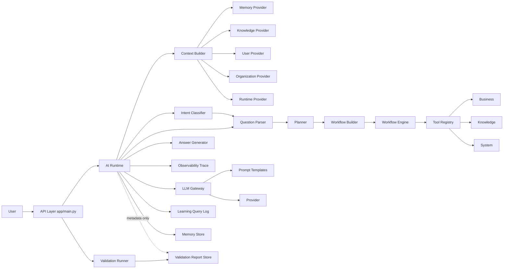
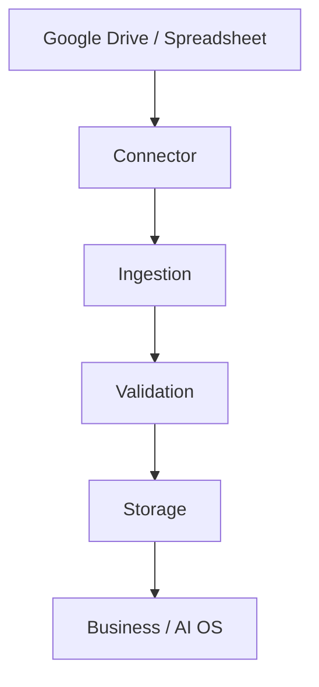
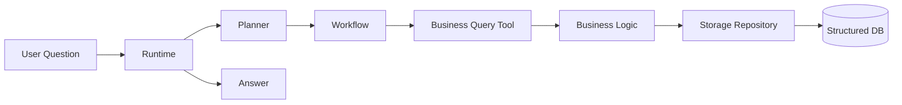
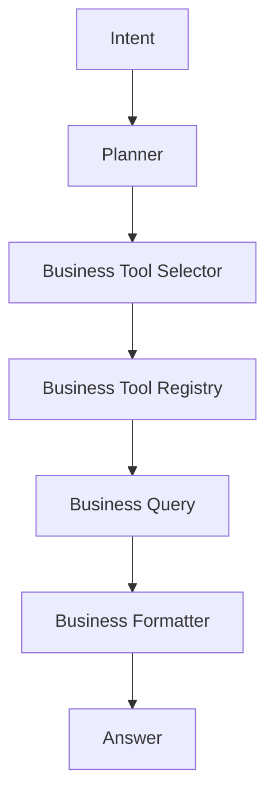
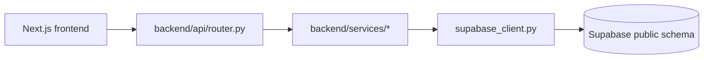

# LOGS AI Platform Architecture (Current)

> **Scope note:** This document describes the layered AI OS implemented in
> `app/main.py` (port 8001). The repository also contains a second,
> independent FastAPI application, `backend/main.py` (port 8000), which
> serves the Next.js frontend and hosts the real-data (Supabase) integration
> work for Home/Workspace/Reasoning. See
> [Section 13](#13-second-api-surface-backend-nextjs-facing) for its
> architecture. The two servers must not run on the same port; see the
> [README](../README.md#two-separate-servers-in-this-repository) for details.

## 1) Current Layer Inventory

- Entry/API layer (`app/`)
- Data and database layer (`database/`, `data/`)
- Session layer (`session/`)
- Configuration layer (`config/`)
- Business domain layer (`business/`)
- Knowledge layer (`knowledge/`)
- System metadata layer (`system/`)
- Planner layer (`planner/`)
- Context layer (`context/`)
- Intent layer (`intent/`)
- Question Understanding layer (`question/`)
- Validation layer (`validation/`)
- Tool Registry layer (`tools/`)
- Workflow layer (`workflow/`)
- Answer layer (`answer/`)
- Observability layer (`observability/`)
- AI Runtime orchestration layer (`ai/runtime.py`)
- LLM Gateway layer (`ai/gateway.py`, `ai/providers/`, `prompts/`)
- Memory layer (`memory/`)
- Learning layer (`learning/`)
- Change Management layer (`change_management/`)
- Self-awareness layer (`self_awareness/`)
- Admin/monitoring layer (`admin/`)

## 2) Layer Responsibilities

- Entry/API layer
  - Exposes HTTP endpoints and validates request-level inputs.
  - Delegates to runtime or each dedicated layer API.

- Data and database layer
  - Imports Excel to SQLite, inspects schema, executes read-safe SQL.
  - Owns persistence concerns for ERP data.
  - Uses repository abstractions so storage backends can be swapped later.

- Session layer
  - Manages request-scoped session state for `session_id`, `user_id`, `organization_id`, and linked `trace_id` values.
  - Must remain separate from Memory.

- Configuration layer
  - Provides environment-specific runtime settings for dev, staging, and production.
  - Supports deployment metadata and cloud runtime preparation.

- Business domain layer
  - Executes sales/product/customer business logic and business routing.

- Knowledge layer
  - Provides glossary/company/brand knowledge retrieval.

- System metadata layer
  - Publishes logic registry and system map metadata.

- Planner layer
  - Produces plan steps from user message (rule-based).
  - Outputs tool-oriented steps for execution phase.

- Context layer
  - Aggregates question-specific context through provider contracts before planning.
  - Collects memory, knowledge, user, organization, and runtime context in one place.
  - Selects providers by rule-based priority before collecting context.
  - Must not execute business logic or update databases directly.

- Intent layer
  - Classifies what the user is asking for after context is assembled and before planning.
  - Uses rule-based intent types such as explain, search, ranking, compare, summarize, continue, generate, improve, and status.
  - Must not call business logic, update databases, or connect to external systems.

- Question Understanding layer
  - Extracts structured question fields such as metric, operation, entity_type, period, limit, and filters.
  - Runs after Intent and before Planner to improve deterministic tool selection.
  - Must stay rule-based and must not call LLM or execute business logic.

- Validation layer
  - Performs data-quality checks for Excel inputs and SQLite schema/row shape.
  - Produces validation reports for admin and runtime metadata reference.
  - Runs on admin operation, post-import, or periodic schedules, not per user question.

- Tool Registry layer
  - Registers executable tool definitions and dispatches by tool name.
  - Provides a stable execution contract for Workflow/Planner executor.

- Workflow layer
  - Builds workflow graph-like step payload and executes each step.
  - Delegates actual work to Tool Registry.

- Answer layer
  - Converts workflow results into readable response text.

- Observability layer
  - Captures trace records for runtime and layer execution.
  - Stores trace sessions for later retrieval through the API.
  - Must not alter business logic or knowledge content.

- AI Runtime orchestration layer
  - End-to-end orchestration: memory context, planning, workflow, answer, logging, memory write.
  - Handles stage-aware error response contract.

- LLM Gateway layer
  - Provider abstraction, prompt loading, provider-specific retry/timeout/auth handling.
  - Refines draft answer if provider is available.

- Memory layer
  - Stores and retrieves conversational context records.
  - Builds runtime context from related and recent memories.

- Learning layer
  - Stores query logs, feedback, improvement backlog and insights.
  - Focuses on quality/improvement management rather than dialog context.

- Change Management layer
  - Tracks change requests and lifecycle transitions.

- Self-awareness layer
  - Reports capabilities, limitations, recommendations, status metrics.

- Admin/monitoring layer
  - Aggregates usage/quality/improvement metrics for operators.

## 3) Inter-layer Dependencies

### High-level flow

### Direct code-level dependency highlights

- Runtime depends on Context, Intent, Question Understanding, Planner, Workflow, Answer, Gateway, Learning, Memory.
- Runtime depends on Observability for trace capture, but Observability must remain passive.
- Runtime references latest validation report metadata but does not run validation checks per request.
- Context depends on provider registry and provider contracts for Memory/Knowledge/User/Organization/Runtime sources.
- Context selection is rule-based and can be overridden explicitly by provider_names.
- Intent depends on rule-based classifier logic and can be overridden by explicit context if needed.
- Validation depends on importer/schema inspection and produces durable reports.
- Workflow Engine depends on Tool Registry, and Tool Registry depends on Business/Knowledge/System handlers.
- API layer currently exposes both end-to-end endpoint and layer-direct endpoints.
- API layer now exposes `POST /chat`, `GET /trace/{trace_id}`, `GET /health`, and `GET /version` as the cloud-facing entry surface.

## 4) Responsibility Overlaps (Current)

- End-to-end orchestration exists in two routes:
  - `/answer` endpoint executes plan/workflow/answer/log directly.
  - `/ai/chat` endpoint executes the runtime orchestration.
  - This is a functional overlap and can diverge over time.

- Planner execution overlap:
  - Planner has `create_plan` and also `execute_plan` path.
  - Workflow also executes steps through registry.
  - Two execution entry paths increase behavior drift risk.

- Learning vs Memory storage overlap:
  - Both store message/answer/intent-like fields.
  - Responsibilities are conceptually distinct, but data shape overlaps.

## 5) Potential Deviations From Intended Design

- API gateway bypass risk
  - Many layer-direct endpoints remain available, so callers can bypass Runtime orchestration contract.

- Runtime resiliency policy ambiguity
  - Gateway falls back to draft answer internally, while Runtime has stage-based error contracts.
  - This mixes silent fallback and explicit failure styles.

- Intent is accepted but Planner still keeps backward-compatible keyword fallback
  - Runtime passes classified intent into Planner, but Planner remains rule-based and keeps a message fallback path.
  - This is acceptable for current sprint goals, but architecture doc should state this explicitly.

## 6) Refactoring Candidates (Prioritized)

1. Unify orchestration entry
   - Make `/ai/chat` the single production orchestration path.
   - Keep `/answer` as compatibility wrapper calling Runtime, or deprecate.

2. Consolidate execution path
   - Decide one canonical executor path between `planner/executor.py` and `workflow/engine.py` for runtime use.
   - Keep the other as testing/debug utility only.

3. Formalize cross-layer contracts
   - Define shared schemas for Plan, Workflow step result, Runtime response, Memory record.
   - Reduce shape-conversion code in Runtime.

4. Separate operational logs and conversational memory more strictly
   - Keep Learning for quality lifecycle metadata.
   - Keep Memory for retrieval-ready conversation context only.
   - Add explicit mapping policy from log to memory to avoid schema drift.

5. Introduce dependency injection for registries/providers/stores
   - Avoid hidden globals and simplify deterministic testing.

## 7) Current Architecture Summary For Team Use

- The platform has transitioned from data-first API into layered AI orchestration.
- Runtime is now the integration point for context-aware chat execution.
- Context is a working table for each question and is not a replacement for Memory storage.
- Context Priority / Provider Selection determines which working sources are consulted first.
- Intent is the question-meaning layer between context and planning.
- Validation is a separate data-quality assurance lane and does not run for each chat request.
- Tool Registry is the abstraction boundary between orchestrators and executable business/knowledge/system tools.
- Learning and Memory are separated by intent, but should be further clarified by contract and lifecycle.
- Near-term architecture goal is reducing duplicate orchestration/execution paths while preserving existing APIs.

## 8) External Source and Storage Foundation (Sprint 29)

To prepare Google Drive / Spreadsheet and cloud DB integration, the platform now includes `connector/`, `ingestion/`, and `storage/` foundations.

- Connector layer abstracts external source APIs and file metadata contracts.
- Ingestion layer orchestrates source sync jobs and prepares handoff to validation/storage.
- Storage layer abstracts DB backend differences between SQLite and PostgreSQL.

Canonical data path:

Scope constraints in this sprint:

- Real Google API and OAuth are not enabled yet.
- PostgreSQL repository remains scaffold-level until production activation.
- Existing Business, Knowledge, Context, Intent, Planner, and Workflow responsibilities remain unchanged.

## 9) Source Registry Expansion (Sprint 30)

The ingestion layer now includes explicit source definitions for Google Drive preparation.

- `ingestion/source_registry.py` manages source metadata contracts.
- Initial sources include Logsys and sales-authored spreadsheet groups.
- Each source can define connector target, folder_id, file_pattern, data_category, and enabled flag.

Current first-target categories:

- Logsys data sources
- Sales data sources

Future extension candidates (excluded in Sprint 30):

- Mail attachments
- PDF files
- Google Docs
- Proposal document workflows

Data handling policy:

- GitHub stores code and docs only.
- Real datasets stay in Google Drive and cloud storage backends.

## 10) Theme 24 Production UI Target

### Product Direction

- End user UI target is Next.js and React.
- Streamlit is debug-only for developers/operators.
- Runtime and domain layers remain UI-independent.
- Frontend and backend APIs are separated.

### Target Screen Set

- Home: today actions, alerts, project summary, recommended actions.
- Chat: response, references, generated outputs, next actions.
- Tasks: recommendation, due date, priority, status.
- Proposal Builder: customer selection, objective, internal/external references, structure, PPTX draft.
- Documents: draft and approval-oriented transaction UI.
- History: execution, generated output, approvals, feedback.
- Admin/Debug: intent/meaning/knowledge/memory/capability/validation traces and runtime logs.

### MVP Scope

- Home
- Chat
- Tasks
- Proposal Builder
- History
- Debug Trace Panel
- Documents is design-first (draft contract prepared, full UX later)

### API Surface for Frontend

- POST /api/chat
- POST /api/tasks/recommend
- POST /api/proposals/draft
- POST /api/documents/draft
- GET /api/history
- GET /api/executions/{id}
- GET /api/evaluation/summary
- GET /api/debug/trace/{id}

### Evaluation Connection from UI

Persist each UI operation as an evaluation event:

- user_input
- ai_response
- intent
- task
- capability
- validation
- user_feedback
- accepted_or_rejected
- corrected_output

This enables automatic transformation from production behavior logs into future regression suites.

## 11) Storage-to-Business Query Runtime Path (Sprint 31)

For user questions, the runtime path now prioritizes structured data in Storage through Business layer access.

- Storage acts as the query-time structured data store.
- Business layer reads Storage through repository interfaces.
- Runtime/Planner must not embed SQL logic.
- User-time requests must not directly call Google Drive.
- Google Drive remains an ingestion sync origin only.

Runtime query-time chain:

## 12) Business Tool Registry Layer (Sprint 33)

Business capabilities are now managed through a dedicated selector/registry pair inside the business domain.

- Planner asks Business Tool Selector to choose a business tool.
- Business Tool Registry resolves tool metadata and handler.
- Selected business tool executes Business Query functions that read via repository abstractions.
- Formatter converts deterministic business outputs to user answers without requiring LLM for supported cases.

## 13) Second API Surface: backend/ (Next.js-facing)

`backend/` is a separate FastAPI application (`backend/main.py`, port 8000)
from the layered AI OS in `app/`. It exists to serve the Next.js frontend
(`frontend/`) and currently carries most of the active real-data integration
work (Supabase `public` schema).

### 13.1 Directory Inventory

- `backend/api/` — route definitions. `router.py` mounts business/project
  routes under the `/api` prefix; `capability_router.py` mounts the
  Capability REST API separately under its own `/capabilities` prefix (not
  `/api`). Both are registered in `backend/main.py`.
- `backend/business/` — business-rule helpers specific to the frontend
  surface (`today_actions.py`, `evaluation_rules.py`). Distinct from the
  top-level `business/` package used by `app/`.
- `backend/domain/` — domain model for projects (`project.py`), consumed by
  `services/project_service.py`.
- `backend/services/` — the bulk of backend logic:
  - `supabase_client.py` — connection handling for the shared production
    Supabase `public` schema (PostgreSQL).
  - `data_providers.py` — real Supabase-backed data access (sales,
    customers, products).
  - `reasoning_pipeline.py` — the Fact/Interpretation/Hypothesis/Knowledge-
    Candidate reasoning flow (Phase 8–13 work); reads real data through
    `supabase_client`. Not yet wired through the Capability framework (see
    13.5).
  - `evidence_integration.py`, `evidence_interpreter.py` — supporting
    evidence-handling logic for the reasoning pipeline.
  - `knowledge_loader.py`, `knowledge_registry.py`, `semantic_registry.py` —
    knowledge/semantic lookups specific to this surface (separate from the
    top-level `knowledge/` package).
  - `capability_instance.py` — the single shared `CapabilityRegistry`
    instance used by both `capability_router.py` and any business logic
    that wants its work tracked as a Capability (e.g.
    `project_service.py`). Import `registry` from here rather than
    constructing a new `CapabilityRegistry()` — a previous bug had
    `capability_router.py` construct its own, disconnected instance.
  - `project_service.py` — builds project state from real `purchase_orders`
    data. `build_project_aggregate` is recorded as a Capability execution
    (`project_aggregate_analysis`) via `capability_instance.registry`.
  - `mock_store.py` — **intentional mock implementation** backing several
    endpoints that have not yet been migrated to real data (see 13.3).
- `backend/connectors/`, `backend/runtime/` — currently placeholder
  packages (`__init__.py` only); reserved for future connector/runtime
  abstractions on this surface.
- `backend/scripts/` — one-off / demo scripts (e.g.
  `seed_logisys_demo.py`).

### 13.2 Route Inventory (`backend/api/router.py`)

| Route | Backing | Status |
|---|---|---|
| `GET /api/health` | `mock_store.get_health` | mock |
| `GET /api/home` | `business.today_actions.get_home_payload` | real (Supabase) |
| `POST /api/chat` | `mock_store.consult` | mock |
| `POST /api/reasoning` | `services.reasoning_pipeline.reason` | real (Supabase) |
| `GET /api/knowledge/documents` | `services.knowledge_loader.load_documents` | real (local knowledge files) |
| `GET /api/knowledge/registry` | `services.knowledge_registry.get_registry` | real (local knowledge files) |
| `POST /api/tasks/recommend` | `mock_store.recommend_tasks` | mock |
| `POST /api/proposals/draft` | `mock_store.draft_proposal` | mock |
| `POST /api/documents/draft` | `mock_store.draft_document` | mock |
| `GET /api/history` | `mock_store.get_history` | mock |
| `GET /api/executions/{id}` | `mock_store.get_execution` | mock |
| `GET /api/evaluation/summary` | `mock_store.get_evaluation_summary` | mock |
| `GET /api/debug/trace/{id}` | `services.trace_store.get_trace` | real (JSONL: `backend/data/traces.jsonl`) — updated 2026-07-04, was mock |
| `POST /api/events` | `mock_store.store_event` | mock |
| `GET /api/projects`, `GET /api/projects/{id}`, `GET /api/projects/{id}/trace` | `services.project_service.ProjectService` | real (Supabase `purchase_orders`); executed as tracked Capability `project_aggregate_analysis` (updated 2026-07-04) |
| `GET /api/today-actions` | `business.today_actions` | real (Supabase) |

> **Note:** this table should be re-verified whenever `backend/api/router.py`
> changes; it reflects a manual read of the source on 2026-07-04, not an
> automated check.

### 13.3 Real vs Mock Boundary

`backend/services/mock_store.py` intentionally backs several endpoints
(`chat`, `tasks/recommend`, `proposals/draft`, `documents/draft`, `history`,
`executions`, `evaluation/summary`, `events`, `health`). `debug/trace` was
migrated off mock_store to `services.trace_store` on 2026-07-04 (Phase B).
This is a deliberate placeholder boundary for the rest, not an oversight —
but as real-data migration continues (see git history: Home/Workspace/
ProjectService/Phase13 were all migrated from mock to real Supabase queries
in recent commits), this table is the fastest way to check what remains
mock at any point in time.

### 13.4 Data Flow (real-data path)

### 13.5 Blueprint Constitution Integration Status (backend/)

`docs/blueprint/AI_OS_BLUEPRINT_v0.2_DRAFT.md`'s 12-principle AI Constitution
was found (2026-07-04 audit) to be largely *not* wired into `backend/`,
despite being partially proven out in `app/`. Work to close this gap is
tracked here rather than only in commit messages, since this table is the
fastest way to check current status without re-auditing from scratch.

| Principle | Status in `backend/` | Notes |
|---|---|---|
| 2, 4, 5, 12 (Capability Driven) | Mostly done | `capability_router.py` is mounted and reachable (Phase A). Both `ProjectService.build_project_aggregate` (`project_aggregate_analysis`, Phase C-1) and `reasoning_pipeline.reason` (`business_question_reasoning`, Phase C-2) are tracked Capability executions via the shared registry in `services/capability_instance.py`. Remaining mock-backed endpoints (`chat`, `tasks/recommend`, `proposals/draft`, `documents/draft`) are not yet wired (Phase E). |
| 6, 10 (Transparent AI / Trace Everything) | Done for `ProjectService` and `reasoning_pipeline` | Both generate and persist a `trace_id` to `backend/data/traces.jsonl`, retrievable via `GET /api/debug/trace/{id}` (Phase B, extended in Phase C-2). |
| 3, 5 (Human Governed / Governed Learning) | Not started | No governance/change_management wiring exists in `backend/`. `capability.registry.CapabilityRegistry` is in-memory only (no persistence) — capability *definitions* re-register idempotently on each use, but *execution history/metrics* (success_rate, confidence, past executions) are still lost on every restart, unlike traces. |

Remaining candidate work:
- Give `CapabilityRegistry` durable storage for execution history/metrics —
  it has the same in-memory-only limitation `trace_store.py` solved for
  traces, but for a different kind of data (aggregated metrics, not
  individual records), so it isn't a copy-paste of that solution.
- Build a governance approval loop for `backend/`, mirroring what `app/`'s
  Learning system does partially (see `docs/review/KNOWN_ISSUES.md`).
- Wire the remaining mock-backed endpoints in `backend/api/router.py`
  through the Capability pattern as they get real implementations
  (Phase E).

## Constraints

- Confidential business data remains local and must not be committed.
- No automatic business definition rewrite from AI outputs.
- Provider-specific LLM tool calling is not enabled yet.