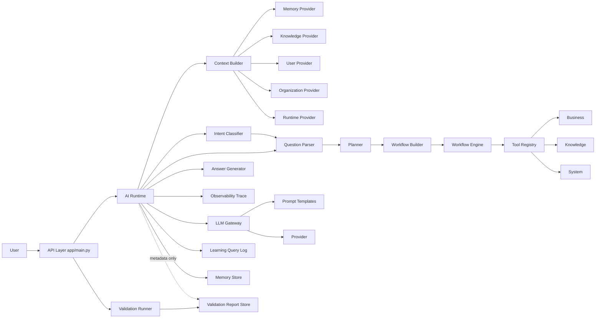
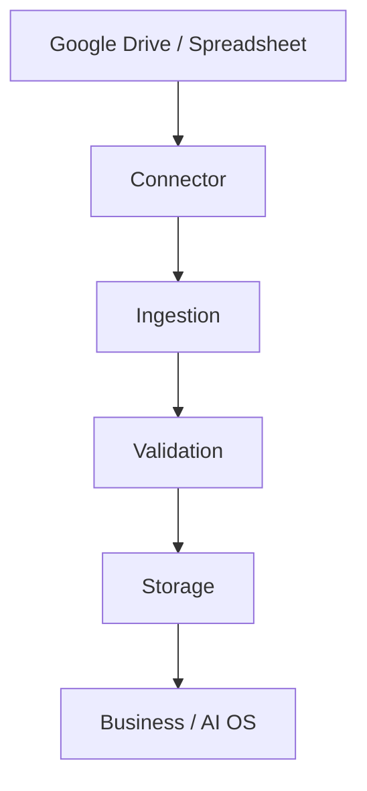
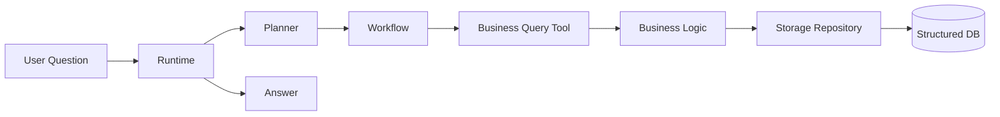
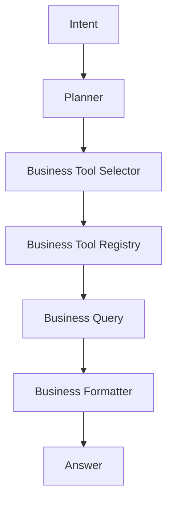

# LOGS AI Platform — Historical Architecture (`app/`-era, deleted 2026-07-06)

> **What this file is:** Sections 1–12 of `docs/architecture.md`, moved
> here on 2026-07-15 (14.104) to declutter the main document (which is
> read at the start of nearly every session). This describes the
> `app/`-era layered architecture (`database/`, `session/`, `config/`,
> `business/` [root], `system/`, `planner/`, `context/`, `intent/`,
> `question/`, `validation/`, `tools/`, `workflow/`, `answer/`,
> `observability/`, `ai/`, `prompts/`, `memory/`, `change_management/`,
> `self_awareness/`, `admin/`) — all of it was deleted in Section 14.14
> (2026-07-06). None of it describes code that exists in the repository
> today. Of everything it lists, only `knowledge/` (data files, not a
> live package import) and parts of `learning/` (see 14.10/14.14)
> survived, and both are now used by `backend/` instead.
>
> **For the actual current architecture, see
> [`docs/architecture.md`](./architecture.md), starting at Section 13.**
> This file is kept only as a historical record of *why* those layers
> existed and how they related to each other, in case that context is
> ever useful (e.g. understanding a design decision that carried over,
> or explaining history to a new team member).

---

## 1) Current Layer Inventory ⚠️ HISTORICAL — describes deleted `app/`-era code, see banner above

- Entry/API layer (`app/`)
- Data and database layer (`database/`, `data/`)
- Session layer (`session/`)
- Configuration layer (`config/`)
- Business domain layer (`business/`)
- Knowledge layer (`knowledge/`)
- System metadata layer (`system/`)
- Planner layer (`planner/`)
- Context layer (`context/`)
- Intent layer (`intent/`)
- Question Understanding layer (`question/`)
- Validation layer (`validation/`)
- Tool Registry layer (`tools/`)
- Workflow layer (`workflow/`)
- Answer layer (`answer/`)
- Observability layer (`observability/`)
- AI Runtime orchestration layer (`ai/runtime.py`)
- LLM Gateway layer (`ai/gateway.py`, `ai/providers/`, `prompts/`)
- Memory layer (`memory/`)
- Learning layer (`learning/`)
- Change Management layer (`change_management/`)
- Self-awareness layer (`self_awareness/`)
- Admin/monitoring layer (`admin/`)

## 2) Layer Responsibilities ⚠️ HISTORICAL (app/-era, deleted 2026-07-06)

- Entry/API layer
  - Exposes HTTP endpoints and validates request-level inputs.
  - Delegates to runtime or each dedicated layer API.

- Data and database layer
  - Imports Excel to SQLite, inspects schema, executes read-safe SQL.
  - Owns persistence concerns for ERP data.
  - Uses repository abstractions so storage backends can be swapped later.

- Session layer
  - Manages request-scoped session state for `session_id`, `user_id`, `organization_id`, and linked `trace_id` values.
  - Must remain separate from Memory.

- Configuration layer
  - Provides environment-specific runtime settings for dev, staging, and production.
  - Supports deployment metadata and cloud runtime preparation.

- Business domain layer
  - Executes sales/product/customer business logic and business routing.

- Knowledge layer
  - Provides glossary/company/brand knowledge retrieval.

- System metadata layer
  - Publishes logic registry and system map metadata.

- Planner layer
  - Produces plan steps from user message (rule-based).
  - Outputs tool-oriented steps for execution phase.

- Context layer
  - Aggregates question-specific context through provider contracts before planning.
  - Collects memory, knowledge, user, organization, and runtime context in one place.
  - Selects providers by rule-based priority before collecting context.
  - Must not execute business logic or update databases directly.

- Intent layer
  - Classifies what the user is asking for after context is assembled and before planning.
  - Uses rule-based intent types such as explain, search, ranking, compare, summarize, continue, generate, improve, and status.
  - Must not call business logic, update databases, or connect to external systems.

- Question Understanding layer
  - Extracts structured question fields such as metric, operation, entity_type, period, limit, and filters.
  - Runs after Intent and before Planner to improve deterministic tool selection.
  - Must stay rule-based and must not call LLM or execute business logic.

- Validation layer
  - Performs data-quality checks for Excel inputs and SQLite schema/row shape.
  - Produces validation reports for admin and runtime metadata reference.
  - Runs on admin operation, post-import, or periodic schedules, not per user question.

- Tool Registry layer
  - Registers executable tool definitions and dispatches by tool name.
  - Provides a stable execution contract for Workflow/Planner executor.

- Workflow layer
  - Builds workflow graph-like step payload and executes each step.
  - Delegates actual work to Tool Registry.

- Answer layer
  - Converts workflow results into readable response text.

- Observability layer
  - Captures trace records for runtime and layer execution.
  - Stores trace sessions for later retrieval through the API.
  - Must not alter business logic or knowledge content.

- AI Runtime orchestration layer
  - End-to-end orchestration: memory context, planning, workflow, answer, logging, memory write.
  - Handles stage-aware error response contract.

- LLM Gateway layer
  - Provider abstraction, prompt loading, provider-specific retry/timeout/auth handling.
  - Refines draft answer if provider is available.

- Memory layer
  - Stores and retrieves conversational context records.
  - Builds runtime context from related and recent memories.

- Learning layer
  - Stores query logs, feedback, improvement backlog and insights.
  - Focuses on quality/improvement management rather than dialog context.

- Change Management layer
  - Tracks change requests and lifecycle transitions.

- Self-awareness layer
  - Reports capabilities, limitations, recommendations, status metrics.

- Admin/monitoring layer
  - Aggregates usage/quality/improvement metrics for operators.

## 3) Inter-layer Dependencies ⚠️ HISTORICAL (app/-era, deleted 2026-07-06)

### High-level flow

### Direct code-level dependency highlights

- Runtime depends on Context, Intent, Question Understanding, Planner, Workflow, Answer, Gateway, Learning, Memory.
- Runtime depends on Observability for trace capture, but Observability must remain passive.
- Runtime references latest validation report metadata but does not run validation checks per request.
- Context depends on provider registry and provider contracts for Memory/Knowledge/User/Organization/Runtime sources.
- Context selection is rule-based and can be overridden explicitly by provider_names.
- Intent depends on rule-based classifier logic and can be overridden by explicit context if needed.
- Validation depends on importer/schema inspection and produces durable reports.
- Workflow Engine depends on Tool Registry, and Tool Registry depends on Business/Knowledge/System handlers.
- API layer currently exposes both end-to-end endpoint and layer-direct endpoints.
- API layer now exposes `POST /chat`, `GET /trace/{trace_id}`, `GET /health`, and `GET /version` as the cloud-facing entry surface.

## 4) Responsibility Overlaps (Current) ⚠️ HISTORICAL (app/-era, deleted 2026-07-06)

- End-to-end orchestration exists in two routes:
  - `/answer` endpoint executes plan/workflow/answer/log directly.
  - `/ai/chat` endpoint executes the runtime orchestration.
  - This is a functional overlap and can diverge over time.

- Planner execution overlap:
  - Planner has `create_plan` and also `execute_plan` path.
  - Workflow also executes steps through registry.
  - Two execution entry paths increase behavior drift risk.

- Learning vs Memory storage overlap:
  - Both store message/answer/intent-like fields.
  - Responsibilities are conceptually distinct, but data shape overlaps.

## 5) Potential Deviations From Intended Design ⚠️ HISTORICAL (app/-era, deleted 2026-07-06)

- API gateway bypass risk
  - Many layer-direct endpoints remain available, so callers can bypass Runtime orchestration contract.

- Runtime resiliency policy ambiguity
  - Gateway falls back to draft answer internally, while Runtime has stage-based error contracts.
  - This mixes silent fallback and explicit failure styles.

- Intent is accepted but Planner still keeps backward-compatible keyword fallback
  - Runtime passes classified intent into Planner, but Planner remains rule-based and keeps a message fallback path.
  - This is acceptable for current sprint goals, but architecture doc should state this explicitly.

## 6) Refactoring Candidates (Prioritized) ⚠️ HISTORICAL (app/-era, deleted 2026-07-06)

1. Unify orchestration entry
   - Make `/ai/chat` the single production orchestration path.
   - Keep `/answer` as compatibility wrapper calling Runtime, or deprecate.

2. Consolidate execution path
   - Decide one canonical executor path between `planner/executor.py` and `workflow/engine.py` for runtime use.
   - Keep the other as testing/debug utility only.

3. Formalize cross-layer contracts
   - Define shared schemas for Plan, Workflow step result, Runtime response, Memory record.
   - Reduce shape-conversion code in Runtime.

4. Separate operational logs and conversational memory more strictly
   - Keep Learning for quality lifecycle metadata.
   - Keep Memory for retrieval-ready conversation context only.
   - Add explicit mapping policy from log to memory to avoid schema drift.

5. Introduce dependency injection for registries/providers/stores
   - Avoid hidden globals and simplify deterministic testing.

## 7) Current Architecture Summary For Team Use ⚠️ HISTORICAL (app/-era, deleted 2026-07-06)

- The platform has transitioned from data-first API into layered AI orchestration.
- Runtime is now the integration point for context-aware chat execution.
- Context is a working table for each question and is not a replacement for Memory storage.
- Context Priority / Provider Selection determines which working sources are consulted first.
- Intent is the question-meaning layer between context and planning.
- Validation is a separate data-quality assurance lane and does not run for each chat request.
- Tool Registry is the abstraction boundary between orchestrators and executable business/knowledge/system tools.
- Learning and Memory are separated by intent, but should be further clarified by contract and lifecycle.
- Near-term architecture goal is reducing duplicate orchestration/execution paths while preserving existing APIs.

## 8) External Source and Storage Foundation (Sprint 29) ⚠️ HISTORICAL (app/-era, deleted 2026-07-06)

To prepare Google Drive / Spreadsheet and cloud DB integration, the platform now includes `connector/`, `ingestion/`, and `storage/` foundations.

- Connector layer abstracts external source APIs and file metadata contracts.
- Ingestion layer orchestrates source sync jobs and prepares handoff to validation/storage.
- Storage layer abstracts DB backend differences between SQLite and PostgreSQL.

Canonical data path:

Scope constraints in this sprint:

- Real Google API and OAuth are not enabled yet.
- PostgreSQL repository remains scaffold-level until production activation.
- Existing Business, Knowledge, Context, Intent, Planner, and Workflow responsibilities remain unchanged.

## 9) Source Registry Expansion (Sprint 30) ⚠️ HISTORICAL (app/-era, deleted 2026-07-06)

The ingestion layer now includes explicit source definitions for Google Drive preparation.

- `ingestion/source_registry.py` manages source metadata contracts.
- Initial sources include Logsys and sales-authored spreadsheet groups.
- Each source can define connector target, folder_id, file_pattern, data_category, and enabled flag.

Current first-target categories:

- Logsys data sources
- Sales data sources

Future extension candidates (excluded in Sprint 30):

- Mail attachments
- PDF files
- Google Docs
- Proposal document workflows

Data handling policy:

- GitHub stores code and docs only.
- Real datasets stay in Google Drive and cloud storage backends.

## 10) Theme 24 Production UI Target ⚠️ HISTORICAL (app/-era, deleted 2026-07-06)

### Product Direction

- End user UI target is Next.js and React.
- Streamlit is debug-only for developers/operators.
- Runtime and domain layers remain UI-independent.
- Frontend and backend APIs are separated.

### Target Screen Set

- Home: today actions, alerts, project summary, recommended actions.
- Chat: response, references, generated outputs, next actions.
- Tasks: recommendation, due date, priority, status.
- Proposal Builder: customer selection, objective, internal/external references, structure, PPTX draft.
- Documents: draft and approval-oriented transaction UI.
- History: execution, generated output, approvals, feedback.
- Admin/Debug: intent/meaning/knowledge/memory/capability/validation traces and runtime logs.

### MVP Scope

- Home
- Chat
- Tasks
- Proposal Builder
- History
- Debug Trace Panel
- Documents is design-first (draft contract prepared, full UX later)

### API Surface for Frontend

- POST /api/chat
- POST /api/tasks/recommend
- POST /api/proposals/draft
- POST /api/documents/draft
- GET /api/history
- GET /api/executions/{id}
- GET /api/evaluation/summary
- GET /api/debug/trace/{id}

### Evaluation Connection from UI

Persist each UI operation as an evaluation event:

- user_input
- ai_response
- intent
- task
- capability
- validation
- user_feedback
- accepted_or_rejected
- corrected_output

This enables automatic transformation from production behavior logs into future regression suites.

## 11) Storage-to-Business Query Runtime Path (Sprint 31) ⚠️ HISTORICAL (app/-era, deleted 2026-07-06)

For user questions, the runtime path now prioritizes structured data in Storage through Business layer access.

- Storage acts as the query-time structured data store.
- Business layer reads Storage through repository interfaces.
- Runtime/Planner must not embed SQL logic.
- User-time requests must not directly call Google Drive.
- Google Drive remains an ingestion sync origin only.

Runtime query-time chain:

## 12) Business Tool Registry Layer (Sprint 33) ⚠️ HISTORICAL (app/-era, deleted 2026-07-06)

Business capabilities are now managed through a dedicated selector/registry pair inside the business domain.

- Planner asks Business Tool Selector to choose a business tool.
- Business Tool Registry resolves tool metadata and handler.
- Selected business tool executes Business Query functions that read via repository abstractions.
- Formatter converts deterministic business outputs to user answers without requiring LLM for supported cases.

