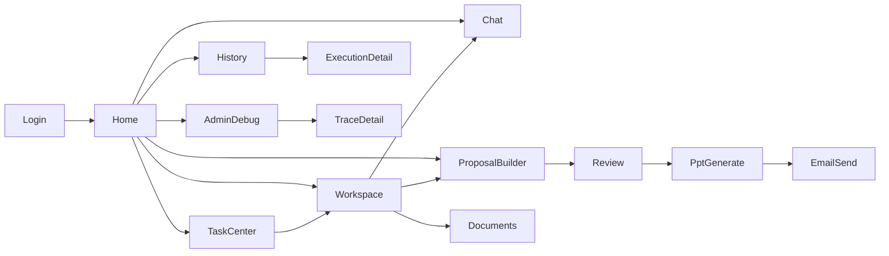

# Theme 25: LOGS AI OS Product and UX Design

## 1. Product Vision

LOGS AI OS is not a chat tool replacement.

It is the daily work entrypoint where employees start work, decide priorities, execute actions, and complete business outputs with AI assistance.

Target product outcome:

- Employees open LOGS AI first when they start work.
- LOGS AI shows what to do now, what is risky, and what to do next.
- Chat is one function inside the product, not the product itself.

## 2. UX Principles

- Work-first over chat-first.
- Actionability over explanation.
- Role-adaptive home over one-size dashboard.
- Evidence-aware outputs with clear references.
- Safe execution with approval gates for risky operations.
- Trace-by-role: simple for end users, deep trace for admins.
- Continuous improvement loop from product usage back to evaluation and runtime.

## 3. User Journey (Daily Work Experience)

## 3.1 Sales

1. Daily work
- Check customer priorities, prepare proposals, follow up by mail, report progress.

2. Pain points
- Too much context switching between mail, sheets, and past proposals.
- Proposal drafting takes long and quality varies by person.

3. AI intervention points
- Morning priority recommendation.
- Proposal draft and storyline generation.
- Follow-up mail draft with customer context.

4. Home design
- Today customers to act on, proposal deadlines, risk alerts, win-probability hints.

5. Required widgets
- Priority customers
- Proposal deadline board
- Follow-up required list
- Pipeline KPI
- Suggested next actions

6. AI proposals
- "Use last BEAMS proposal structure with updated OEM margin trend section."
- "Prepare 2 alternative proposal narratives by decision-maker profile."

7. AI notifications
- "Fanatics proposal deadline in 2 days; draft incomplete."
- "High-impact customer has no follow-up mail in 5 business days."

## 3.2 Planning

1. Daily work
- Plan initiatives, compare scenarios, prepare internal proposal docs.

2. Pain points
- Hard to connect market signals with internal performance data quickly.

3. AI intervention points
- Scenario generation and evidence summarization.
- Drafting structured proposal outlines.

4. Home design
- Active themes, external signal summary, pending decision items.

5. Required widgets
- Theme progress board
- Market signal digest
- Decision backlog
- KPI trend snapshot

6. AI proposals
- "Create scenario A/B/C with margin impact and execution risk."

7. AI notifications
- "Market trend changed for key product category; re-check plan assumptions."

## 3.3 Production Control

1. Daily work
- Monitor lead times, delays, purchasing status, and operational exceptions.

2. Pain points
- Delay causes are fragmented across tasks/messages/files.

3. AI intervention points
- Daily risk detection.
- Required action extraction by project and owner.

4. Home design
- Delay risks, purchase gaps, unresolved issue list, required actions today.

5. Required widgets
- Delay risk panel
- Unpurchased sales check
- Pending issue board
- Owner action queue

6. AI proposals
- "Prioritize these 5 tasks to reduce this-week delay risk by 30%."

7. AI notifications
- "Shipment risk increased: supplier confirmation missing for Project X."

## 3.4 Sales Operations

1. Daily work
- Create and verify transaction drafts, coordinate approvals, maintain records.

2. Pain points
- Manual drafting and approval handoff delays.

3. AI intervention points
- Document draft automation.
- Missing-field and risk checks before submission.

4. Home design
- Draft queue, approval queue, blocked items, due-today transactions.

5. Required widgets
- Draft generation queue
- Approval waiting list
- Blocked by validation list
- SLA timer

6. AI proposals
- "Create draft invoice package for these 10 records and route approvals."

7. AI notifications
- "3 transaction drafts blocked: missing entity mapping."

## 3.5 Management

1. Daily work
- Review KPI, identify risks, decide strategic priorities.

2. Pain points
- Too many reports, not enough decision-ready summaries.

3. AI intervention points
- KPI anomaly summaries.
- Decision options with impact and confidence.

4. Home design
- KPI cockpit, critical alerts, strategic action recommendations.

5. Required widgets
- Executive KPI board
- Critical issue list
- Cross-team execution health
- Decision recommendation panel

6. AI proposals
- "Recommend top 3 actions for margin recovery this month with rationale."

7. AI notifications
- "Gross margin deterioration trend exceeds threshold for 2 consecutive weeks."

## 3.6 Administrator

1. Daily work
- Monitor runtime quality, approval policy compliance, and operation stability.

2. Pain points
- Hard to correlate user behavior with runtime/evaluation quality quickly.

3. AI intervention points
- Regression candidates from real usage.
- Alerting on validation bypass risk and trace anomalies.

4. Home design
- System health, trace anomalies, evaluation drift, policy violation dashboard.

5. Required widgets
- Runtime health
- Validation fail heatmap
- Trace anomaly stream
- Evaluation trend panel

6. AI proposals
- "Top 10 failure patterns to convert into regression tests this week."

7. AI notifications
- "Validation mismatch rate increased in Document flow after latest release."

## 4. Screen Flow

## 5. Information Architecture

- Global Navigation
- Home
- Task Center
- Workspace
- Chat
- Proposal Builder
- Documents
- History
- Admin and Debug

- Core Domain Objects
- User
- Role
- Permission
- Customer
- Project
- Task
- Proposal
- Document Draft
- Execution
- Trace
- Evaluation Event

- Key Relationships
- Workspace is the hub by project.
- Task Center aggregates tasks across project, mail, Slack, and internal requests.
- Proposal Builder consumes knowledge, memory, and project context from Workspace.
- History stores execution and feedback to improve evaluation and runtime.

## 6. Widget List

- Today Required Actions
- Critical Alerts
- Recommended Actions
- KPI Summary
- In-progress Tasks
- Due Soon Tasks
- Proposal Draft Progress
- Approval Queue
- Project Health Snapshot
- Risk Heatmap
- AI Suggestions
- AI Notifications
- Execution History Snapshot
- Feedback Needed
- Trace Health (admin)

## 7. Product KPI

- DAU
- WAU
- MAU
- Proposal creation time
- Proposal adoption rate
- AI feature utilization rate
- Draft adoption rate
- Task recommendation adoption rate
- Response correction rate
- PowerPoint correction time
- Estimated business time saved

## 8. Product Analytics Events

- screen_view
- click
- generation_started
- generation_completed
- artifact_downloaded
- edit_started
- edit_completed
- accepted
- rejected
- ai_recommendation_accepted
- ai_recommendation_rejected

Recommended event payload fields:

- user_id
- role
- screen
- workspace_id
- execution_id
- intent
- task
- capability
- validation_status
- timestamp

## 9. Feedback Loop

Product Analytics
-> Evaluation
-> Knowledge Improvement
-> Runtime Improvement
-> UI Improvement

Operational loop detail:

- Capture behavior and outcomes in analytics events.
- Aggregate mismatch patterns into evaluation candidates.
- Convert accepted/rejected and corrected output into regression cases.
- Update knowledge and runtime policies.
- Reflect improvements in home/task/proposal UX patterns.

## 10. MVP

MVP scope:

- Home
- Task Center
- Workspace
- Chat
- Proposal Builder
- History
- Debug Trace Panel

MVP constraints:

- Documents starts with draft workflow and approval handoff only.
- Admin-only deep trace.
- User-facing screens hide low-level internals.

## 11. Version Roadmap

V0.1 Foundation

- Home, Chat, Task Center, Workspace shell
- API integration for chat/tasks/history
- Basic analytics event pipeline

V0.2 Sales and Proposal Productivity

- Full Proposal Builder one-screen flow
- PPTX draft generation and review handoff
- Customer/project context injection

V0.3 Operations and Document Flow

- Transaction draft flows
- Approval queue UX
- Monitoring alerts and daily action board

V0.4 Management and Intelligence

- Executive KPI cockpit
- AI strategic recommendations
- Cross-functional workspace analytics

V0.5 Continuous Improvement OS

- Analytics to evaluation automation
- Regression case generation from production logs
- Closed-loop knowledge/runtime/ui optimization

## Proposal Builder One-Screen Flow

Customer Selection
-> Purpose Selection
-> Reference Data Selection
-> AI Draft
-> PowerPoint Generation
-> Review
-> Mail Send

## Task Center Definition

Task Center unifies:

- Project tasks
- Due dates
- Email follow-ups
- Slack requests
- Internal requests

Task Center outputs:

- Prioritized today list
- Risk-ranked backlog
- One-click execution links into Workspace

## Workspace Definition

Workspace is the project-level operating context that aggregates:

- AI conversation
- Proposals
- Emails
- Tasks
- History
- Generated artifacts

Workspace objective:

- Eliminate context switching and keep all project execution evidence in one place.
