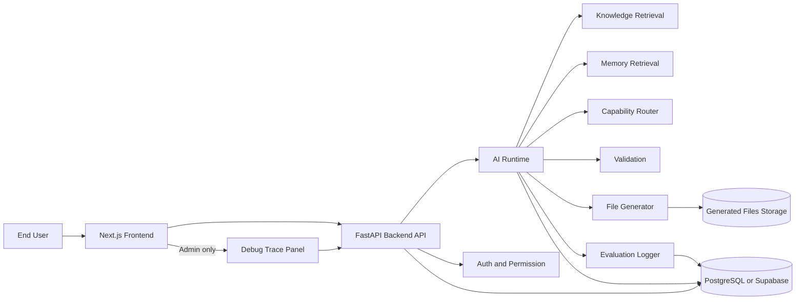

# Theme 24: Production UI Architecture for LOGS AI OS

## 1. Purpose

Build a production-grade end-user UI early, so real business users can test proposal creation, task checking, project checking, and chat validation in actual workflow contexts.

This architecture explicitly avoids a Streamlit-first product path.

## 2. Core Policy

- End User UI uses Next.js and React as the primary experience.
- Streamlit, if used, is restricted to developer/operator debug tooling.
- AI Runtime, Knowledge, Memory, Capability, Validation, and Evaluation remain UI-independent.
- Backend API is separated from frontend delivery.
- Repository is managed in GitHub with frontend/backend boundaries.
- User-facing UX emphasizes business outcomes and next actions, not internal model internals.

## 3. Recommended Tech Stack

### Frontend

- Next.js (App Router)
- React
- TypeScript
- Tailwind CSS
- shadcn/ui
- React Query (or SWR) for API state
- Zod for request/response runtime validation

### Backend

- FastAPI
- Runtime orchestration layer
- Knowledge retrieval service
- Memory retrieval service
- Capability router
- Evaluation logger
- Auth and permission service
- File generation service (PPTX, docs)

### Data and Storage

- Supabase or PostgreSQL
- Generated files storage (object storage)
- User, role, permission tables
- Task, history, execution logs tables

## 4. Runtime and UI Separation

UI must never own business logic decisions such as intent resolution, validation gating, or capability routing.

UI responsibilities:

- Collect user intent and context input
- Trigger backend API requests
- Display outcome, references, next action
- Show trace only in Admin/Debug scope

Backend responsibilities:

- Intent and meaning resolution
- Knowledge and memory planning
- Task and capability planning
- Validation and execution control
- Evaluation event logging

## 5. Screen Architecture

## 5.1 Home

- Today actions
- High-priority alerts
- Project summary
- Recommended next actions

Primary UX objective:

- Show what needs action now
- Show why it matters
- Provide one-click next step

## 5.2 Chat

- Business AI chat panel
- Response area
- Referenced data preview
- Generated artifacts
- Suggested next actions

Primary UX objective:

- Turn free-form requests into actionable outputs

## 5.3 Tasks

- Recommended tasks
- Assigned projects
- Due date
- Priority
- Status

Primary UX objective:

- Operational clarity for daily execution

## 5.4 Proposal Builder

- Customer selector
- Proposal objective
- Internal data selection
- External information selection
- Proposed structure outline
- PPTX draft generation

Primary UX objective:

- Structured proposal drafting with clear evidence and reusable template flow

## 5.5 Documents

- Quotation
- Purchase order
- Sales slip
- Purchase slip
- Invoice
- Draft generation
- Waiting for approval

Primary UX objective:

- Controlled draft and approval workflow (no dangerous auto-confirm)

## 5.6 History

- AI execution history
- Generated artifact history
- Approval history
- User feedback history

Primary UX objective:

- Auditability and learning loop

## 5.7 Admin / Debug

- Intent trace
- Meaning trace
- Knowledge trace
- Memory trace
- Capability trace
- Validation result
- Evaluation result
- Runtime logs

Primary UX objective:

- Diagnosability for operators and developers

## 6. MVP Scope (First Release)

MVP target screens:

1. Home
2. Chat
3. Tasks
4. Proposal Builder
5. History
6. Debug Trace Panel

Documents is design-first in MVP, with draft flow contract prepared but full UX postponed.

## 7. API Contract (Frontend to Backend)

- POST /api/chat
- POST /api/tasks/recommend
- POST /api/proposals/draft
- POST /api/documents/draft
- GET /api/history
- GET /api/executions/{id}
- GET /api/evaluation/summary
- GET /api/debug/trace/{id}

### Minimal response envelope recommendation

All endpoints should return a consistent envelope shape for UI reuse:

- execution_id
- status
- message
- result
- next_actions
- references
- trace_id (admin scope)

## 8. GitHub Repository Structure (Target)

logs-ai-platform/
  frontend/
    app/
    components/
    lib/
    hooks/
    styles/
  backend/
    api/
    runtime/
    services/
    connectors/
  knowledge/
  memory/
  capability/
  tests/
    evaluation/
  docs/

## 9. Evaluation Integration from UI Operations

Each UI operation should create a durable evaluation event with:

- user_input
- ai_response
- intent
- task
- capability
- validation
- user_feedback
- accepted_or_rejected
- corrected_output

This enables transforming production logs into future regression test cases.

## 10. UX Guardrails

End-user screens should focus on:

- What was completed
- What must be confirmed
- What to do next

Do not expose deep internal trace by default.

Expose detailed trace only in Admin/Debug role.

## 11. Suggested API-Level Domain Models

### ExecutionSummary

- execution_id
- user_id
- intent
- task
- status
- validation_status
- created_at

### TraceSummary

- trace_id
- intent_trace
- meaning_trace
- knowledge_trace
- memory_trace
- capability_trace
- validation_trace

### EvaluationEvent

- event_id
- execution_id
- user_input
- ai_response
- intent
- task
- capability
- validation
- user_feedback
- accepted_or_rejected
- corrected_output
- created_at

## 12. Delivery Sequence (Implementation Order)

1. Backend API surface stabilization (chat, tasks, proposals, history, trace).
2. Frontend shell and navigation (Home, Chat, Tasks, Proposal, History, Debug).
3. Chat + Task recommendation end-to-end connection.
4. Proposal Builder draft flow with generated artifact links.
5. History and execution details pages with feedback capture.
6. Debug Trace Panel role-based exposure.
7. Documents draft flow UI and approval handoff.
8. Evaluation event ingestion and nightly regression conversion pipeline.

## 13. Architecture Diagram

